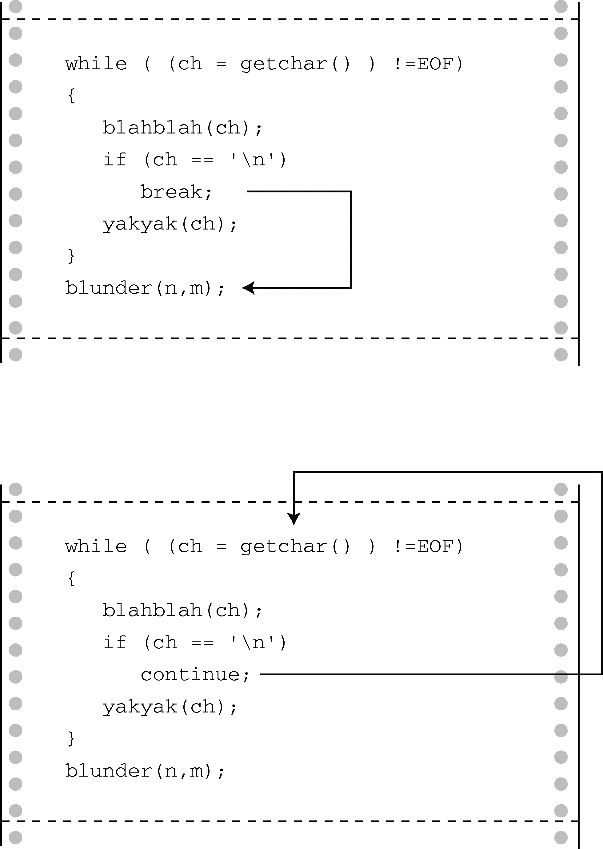

#### 7.6.2　 `break` 语句

程序执行到循环中的 `break` 语句时，会终止包含它的循环，并继续执行下一阶段。把程序清单7.9中的 `continue` 替换成 `break` ，在输入 `188` 时，不是跳至执行下一轮循环，而是导致退出当前循环。图7.3比较了 `break` 和 `continue` 。如果 `break` 语句位于嵌套循环内，它只会影响包含它的当前循环。


<center class="my_markdown"><b class="my_markdown">图7.3　比较 `break` 和 `continue`</b></center>

`break` 还可用于因其他原因退出循环的情况。程序清单7.10用一个循环计算矩形的面积。如果用户输入非数字作为矩形的长或宽，则终止循环。

程序清单7.10　 `break.c` 程序

```c
/* break.c -- 使用 break 退出循环 */
#include <stdio.h>
int main(void)
{
     float length, width;
     printf("Enter the length of the rectangle:\n");
     while (scanf("%f", &length) == 1)
     {
          printf("Length = %0.2f:\n", length);
          printf("Enter its width:\n");
          if (scanf("%f", &width) != 1)
               break;
          printf("Width = %0.2f:\n", width);
          printf("Area = %0.2f:\n", length * width);
          printf("Enter the length of the rectangle:\n");
     }
     printf("Done.\n");
     return 0;
}
```

可以这样控制循环：

```c
while (scanf("%f %f", &length, &width) == 2)
```

但是，用 `break` 可以方便显示用户输入的值。

和 `continue` 一样，如果用了 `break` 代码反而更复杂，就不要使用 `break` 。例如，考虑下面的循环：

```c
while ((ch = getchar()) != '\n')
{
     if (ch == '\t')
          break;
     putchar(ch);
}
```

如果把两个测试条件放在一起，逻辑就更清晰了：

```c
while ((ch = getchar() ) != '\n' && ch != '\t')
     putchar(ch);
```

`break` 语句对于稍后讨论的 `switch` 语句而言至关重要。

在 `for` 循环中的 `break` 和 `continue` 的情况不同，执行完 `break` 语句后会直接执行循环后面的第1条语句，连更新部分也跳过。嵌套循环内层的 `break` 只会让程序跳出包含它的当前循环，要跳出外层循环还需要一个 `break` ：

```c
int p, q;
scanf("%d", &p);
while (p > 0)
{
     printf("%d\n", p);
     scanf("%d", &q);
     while (q > 0)
     {
          printf("%d\n", p*q);
          if (q > 100)
               break; // 跳出内层循环
          scanf("%d", &q);
     }
     if (q > 100)
          break; // 跳出外层循环
     scanf("%d", &p);
}
```

