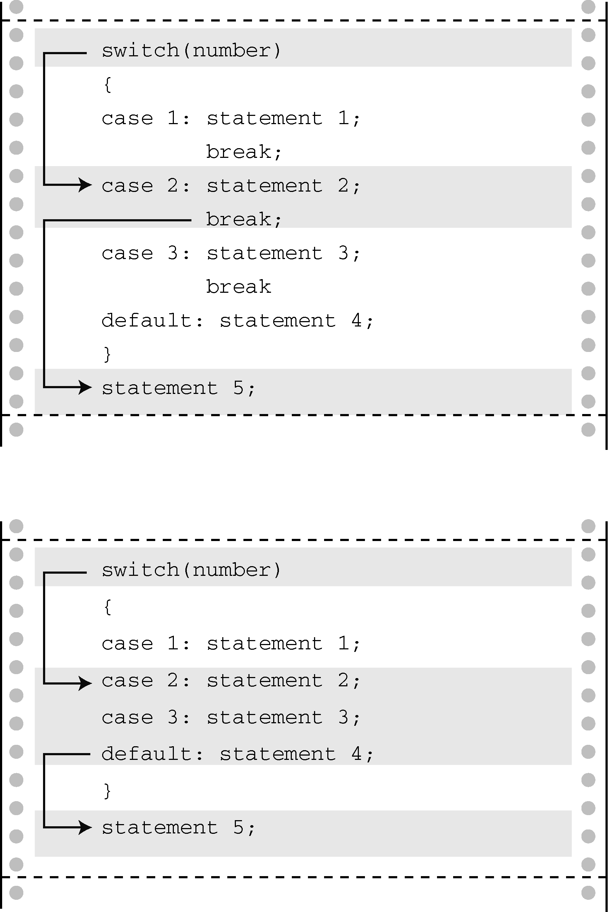

#### 7.7.1　 `switch` 语句

要对紧跟在关键字 `switch` 后圆括号中的表达式求值。在程序清单7.11中，该表达式是刚输入给 `ch` 的值。然后程序扫描标签（这里指， `case 'a' :` 、 `case 'b' :` 等）列表，直到发现一个匹配的值为止。然后程序跳转至那一行。如果没有匹配的标签怎么办？如果有 `default :` 标签行，就跳转至该行；否则，程序继续执行在 `switch` 后面的语句。

`break` 语句在其中起什么作用？它让程序离开 `switch` 语句，跳至 `switch` 语句后面的下一条语句（见图7.4）。如果没有 `break` 语句，就会从匹配标签开始执行到 `switch` 末尾。例如，如果删除该程序中的所有 `break` 语句，运行程序后输入 `d` ，其交互的输出结果如下：


<center class="my_markdown"><b class="my_markdown">图7.4　 `switch` 中有 `break` 和没有 `break` 的程序流</b></center>

```c
Give me a letter of the alphabet, and I will give an animal name
beginning with that letter.
Please type in a letter; type # to end my act.
d [enter]
desman, aquatic, molelike critter
echidna, the spiny anteater
fisher, a brownish marten
That's a stumper!
Please type another letter or a #.
# [enter]
Bye!

```

如上所示，执行了从 `case 'd':` 到 `switch` 语句末尾的所有语句。

顺带一提， `break` 语句可用于循环和 `switch` 语句中，但是 `continue` 只能用于循环中。尽管如此，如果 `switch` 语句在一个循环中， `continue` 便可作为 `switch` 语句的一部分。这种情况下，就像在其他循环中一样， `continue` 让程序跳出循环的剩余部分，包括 `switch` 语句的其他部分。

如果读者熟悉Pascal，会发现 `switch` 语句和Pascal的 `case` 语句类似。它们最大的区别在于，如果只希望处理某个带标签的语句，就必须在 `switch` 语句中使用 `break` 语句。另外，C语言的 `case` 一般都指定一个值，不能使用一个范围。

`switch` 在圆括号中的测试表达式的值应该是一个整数值（包括 `char` 类型）。 `case` 标签必须是整数类型（包括 `char` 类型）的常量或整型常量表达式（即，表达式中只包含整型常量）。不能用变量作为 `case` 标签。 `switch` 的构造如下：

```c
switch ( 整型表达式)
{
     case 常量1:
           语句 <--可选
     case 常量2:
           语句 <--可选
     default :         <--可选
           语句 <--可选
}

```

