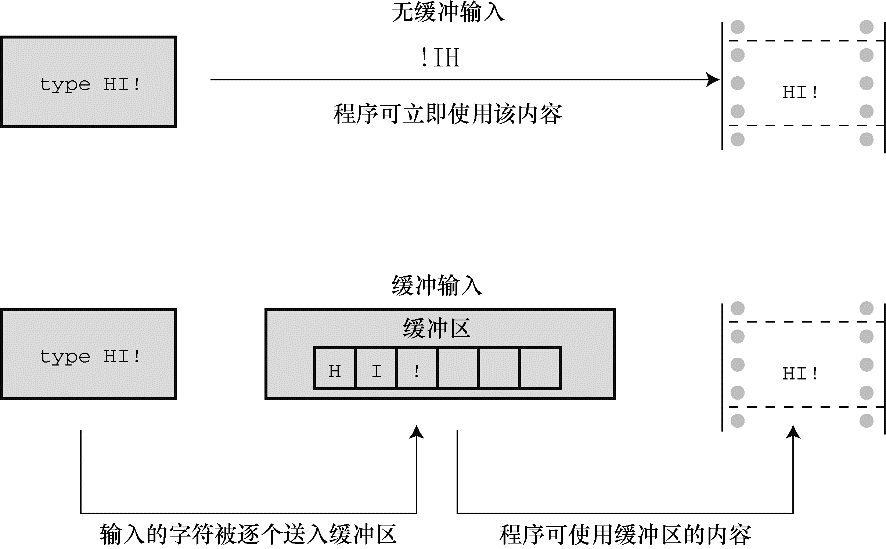

### 8.2　缓冲区

如果在老式系统运行程序清单8.1，你输入文本时可能显示如下：

```c
HHeelllloo,, tthheerree.. II wwoouulldd[enter]
lliikkee aa #
```

以上行为是个例外。像这样回显用户输入的字符后立即重复打印该字符是属于无缓冲（或直接）输入，即正在等待的程序可立即使用输入的字符。对于该例，大部分系统在用户按下Enter键之前不会重复打印刚输入的字符，这种输入形式属于缓冲输入。用户输入的字符被收集并存储在一个被称为缓冲区（buffer）的临时存储区，按下Enter键后，程序才可使用用户输入的字符。图8.1比较了这两种输入。


<center class="my_markdown"><b class="my_markdown">图8.1　缓冲输入和无缓冲输入</b></center>

为什么要有缓冲区？首先，把若干字符作为一个块进行传输比逐个发送这些字符节约时间。其次，如果用户打错字符，可以直接通过键盘修正错误。当最后按下Enter键时，传输的是正确的输入。

虽然缓冲输入好处很多，但是某些交互式程序也需要无缓冲输入。例如，在游戏中，你希望按下一个键就执行相应的指令。因此，缓冲输入和无缓冲输入都有用武之地。

缓冲分为两类：完全缓冲I/O和行缓冲I/O。完全缓冲输入指的是当缓冲区被填满时才刷新缓冲区（内容被发送至目的地），通常出现在文件输入中。缓冲区的大小取决于系统，常见的大小是512字节和4096字节。行缓冲I/O指的是在出现换行符时刷新缓冲区。键盘输入通常是行缓冲输入，所以在按下Enter键后才刷新缓冲区。

那么，使用缓冲输入还是无缓冲输入？ANSI C和后续的C标准都规定输入是缓冲的，不过最初K&R把这个决定权交给了编译器的编写者。读者可以运行 `echo.c` 程序观察输出的情况，了解所用的输出类型。

ANSI C决定把缓冲输入作为标准的原因是：一些计算机不允许无缓冲输入。如果你的计算机允许无缓冲输入，那么你所用的C编译器很可能会提供一个无缓冲输入的选项。例如，许多IBM PC兼容机的编译器都为支持无缓冲输入提供一系列特殊的函数，其原型都在 `conio.h` 头文件中。这些函数包括用于回显无缓冲输入的 `getche()` 函数和用于无回显无缓冲输入的 `getch()` 函数（回显输入意味着用户输入的字符直接显示在屏幕上，无回显输入意味着击键后对应的字符不显示）。UNIX系统使用另一种不同的方式控制缓冲。在UNIX系统中，可以使用 `ioctl()` 函数（该函数属于UNIX库，但是不属于C标准）指定待输入的类型，然后用 `getchar()` 执行相应的操作。在ANSI C中，用 `setbuf()` 和 `setvbuf()` 函数（详见第13章）控制缓冲，但是受限于一些系统的内部设置，这些函数可能不起作用。总之，ANSI没有提供调用无缓冲输入的标准方式，这意味着是否能进行无缓冲输入取决于计算机系统。在这里要对使用无缓冲输入的读者说声抱歉，本书假设所有的输入都是缓冲输入。

