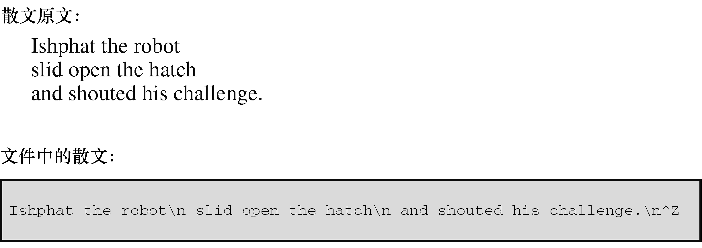

#### 8.3.2　文件结尾

计算机操作系统要以某种方式判断文件的开始和结束。检测文件结尾的一种方法是，在文件末尾放一个特殊的字符标记文件结尾。CP/M、IBM-DOS和MS-DOS的文本文件曾经用过这种方法。如今，这些操作系统可以使用内嵌的Ctrl+Z字符来标记文件结尾。这曾经是操作系统使用的唯一标记，不过现在有一些其他的选择，例如记录文件的大小。所以现代的文本文件不一定有嵌入的Ctrl+Z，但是如果有，该操作系统会将其视为一个文件结尾标记。图8.2演示了这种方法。


<center class="my_markdown"><b class="my_markdown">图8.2　带文件结尾标记的文件</b></center>

操作系统使用的另一种方法是存储文件大小的信息。如果文件有3000字节，程序在读到3000字节时便达到文件的末尾。MS-DOS及其相关系统使用这种方法处理二进制文件，因为用这种方法可以在文件中存储所有的字符，包括Ctrl+Z。新版的DOS也使用这种方法处理文本文件。UNIX使用这种方法处理所有的文件。

无论操作系统实际使用何种方法检测文件结尾，在C语言中，用 `getchar()` 读取文件检测到文件结尾时将返回一个特殊的值，即 `EOF` （end of file的缩写）。 `scanf()` 函数检测到文件结尾时也返回 `EOF` 。通常， `EOF` 定义在 `stdio.h` 文件中：

```c
#define EOF (-1)
```

为什么是 `-1` ？因为 `getchar()` 函数的返回值通常都介于 `0` ～ `127` ，这些值对应标准字符集。但是，如果系统能识别扩展字符集，该函数的返回值可能在 `0` ～ `255` 。无论哪种情况， `-1` 都不对应任何字符，所以，该值可用于标记文件结尾。

某些系统也许把 `EOF` 定义为 `-1` 以外的值，但是定义的值一定与输入字符所产生的返回值不同。如果包含 `stdio.h` 文件，并使用 `EOF` 符号，就不必担心 `EOF` 值不同的问题。这里关键要理解 `EOF` 是一个值，标志着检测到文件结尾，并不是在文件中找得到的符号。

那么，如何在程序中使用 `EOF` ？把 `getchar()` 的返回值和 `EOF` 作比较。如果两值不同，就说明没有到达文件结尾。也就是说，可以使用下面这样的表达式：

```c
while ((ch = getchar()) != EOF)
```

如果正在读取的是键盘输入不是文件会怎样？绝大部分系统（不是全部）都有办法通过键盘模拟文件结尾条件。了解这些以后，读者可以重写程序清单8.1的程序，如程序清单8.2所示。

程序清单8.2　 `echo_eof.c` 程序

```c
/* echo_eof.c -- 重复输入，直到文件结尾 */
#include <stdio.h>
int main(void)
{
     int ch;
     while ((ch = getchar()) != EOF)
          putchar(ch);
     return 0;
}
```

注意下面几点。

+ 不用定义 `EOF` ，因为 `stdio.h` 中已经定义过了。
+ 不用担心 `EOF` 的实际值，因为 `EOF` 在 `stdio.h` 中用 `#define` 预处理指令定义，可直接使用，不必再编写代码假定 `EOF` 为某值。
+ 变量 `ch` 的类型从 `char` 变为 `int` ，因为 `char` 类型的变量只能表示 `0` ～ `255` 的无符号整数，但是 `EOF` 的值是 `-1` 。还好， `getchar()` 函数实际返回值的类型是 `int` ，所以它可以读取 `EOF` 字符。如果实现使用有符号的 `char` 类型，也可以把 `ch` 声明为 `char` 类型，但最好还是用更通用的形式。
+ 由于 `getchar()` 函数的返回类型是 `int` ，如果把 `getchar()` 的返回值赋给 `cha` r类型的变量，一些编译器会警告可能丢失数据。
+ ch是整数不会影响 `putchar()` ，该函数仍然会打印等价的字符。
+ 使用该程序进行键盘输入，要设法输入 `EOF` 字符。不能只输入字符 `EOF` ，也不能只输入 `-1` （输入 `-1` 会传送两个字符：一个连字符和一个数字 `1` ）。正确的方法是，必须找出当前系统的要求。例如，在大多数UNIX和Linux系统中，在一行开始处按下Ctrl+D会传输文件结尾信号。许多微型计算机系统都把一行开始处的Ctrl+Z识别为文件结尾信号，一些系统把任意位置的Ctrl+Z解释成文件结尾信号。

下面是在UNIX系统下运行 `echo_eof.c` 程序的缓冲示例：

```c
She walks in beauty, like the night
She walks in beauty, like the night
 Of cloudless climes and starry skies...
  Of cloudless climes and starry skies...
                          Lord Byron
                          Lord Byron
[Ctrl+D]

```

每次按下Enter键，系统便会处理缓冲区中存储的字符，并在下一行打印该输入行的副本。这个过程一直持续到以UNIX风格模拟文件结尾（按下Ctrl+D）。在PC中，要按下Ctrl+Z。

我们暂停一会。既然 `echo_eof.c` 程序能把用户输入的内容拷贝到屏幕上，那么考虑一下该程序还可以做什么。假设以某种方式把一个文件传送给它，然后它把文件中的内容打印在屏幕上，当到达文件结尾发现 `EOF` 信号时停止。或者，假设以某种方式把程序的输出定向到一个文件，然后通过键盘输入数据，用 `echo_eof.c` 来存储在文件中输入的内容。假设同时使用这两种方法：把输入从一个文件定向到 `echo_eof.c` 中，并把输出发送至另一个文件，然后便可以使用 `echo_eof.c` 来拷贝文件。这个小程序有查看文件内容、创建一个新文件、拷贝文件的潜力，没想到一个小程序竟然如此多才多艺！关键是要控制输入流和输出流，这是我们下一个要讨论的主题。

> **注意　模拟EOF和图形界面**
> 模拟 `EOF` 的概念是在使用文本界面的命令行环境中产生的。在这种环境中，用户通过击键与程序交互，由操作系统生成 `EOF` 信号。但是在一些实际应用中，却不能很好地转换成图形界面（如Windows和Macintosh），这些用户界面包含更复杂的鼠标移动和按钮点击。程序要模拟 `EOF` 的行为依赖于编译器和项目类型。例如，Ctrl+Z可以结束输入或整个程序，这取决于特定的设置。

