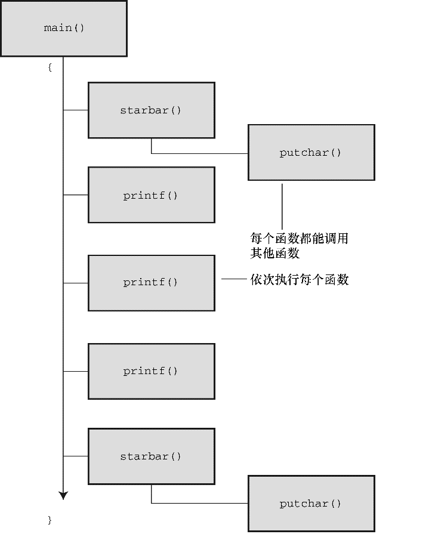
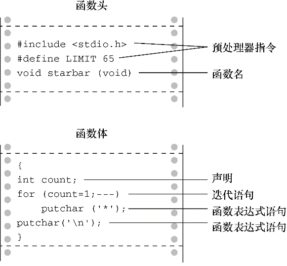

#### 9.1.2　分析程序

该程序要注意以下几点。

+ 程序在3处使用了 `starbar` 标识符：函数原型（function prototype）告诉编译器函数 `starbar()` 的类型；函数调用（function call）表明在此处执行函数；函数定义（function definition）明确地指定了函数要做什么。
+ 函数和变量一样，有多种类型。任何程序在使用函数之前都要声明该函数的类型。因此，在 `main()` 函数定义的前面出现了下面的ANSI C风格的函数原型： `   void starbar(void);`圆括号表明 `starbar` 是一个函数名。第1个 `void` 是函数类型， `void` 类型表明函数没有返回值。第2个 `void` （在圆括号中）表明该函数不带参数。分号表明这是在声明函数，不是定义函数。也就是说，这行声明了程序将使用一个名为 `starbar()` 、没有返回值、没有参数的函数，并告诉编译器在别处查找该函数的定义。对于不识别ANSI C风格原型的编译器，只需声明函数的类型，如下所示： `   void starbar();`注意，一些老版本的编译器甚至连 `void` 都识别不了。如果使用这种编译器，就要把没有返回值的函数声明为 `int` 类型。当然，最好还是换一个新的编译器。
+ 一般而言，函数原型指明了函数的返回值类型和函数接受的参数类型。这些信息称为该函数的签名（signature）。对于 `starbar()` 函数而言，其签名是该函数没有返回值，没有参数。
+ 程序把 `starbar()` 原型置于 `main()` 的前面。当然，也可以放在 `main()` 里面的声明变量处。放在哪个位置都可以。
+ 在 `main()` 中，执行到下面的语句时调用了 `starbar()` 函数： `   starbar();`这是调用 `void` 类型函数的一种形式。当计算机执行到 `starbar();` 语句时，会找到该函数的定义并执行其中的内容。执行完 `starbar()` 中的代码后，计算机返回主调函数（calling function）继续执行下一行（本例中，主调函数是 `main()` ），见图9.1（更确切地说，编译器把C程序翻译成执行以上操作的机器语言代码）。

<b class="my_markdown">图9.1　 `lethead1.c` （程序清单9.1）的程序流</b>

+ 程序中 `starbar()` 和 `main()` 的定义形式相同。首先函数头包括函数类型、函数名和圆括号，接着是左花括号、变量声明、函数表达式语句，最后以右花括号结束（见图9.2）。注意，函数头中的 `starbar()` 后面没有分号，告诉编译器这是定义 `starbar()` ，而不是调用函数或声明函数原型。

<b class="my_markdown">图9.2　简单函数的结构</b>

+ 程序把 `starbar()` 和 `main()` 放在一个文件中。当然，也可以把它们分别放在两个文件中。把函数都放在一个文件中的单文件形式比较容易编译，而使用多个文件方便在不同的程序中使用同一个函数。如果把函数放在一个单独的文件中，要把 `#define` 和 `#include` 指令也放入该文件。我们稍后会讨论使用多个文件的情况。现在，先把所有的函数都放在一个文件中。 `main()` 的右花括号告诉编译器该函数结束的位置，后面的 `starbar()` 函数头告诉编译器 `starbar()` 是一个函数。
+ `starbar()` 函数中的变量 `count` 是局部变量（local variable），意思是该变量只属于 `starbar()` 函数。可以在程序中的其他地方（包括 `main()` 中）使用 `count` ，这不会引起名称冲突，它们是同名的不同变量。

如果把 `starbar()` 看作是一个黑盒，那么它的行为是打印一行星号。不用给该函数提供任何输入，因为调用它不需要其他信息。而且，它没有返回值，所以也不给 `main()` 提供（或返回）任何信息。简而言之， `starbar()` 不需要与主调函数通信。

接下来介绍一个函数间需要通信的例子。

