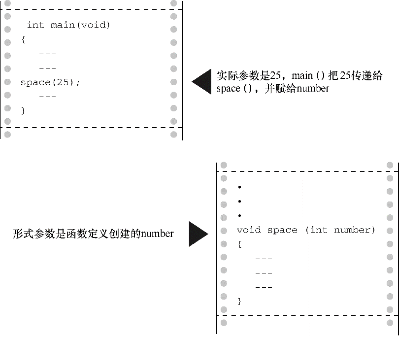

#### 9.1.6　调用带实际参数的函数

在函数调用中，实际参数（actual argument，简称实参）提供了 `ch` 和 `num` 的值。考虑程序清单9.2中第1次调用 `show_n_char()` ：

```c
show_n_char(SPACE, 12);
```

实际参数是空格字符和 `12` 。这两个值被赋给 `show_n_char()` 中相应的形式参数：变量 `ch` 和 `num` 。简而言之，形式参数是被调函数（called function）中的变量，实际参数是主调函数（calling function）赋给被调函数的具体值。如上例所示，实际参数可以是常量、变量，或甚至是更复杂的表达式。无论实际参数是何种形式都要被求值，然后该值被拷贝给被调函数相应的形式参数。以程序清单9.2中最后一次调用 `show_n_char()` 为例：

```c
show_n_char(SPACE, (WIDTH - strlen(PLACE)) / 2);
```

构成该函数第2个实际参数的是一个很长的表达式，对该表达式求值为 `10` 。然后， `10` 被赋给变量 `num` 。被调函数不知道也不关心传入的数值是来自常量、变量还是一般表达式。再次强调，实际参数是具体的值，该值要被赋给作为形式参数的变量（见图9.3）。因为被调函数使用的值是从主调函数中拷贝而来，所以无论被调函数对拷贝数据进行什么操作，都不会影响主调函数中的原始数据。

> **注意　实际参数和形式参数**
> 实际参数是出现在函数调用圆括号中的表达式。形式参数是函数定义的函数头中声明的变量。调用函数时，创建了声明为形式参数的变量并初始化为实际参数的求值结果。程序清单9.2中， `'` * `'` 和 `WIDTH` 都是第1次调用 `show_n_char()` 时的实际参数，而 `SPACE` 和 `11` 是第2次调用 `show_n_char()` 时的实际参数。在函数定义中， `ch` 和 `num` 都是该函数的形式参数。

`

`


图9.3　形式参数和实际参数

