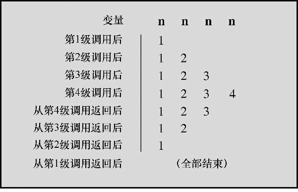

#### 9.3.2　递归的基本原理

初次接触递归会觉得较难理解。为了帮助读者理解递归过程，下面以程序清单9.6为例讲解几个要点。

第1，每级函数调用都有自己的变量。也就是说，第1级的 `n` 和第2级的 `n` 不同，所以程序创建了4个单独的变量，每个变量名都是 `n` ，但是它们的值各不相同。当程序最终返回 `up_and_down()` 的第1级调用时，最初的 `n` 仍然是它的初值 `1` （见图9.4）。

<b class="my_markdown">图9.4　递归中的变量</b>

第2，每次函数调用都会返回一次。当函数执行完毕后，控制权将被传回上一级递归。程序必须按顺序逐级返回递归，从某级 `up_and_down()` 返回上一级的 `up_and_down()` ，不能跳级回到 `main()` 中的第1级调用。

第3，递归函数中位于递归调用之前的语句，均按被调函数的顺序执行。例如，程序清单9.6中的打印语句 `#1` 位于递归调用之前，它按照递归的顺序：第1级、第2级、第3级和第4级，被执行了4次。

第4，递归函数中位于递归调用之后的语句，均按被调函数相反的顺序执行。例如，打印语句 `#2` 位于递归调用之后，其执行的顺序是第4级、第3级、第2级、第1级。递归调用的这种特性在解决涉及相反顺序的编程问题时很有用。稍后将介绍一个这样的例子。

第5，虽然每级递归都有自己的变量，但是并没有拷贝函数的代码。程序按顺序执行函数中的代码，而递归调用就相当于又从头开始执行函数的代码。除了为每次递归调用创建变量外，递归调用非常类似于一个循环语句。实际上，递归有时可用循环来代替，循环有时也能用递归来代替。

第6，递归函数必须包含能让递归调用停止的语句。通常，递归函数都使用 `if` 或其他等价的测试条件在函数形参等于某特定值时终止递归。为此，每次递归调用的形参都要使用不同的值。例如，程序清单9.6中的 `up_and_down(n)` 调用 `up_and_down(n+1)` 。最终，实际参数等于 `4` 时， `if` 的测试条件 `(n < 4)` 为假。

