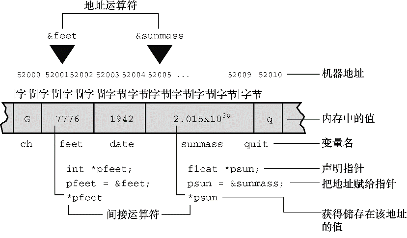

#### 9.7.2　声明指针

相信读者已经很熟悉如何声明 `int` 类型和其他基本类型的变量，那么如何声明指针变量？你也许认为是这样声明：

```c
pointer ptr; // 不能这样声明指针
```

为什么不能这样声明？因为声明指针变量时必须指定指针所指向变量的类型，因为不同的变量类型占用不同的存储空间，一些指针操作要求知道操作对象的大小。另外，程序必须知道存储在指定地址上的数据类型。 `long` 和 `float` 可能占用相同的存储空间，但是它们存储数字却大相径庭。下面是一些指针的声明示例：

```c
int * pi;        // pi是指向int类型变量的指针
char * pc;        // pc是指向char类型变量的指针
float * pf, * pg;    // pf、pg都是指向float类型变量的指针
```

类型说明符表明了指针所指向对象的类型，星号（*）表明声明的变量是一个指针。 `int`  *  `pi;` 声明的意思是 `pi` 是一个指针，* `pi` 是 `int` 类型（见图9.5）。


<center class="my_markdown"><b class="my_markdown">图9.5　声明并使用指针</b></center>

*和指针名之间的空格可有可无。通常，程序员在声明时使用空格，在解引用变量时省略空格。

`pc` 指向的值（* `pc` ）是 `char` 类型。 `pc` 本身是什么类型？我们描述它的类型是“指向 `char` 类型的指针”。 `pc` 的值是一个地址，在大部分系统内部，该地址由一个无符号整数表示。但是，不要把指针认为是整数类型。一些处理整数的操作不能用来处理指针，反之亦然。例如，可以把两个整数相乘，但是不能把两个指针相乘。所以，指针实际上是一个新类型，不是整数类型。因此，如前所述，ANSI C专门为指针提供了 `%p` 格式的转换说明。

