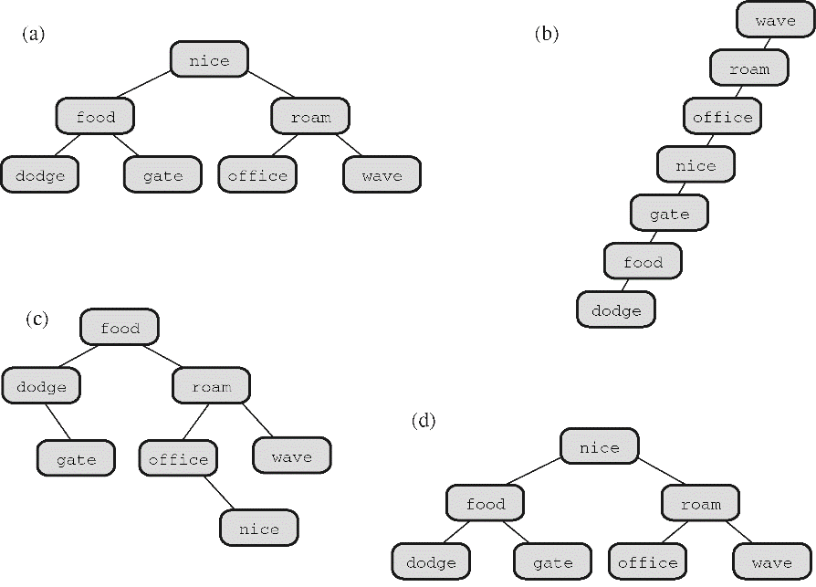
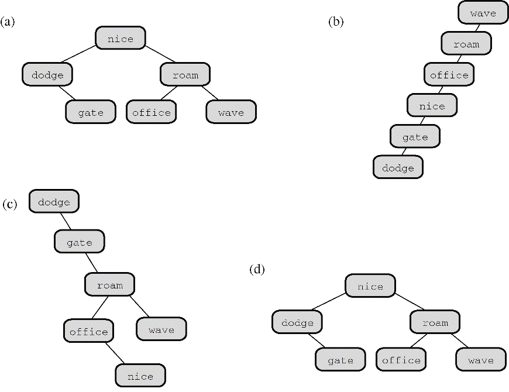

### A.17　第17章复习题答案

1．定义一种数据类型包括确定如何存储数据，以及设计管理该数据的一系列函数。

2．因为每个结构包含下一个结构的地址，但是不包含上一个结构的地址，所以这个链表只能沿着一个方向遍历。可以修改结构，在结构中包含两个指针，一个指向上一个结构，一个指向下一个结构。当然，程序也要添加代码，在每次新增结构时为这些指针赋正确的地址。

3．ADT是抽象数据类型，是对一种类型属性集和可以对该类型进行的操作的正式定义。ADT应该用一般语言表示，而不是用某种特殊的计算机语言，而且不应该包含实现细节。

4． **直接传递变量的优点：** 该函数查看一个队列，但是不改变其中的内容。直接传递队列变量，意味着该函数使用的是原始队列的副本，这保证了该函数不会更改原始的数据。直接传递变量时，不需要使用地址运算符或指针。

**直接传递变量的缺点：** 程序必须分配足够的空间存储整个变量，然后拷贝原始数据的信息。如果变量是一个大型结构，用这种方法将花费大量的时间和内存空间。

**传递变量地址的优点：** 如果待传递的变量是大型结构，那么传递变量的地址和访问原始数据会更快，所需的内存空间更少。

**传递变量地址的缺点：** 必须记得使用地址运算符或指针。在K&R C中，函数可能会不小心改变原始数据，但是用ANSI C中的const限定符可以解决这个问题。

5．a．

**类型名：**
栈

**类型属性：**
可以存储有序项

**类型操作：**
初始化栈为空

确定栈是否为空

确定栈是否已满

从栈顶添加项（压入项）

从栈顶删除项（弹出项）

b．下面以数组形式实现栈，但是这些信息只影响结构定义和函数定义的细节，不会影响函数原型的接口。

```c
/* stack.h –– 栈的接口 */
#include <stdbool.h>
/* 在这里插入 Item 类型 */
/* 例如： typedef int Item; */
#define MAXSTACK 100
typedef struct stack
{
　　 Item items[MAXSTACK];　/* 存储信息        */
　　 int top;　　　　        /* 第1个空位的索引 */
} Stack;
/* 操作：　　　初始化栈　　　　　　　　　　　　　　　　　　　　　*/
/* 前提条件：　ps 指向一个栈　　　　　　　　　　　　　　　　　　 */
/* 后置条件：　该栈被初始化为空　　　　　　　　　　　　　　　　　*/
void InitializeStack(Stack * ps);
/* 操作：　　　检查栈是否已满　　　　　　　　　　　　　　　　　　*/
/* 前提条件：　ps 指向之前已被初始化的栈　　　　　　　　　　　　*/
/* 后置条件：　如果栈已满，该函数返回true；否则，返回false　　 */
bool FullStack(const Stack * ps);
/* 操作：　　　检查栈是否为空　　　　　　　　　　　　　　　　　　*/
/* 前提条件：　ps 指向之前已被初始化的栈　　　　　　　　　　　　*/
/* 后置条件：　如果栈为空，该函数返回true；否则，返回false　　 */
bool EmptyStack(const Stack *ps);
/* 操作：　　　把项压入栈顶　　　　　　　　　　　　　　　　　　　*/
/* 前提条件：　ps 指向之前已被初始化的栈　　　　　　　　　　　　*/
/*　　　　　　 item 是待压入栈顶的项　　　　　　　　　　　　　　*/
/* 后置条件：　如果栈不满，把 item 放在栈顶，该函数返回ture；　*/
/*　　　　　　 否则，栈不变，该函数返回 false　　　　　　　　　 */
bool Push(Item item, Stack * ps);
/* 操作：　　　从栈顶删除项　　　　　　　　　　　　　　　　　　　*/
/* 前提条件：　ps 指向之前已被初始化的栈　　　　　　　　　　　　*/
/* 后置条件：　如果栈不为空，把栈顶的item拷贝到*pitem，　　　　*/
/*　　　删除栈顶的item，该函数返回ture；　　　　　　　　　　　　*/
/*　　　如果该操作后栈中没有项，则重置该栈为空。　　　　　　　　*/
/*　　　如果删除操作之前栈为空，栈不变，该函数返回false　　　 　*/
bool Pop(Item *pitem, Stack * ps);
```

6．比较所需的最大次数如下：

| 项 | 顺序查找 | 二分查找 |
| :-----  | :-----  | :-----  | :-----  | :-----  |
| `3` | `3` | `2` |
| `1023` | `1023` | `10` |
| `65535` | `65535` | `16` |

7．见图A.1。


<center class="my_markdown"><b class="my_markdown">图A.1　单词的二分查找树</b></center>

8．见图A.2。


<center class="my_markdown"><b class="my_markdown">图A.2　删除项后的单词二分查找树</b></center>

[1]　这句英文翻译成中文是“这句话是出色的捷克人”。显然不知所云，这就是语言中的语义错误。——译者注

[2]　 `thrice_n` 本应表示n的3倍，但是 `3 + n` 表示的并不是 `n` 的3倍，应该用 `3` * `n` 来表示。——译者注


