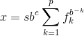

#### B.8.1　IEC浮点标准

国际电工技术委员会（IEC）已经发布了一套浮点计算的标准（IEC 60559）。该标准包括了浮点数的格式、精度、NaN、无穷值、舍入规则、转换、异常以及推荐的函数和算法等。C99纳入了该标准，将其作为C实现浮点计算的指导标准。C99新增的大部分浮点工具（如， `fenv.h` 头文件和一些新的数学函数）都基于此。另外， `float.h` 头文件定义了一些与IEC浮点模型相关的宏。

#### 1．浮点模型

下面简要介绍一下浮点模型。标准把浮点数 `x` 看作是一个基数的某次幂乘以一个分数，而不是C语言的 `E` 记数法（例如，可以把 `876.54` 写成 `0.87654E3` ）。正式的浮点表示更为复杂：



简单地说，这种表示法把一个数表示为有效数（significand）与 `b` 的 `e` 次幂的乘积。

下面是各部分的含义。

`s` 代表符号（± `1` ）。

`b` 代表基数。最常见的值是 `2` ，因为浮点处理器通常使用二进制数学。

`e` 代表整数指数（不要与自然对数中使用的数值常量 `e` 混淆），限制最小值和最大值。这些值依赖于留出存储指数的位数。

`fk` 代表基数为 `b` 时可能的数字。例如，基数为 `2` 时，可能的数字是 `0` 和 `1` ；在十六进制中，可能的数字是 `0` ～ `F` 。

`p` 代表精度，基数为 `b` 时，表示有效数的位数。其值受限于预留存储有效数字的位数。

明白这种表示法的关键是理解 `float.h` 和 `fenv.h` 的内容。下面，举两个例子解释内部如何表示浮点数。

首先，假设一个浮点数的基数 `b` 为 `10` ，精度 `p` 为 `5` 。那么，根据上面的表示法， `24.51` 应写成：

`(+1)10<sup class="my_markdown">3</sup>(2/10 + 4/100 + 5/1000 + 1/10000 + 0/100000)`

假设计算机可存储十进制数（ `0` ～ `9` ），那么可以存储符号、指数 `3` 和 `5` 个f<sub class="my_markdown">k</sub>值： `2` 、 `4` 、 `5` 、 `1` 、 `0` （这里，f<sub>1</sub>是2，f<sub>2</sub>是4，等等）。因此，有效数是 `0.24510` ，乘以 `10<sup class="my_markdown">3</sup>` 得 `24.51` 。

接下来，假设符号为正，基数 `b` 是 `2` ， `p` 是 `7` （即，用 `7` 位二进制数表示），指数是 `5` ，待存储的有效数是 `1011001` 。下面，根据上面的公式构造该数：

`x = (+1)2<sup class="my_markdown">5</sup> (1/2 +0/4 + 1/8 + 1/16 + 0/32 + 0/64 + 1/128)`

`= 32(1/2 +0/4 + 1/8 + 1/16 + 0/32 + 0/64 + 1/128)`

`= 16 + 0 + 4 + 2 +0 + 0 + 1/4 = 22.25`

`float.h` 中的许多宏都与该浮点表示相关。例如，对于一个 `float` 类型的值，表示基数的 `FLT_RADIX` 是 `b` ，表示有效数位数（基数为 `b` 时）的 `FLT_MANT_DIG` 是 `p` 。

#### 2．正常值和低于正常的值

正常浮点值（normalized floating-point value）的概念非常重要，下面简要介绍一下。为简单起见，先假设系统使用十进制（ `b = FLT_RADIX = 10` ）和浮点值的精度为 `5` （ `p = FLT_MANT_DIG = 5` ）（标准要求的精度更高）。考虑下面表示 `31.841` 的方式：

指数 = 3，有效数 = .31841（.31841
`E`
3）

指数 = 4，有效数 = .03184（.03184
`E`
4）

指数 = 5，有效数 = .00318（.00318
`E`
5）

显而易见，第 `1` 种方法精度最高，因为在有效数中使用了所有的 `5` 位可用位。规范化浮点非零值是第 `1` 位有效位为非零的值，这也是通常存储浮点数的方式。

现在，假设最小指数（ `FLT_MIN_EXP` ）是 `-10` ，那么最小的规范值是：

指数 = -10，有效数 = .10000（.10000
`E`
-10）

通常，乘以或除以 `10` 意味着使指数增大或减小，但是在这种情况下，如果除以 `10` ，却无法再减小指数。但是，可以改变有效数获得这种表示：

指数 = -10，有效数 = .01000（.01000
`E`
-10）

这个数被称为低于正常的（subnormal），因为该数并未使用有效数的全精度。例如， `0.12343E-10` 除以 `10` 得 `.01234E-10` ，损失了一位的信息。

对于这个特例， `0.1000E-10` 是最小的非零正常值（ `FLT_MIN` ），最小的非零低于正常值是 `0.00001E-10` （ `FLT_TRUE_MIN` ）。

`float.h` 中的宏 `FLT_HAS_SUBNURM` 、 `DBL_HAS_SUBNORM` 和 `LDBL_HAS_SUBNORM` 表征实现如何处理低于正常的值。下面是这些宏可能会用到的值及其含义：

-1　　不确定（尚未统一）

0　　 不存在（例如，实现可能会用0替换低于正常的值）

1　　 存在

`math.h` 库提供一些方法，包括 `fpclassify()` 和 `isnormal()` 宏，可以识别程序何时生成低于正常的值，这样会损失一些精度。

#### 3．求值方案

`float.h` 中的宏 `FLT_EVAL_METHOD` 确定了实现采用何种浮点表达式的求值方案，如下所示（有些实现还会提供其他负值选项）。

-1　　不确定

0　　 对在所有浮点类型范围和精度内的操作、常量求值

1　　 对在 `double` 类型的精度内和 `float` 、 `double` 类型的范围内的操作、常量求值，对 `longdouble` 范围内的 `long`   `double` 类型的操作、常量求值

2　　 对所有浮点类型范围内和 `long`   `double` 类型精度内的操作和常量求值

例如，假设程序中要把两个 `float` 类型的值相乘，并把乘积赋给第 `3` 个 `float` 类型变量。对于选项 `1` （即K&R C采用的方案），这两个 `float` 类型的值将被扩展为 `double` 类型，使用 `double` 类型完成乘法计算，然后在赋值计算结果时再把乘积转为 `float` 类型。

如果选择 `0` （即ANSI C采用的方案），实现将直接使用这两个 `float` 类型的值相乘，然后赋值乘积。这样做比选项 `1` 快，但是会稍微损失一点精度。

#### 4．舍入

`float.h` 中的宏 `FLT_ROUNDS` 确定了系统如何处理舍入，其指定值所对应的舍入方案如下所示。

-1　　不确定

0　　 趋零截断

1　　 舍入到最接近的值

2　　 趋向正无穷

3　　 趋向负无穷

系统可以定义其他值，对应其他舍入方案。

一些系统提供控制舍入的方案，在这种情况下， `fenv.h` 中的 `festround()` 函数提供编程控制。

如果只是计算制作 `37` 个蛋糕需要多少面粉，这些不同的舍入方案可能并不重要，但是对于金融和科学计算而言，这很重要。显然，把较高精度的浮点值转换成较低精度值时需要使用舍入方案。例如，把 `double` 类型的计算结果赋给 `float` 类型的变量。另外，在改变进制时，也会用到舍入方案。不同进制下精确表示的分数不同。例如，考虑下面的代码：

```c
float x = 0.8;
```

在十进制下， `8/10` 或 `4/5` 都可以精确表示 `0.8` 。但是大部分计算机系统都以二进制存储结果，在二进制下， `4/5` 表示为一个无限循环小数：

```c
0.1100110011001100...
```

因此，在把 `0.8` 存储在 `x` 中时，将其舍入为一个近似值，其具体值取决于使用的舍入方案。

尽管如此，有些实现可能不满足IEC 60559的要求。例如，底层硬件可能无法满足要求。因此，C99定义了两个可用作预处理器指令的宏，检查实现是否符合规范。第 `1` 个宏是 `_ _STDC_IEC_559_ _` ，如果实现遵循IEC 60559浮点规范，该宏被定义为常量 `1` 。第 `2` 个宏是 `_ _STDC_IEC_559_COMPLEX_ _` ，如果实现遵循IEC 60559兼容复数运算，该宏被定义为常量 `1` 。

如果实现中未定义这两个宏，则不能保证遵循IEC 60559。

