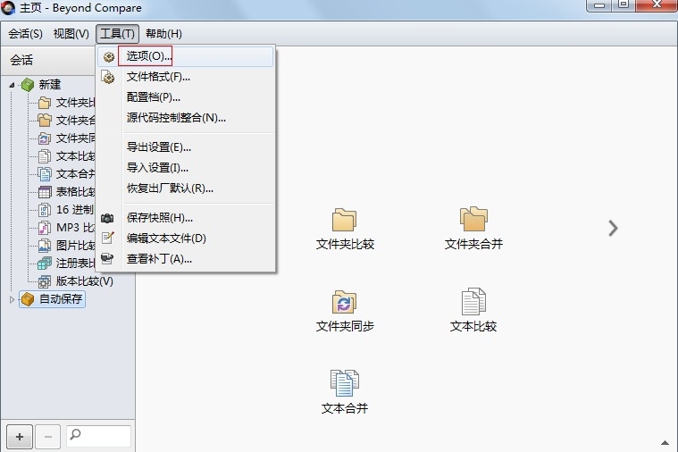
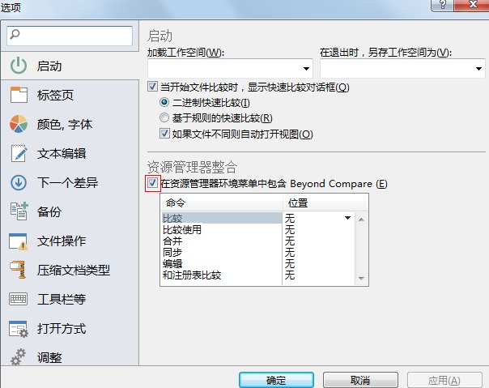
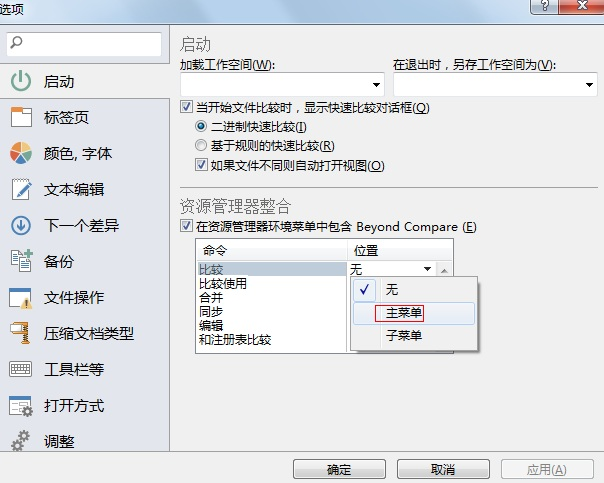

[toc]

> 参考自：<https://www.beyondcompare.cc/wenti/youjian-caidan.html>

### 步骤一

打开 `Beyond Compare` 软件，点击菜单栏 `工具` -> `选项...` 菜单。

### 步骤二：

在打开的选项对话框中，在左侧选择 "启动" 栏目，然后在右侧勾选 "在资源管理器环境菜单中包含 Beyond Compare (E)"：

### 步骤三

在 "资源管理器整合" 的 "比较" 命令右边的位置点击下拉按钮，选择主菜单：

