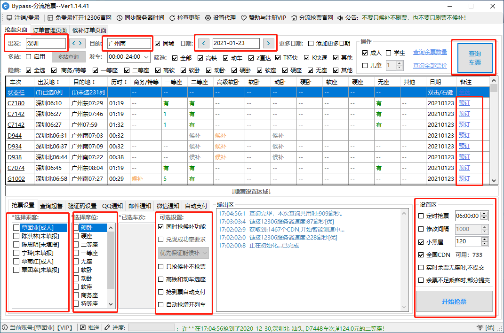

### 1. 12306Bypass 下载

12306Bypass 官网地址：<https://www.bypass.cn/>

### 2. 解压缩文件

将下载完成的压缩包解压缩到 C 盘根目录下。

### 3. 运行 12306Bypass

双击运行 `Bypass.exe` 文件，如果运行失败，则双击运行 `打不开安装这个.exe` 文件，当安装完成后，再运行 `Bypass.exe` 文件。

### 4. 登录账号

账号：18078274532

密码：tu033179ye

### 5. 应用界面说明

### 6. 操作说明

步骤1：在出发栏填写出发的火车站，深圳写：**深圳北**，广州写：**广州南**，柳州写：**柳州**。

步骤2：在目的栏填写目的的火车站，深圳写：**深圳北**，广州写：**广州南**，柳州写：**柳州**。

步骤3：点击 `查询车票` 按钮。

步骤4：在车次列表中要乘坐的车次的后面点击 `预订` 按钮，**确保选中的是 D 或 G 开头的车次**。**注意：因为需要换乘，所以一定要保证两趟车之间的间隔时间在20分钟以上。回家的车票一定要确保在16:30前到达柳州，不然没有车回家了。**

步骤5：在选择乘客下的列表框中选**我**。

步骤6：在选择席位下的列表框中选择**二等座**。

步骤7：在可选设置下的列表框中确保**勾选同时抢候补功能**。

步骤8：在设置区处，勾选定时抢票，时间设置为**可抢票时间快3秒**，比如抢票时间是 10:00，那么设置抢票时间为：9:59:57 。

步骤9：在设置区处，勾选修改间隔，设置值为 **100**。

步骤10：确保勾选 **小黑屋** 和 **全国CDN**。

步骤11：确保全国CDN后面的数值大于 **200** 后，点击开始抢票。

步骤12：点击应用标题下面的 `同步服务器时间` 按钮，使电脑时间与服务器同步。

> 注意：在输出区中会有相关状态的日志输出，请确保抢票的日志和定时的时间正确。