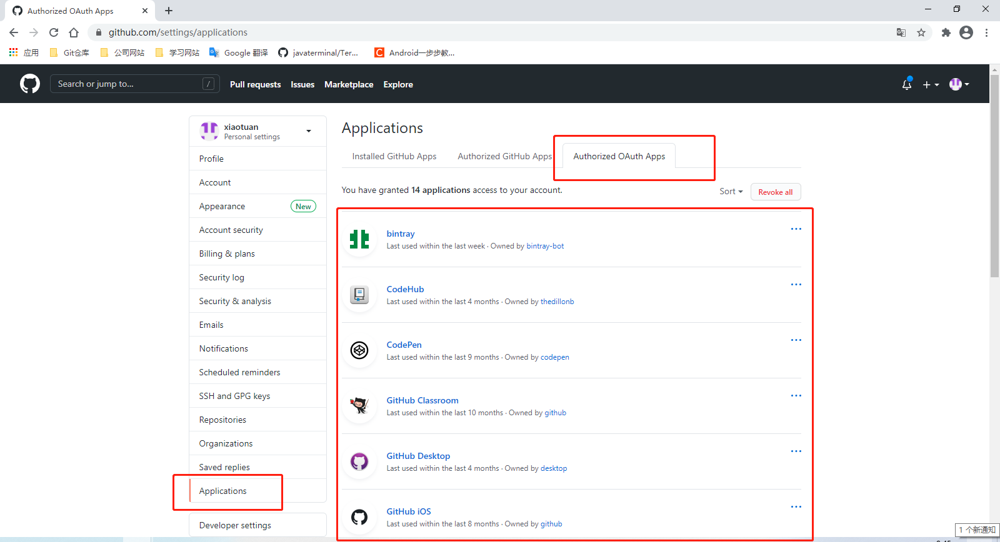

可以通过以下步骤管理 GitHub 对第三方应用或网站的授权。

1. 打开 [Github](https://github.com) 网站并登陆账号。

2. 进入用户账号设置界面。

3. 在设置界面的左边列表中选择 Applications 项。

4. 在 Application 设置项中选择 Authorized OAuth Apps 选项卡，所有对第三方的授权都在这里了。

   