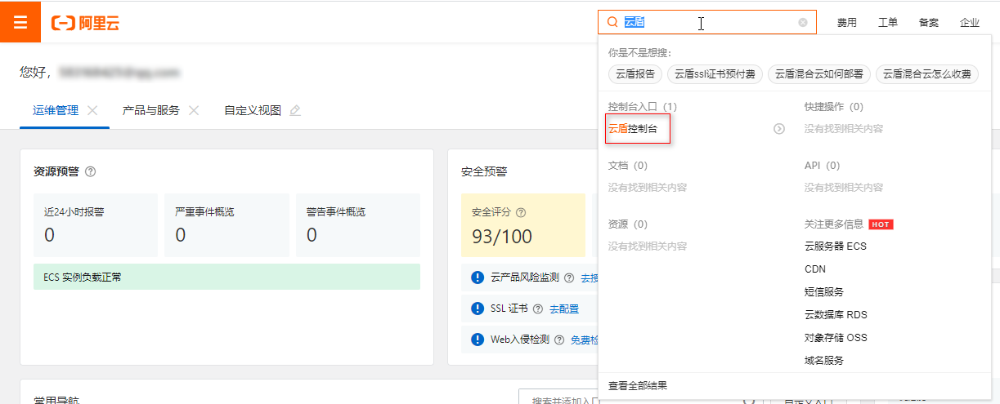
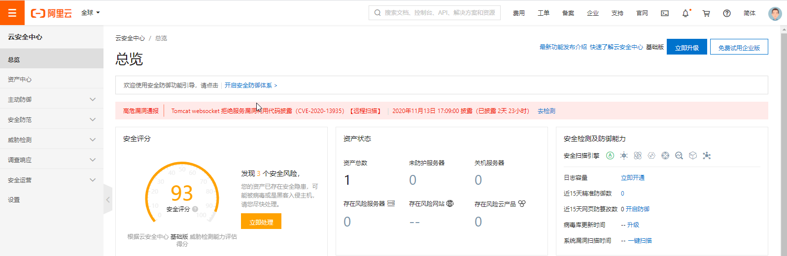
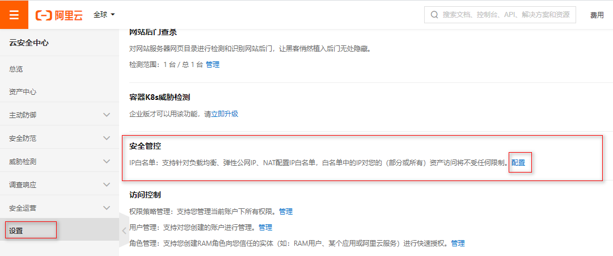
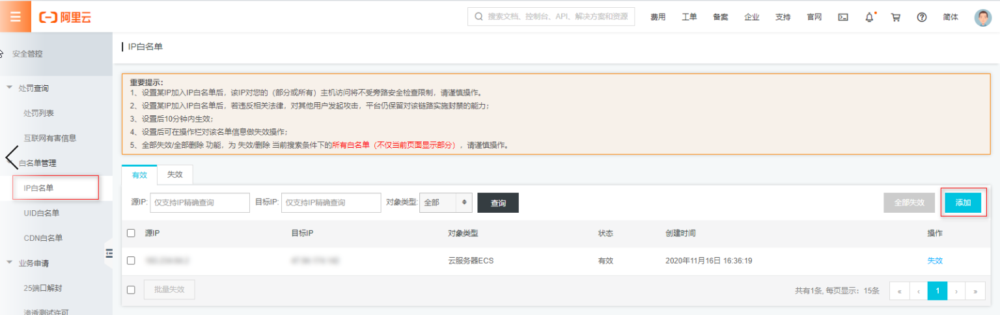
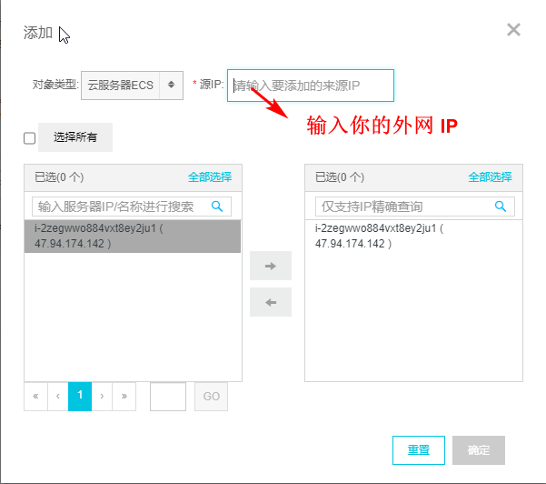

通过 ssh 连接阿里云服务器时，出现 Connection reset by peer 的错误，导致无法连接。解决办法如下：

（1）在自己电脑上执行下面命令获取本机的外网 IP。

```console
# curl ifconfig.me
```

（2）进入阿里云控制后台，在搜索框中搜索 "云盾"，点击进入云盾控制界面。





（3）点击设置 -> 安全管控项中的配置。



（4）添加信任，洗白 IP。





（5）登陆测试。

```console
# ssh root@183.234.64.2 -p 22
```

