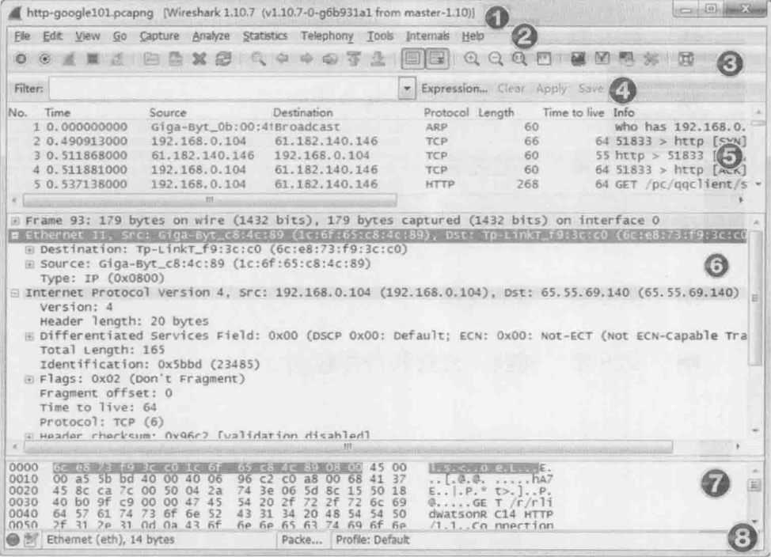

+ ① 标题栏 —— 用于显示文件名称、捕获的设备名称和 Wireshark 版本号。
+ ② 菜单栏 —— Wireshark 的标准菜单栏。
+ ③ 工具栏 —— 常用功能快捷键图标按钮。
+ ④ 显示过滤区域 —— 减少查看数据的复杂度。
+ ⑤ Packet List 面板 —— 显示每个数据帧的摘要。
+ ⑥ Packet Details 面板 —— 分析封包的详细信息。
+ ⑦ Packet Bytes 面板 —— 以十六进制和 ASCII 格式显示数据包的细节。
+ ⑧ 状态栏 —— 专家信息、注释、包数和 Profile 。