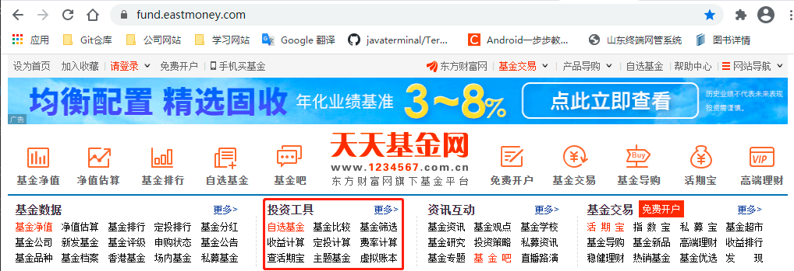
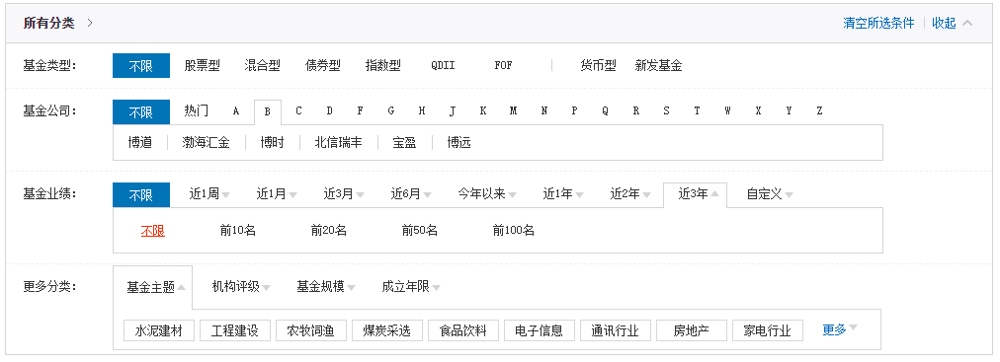
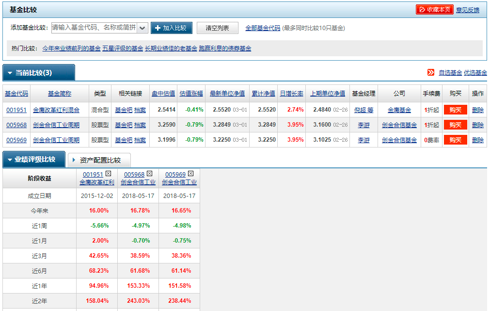
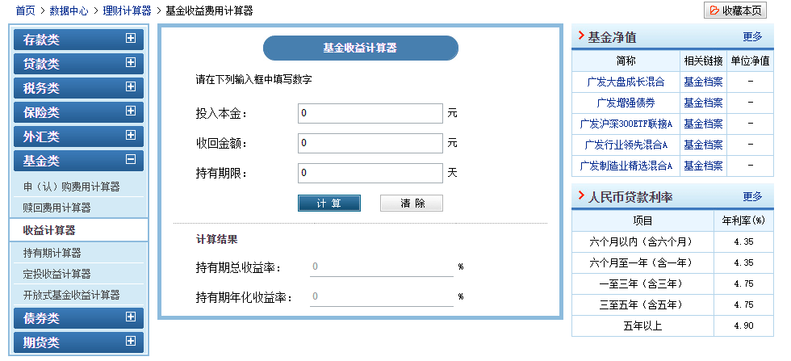

[toc]

### 1. 需要了解的 6 个基金指标

#### 1.1 基金类型

基金的类型包括股票型、混合型、债券型、指数型、QDII、FOF、保本型、分级A类、货币型、理财型及新发基金等。

#### 1.2 基金评级

基金评级是指有基金评级机构收集有关信息，通过科学定性、定量分析，依据一定的标准，对投资者投资于某一种基金后所需要承担的风险及能够获得的回报进行评估，并根据收益和风险的评估对基金进行排序。基金评级能给人对该基金最直观的评价，基金的星级高代表其历史表现不错。

#### 1.3 基金业绩

有些基金的成立时间未必很长，所以评级的时候可能会被忽略，在查看近几年的基金产品时，可以多多关注其上市后的历史收益情况。

#### 1.4 基金公司及经理

新发基金并没有历史数据可以参考，也不在评级系统内。这时优秀的基金经理与基金公司自然就是重要参考，当然这个指标也适用于老基金。基金经理是真正进行投资决策的人，但是每只成功的基金背后都不是只有一个负责投资的基金经理，而是有一个庞大的研究团队来分管投资研究和风险控制等各个环节。因此，基金公司的综合实力对筛选基金的投资者具有很高的参考价值。

#### 1.5 基金规模

对于跟踪同一标的指数的指数基金来说，基金规模越大，相对而言跟踪的误差也就越小。这主要是基于两个方面的原因：一方面，指数基金规模越大，遇到大规模申购和赎回时受到的冲击就越小；另一方面，规模越大，基金公司会投入越多用来提升基金管理的软硬件水平。

另外，对于 IPO 上市比较多的情况，若基金打新增强比较多，这时不是选择基金规模越大越好，反而是最优规模基金打新额外对指数基金增强效果更好，通常，选择规模在 2 亿元以上的指数基金就可以了。

#### 1.6 基金费用

基金的费用主要包括两类，一类是交易费用，包括申购费和赎回费，这类费用在买卖基金的时候收取；另一类是运营费用，包括管理费、托管费和销售服务费，这类费用每天从基金资产中计提，直接体现在基金净值中。如果只关注某只基金的高收益，而忽略其可能的高费用，那么你的收益可能会被费用慢慢 “侵蚀”。

### 2. 基金的筛选方法

可以有效利用 "天天基金网"（<http://www.1234567.com.cn/>）上面提供的 “投资工具” 中的功能，辅助自己进行基金产品的选择。

#### 2.1 基金筛选

可以直接在 “天天基金网” 通过 “基金筛选” 功能，清楚明白地看待自己可选择的基金投资选项。

第一步：选择想投资的 “基金类型”；

第二步：选择信赖的 “基金公司”；

第三步：选择所希望的 “基金业绩”；

第四步：如果有其他要求，还可以在 “更多分类” 中今夕选择。

#### 2.2 基金比较

当你对自己将要投资的基金产品有了大致的选择范围后，就可以进一步通过 ”基金比较“ 功能简单挑出几只自己更加看好的基金产品进行比较。

第一步：输入想比较的基金的名称或代码，点击 “加入比较“ 按钮；

第二步：输入下一个基金的名称或代码，点击 “加入比较” 按钮；

第三步：添加完参与比较的基金后，就可以看到各基金在 “业绩评级” 与资产配置“ 中各方面的详细比较。

#### 2.3 收益计算

可以通过 “收益计算” 功能查看自己的收益情况。

第一步：输入投资本金；

第二步：输入最终收回金额数；

第三步：输入总持有期限，点击 ”计算“ 按钮， 得出 ”持有期总收益率“ 与 ”持有期年化收益率“。

#### 2.4 定投收益计算（无效）

“天天基金网” 的 “定投计算” 功能可以直接帮你解决这个问题。

第一步：输入所定投的基金的代码；

第二步：输入定投开始日期；

第三步：选择定投周期，是周定投还是月定投，以及多久定投一次。

第四步：输入每期投入的金额；

第五步：点击 ”计算“按钮即可得到定投收益结果，十分方便。

