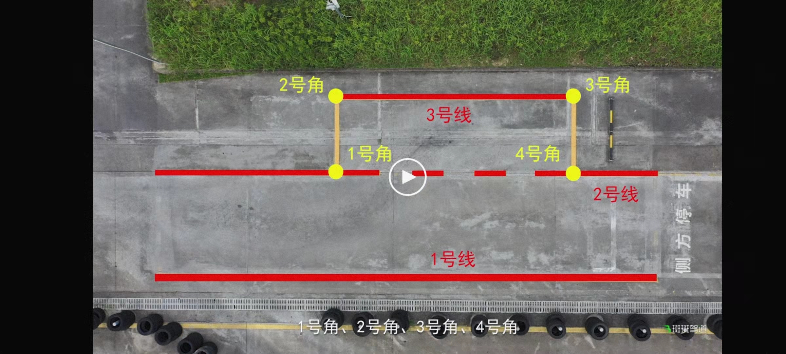

[toc]

### 1. 左倒库

1. 车辆从车库中直线驶出，当左边门把手与 2 号线重合时，向左打一圈加90度的方向盘。

   > 注意：
   >
   > 1. 在车辆驶出前，如果车辆在车库的位置离 5 号线距离过小时，在驶出出车库前向右打 90 度方向盘，当车前轮驶出车库后回正方向盘。
   > 2. 在车辆驶出前，如果车辆在车库的位置离 5 号线距离过大时，在驶出出车库前向左打 90 度方向盘，当车前轮驶出车库后回正方向盘。
   > 3. 上面两点中，回正方向盘的时机不是固定的，只要车辆出库时不会压到 4 号角即可。

2. 当车辆门把手与 4 号线重合时停车，保持方向盘位置不变，挂倒挡倒车。

   > 注意：
   >
   > 1. 车前轮必须压在或驶过 4 号线，因此可以在门把手与 4 号线重合时继续开过去一点。

3. 当左后轮压在 5 号线延长线上时，注意观察左后轮的延长线。当左后轮延长线与 4 号角的距离为 30 厘米，或左后轮外边缘刚好压在左边第一个虚线实块的左边缘上时回 90 度方向盘。

   > 注意：
   >
   > 1. 真实情况下，上面的情形是不会出现的，需要通过微调才可以达到。
   > 2. 当左后轮压在 5 号线延长时，如果左后轮的延长线与 4 号角距离过小时，回 90 度方向盘。
   > 3. 当左后轮压在 5 号线延长时，如果左后轮的延长线与 4 号角距离过大时，打死方向盘。

4. 当车身与 5 号线成倒八字时，回正方向盘。

   >  注意：
   >
   > 1. 如果左后轮与 5 号线的距离过大，则保持当前方向盘不变，直到左后轮与 5 号线的距离合适时回正方向盘，然后马上向右打方向盘，使其车身回正。具体打多少方向盘，要看车身与 5 号线的夹角决定，如果夹角很大，则直接向右打死方向盘；如果夹角不大，则向右打 90 度即可。这个需要具体问题具体分析。
   > 2. 如果左后轮与 5 号线的距离过小，则在车身与 5 号线成倒八字时，回正方向盘，然后马上向右打方向盘。具体打多少需要看情况而定，当车身进入车库不到 1/3 时，向右打一圈方向盘；当车身进入车库 1/2 时，向右打 90 度方向盘。具体什么时候回正方向盘需要灵活判断，如果 1/3 进库，则可以慢些；如果 1/2 进库，则应该快些回正方向盘。
   > 3. 上面两种调节方向盘的操作，在回正方向盘时，应该避免左后轮压到 5 号线，或者右前轮压到 1 号角。因此，随着车入库的深度不断改变，可以调整的幅度就会越小。

5. 当左后视镜凹槽盖住 2 号线时停车。

      > 注意：
      >
      > 1. 上车后必须检查座位是否垫有东西，座椅位置要调好，不然会影响这个判断的。
      > 2. 我都是要在盖住 2 号线后还往后到一丁点，确保车前盖不会压到虚线。

### 2. 右倒库

1. 摆车，确保车头左边天线与 1 号线右边缘的距离有两个手指的宽度。

    > 注意：
    >
    > 1. 车辆行驶时，如果天线与 1 号线右边缘的距离过小，根据距离的大小，向右调整方向盘，差距越大调整方向盘的幅度也越大。
    > 2. 车辆行驶时，如果天线与 1 号线右边缘的距离过大，根据距离的大小，向左调整方向盘，差距越大调整方向盘的幅度也越大。

2. 当门把手与 7 号线重合时停车。

    > 注意：只要 7 号线在门把手和车窗锚钉之间停车都可以。

3. 挂倒挡倒车

4. 当左后视镜盖住 7 号线后 1秒，向右打满方向盘。

      > 注意：盖住后马上打满方向盘也是可以的，就是后面可能需要微调方向盘才可以。

5. 当左后视镜中看到 4 号角后回一圈方向盘。

      > 注意：
      >
      > 1. 如果当看到 4 号角时，左后轮已经快要压在虚线上时，不能回一圈方向盘，应该保存方向盘不动，继续倒车，车辆回正后继续倒车。当车辆与 5 号线呈 30 度角时回正方向盘，并向左打一圈方向盘使车辆回正。
      > 2. 当看到 4 号角回一圈方向盘后，如果左后轮还是与 5 号线距离过大，这时当车与 5 号线夹角呈 30 度时回正方向盘，当距离合适后，向右打方向盘使其车身回正。其实这一步骤也可以这样操作：当发现左侧车身与 5 号线距离过大时，可以向左转动方向盘，具体转多少需要看情况，当感觉左后轮与 5 号线直接的距离为 30 厘米时，向右打死方向盘，当车身与 5 号线成倒八字时回正方向盘。
      > 3. 上面两点都需要注意下，如果车身进入车库过多时，不易做过多的调整。且在做上面调整时，必须时刻关注车身或车轮不能压线。

6. 当车身与 5  号线呈倒八字时回正方向盘。

### 3. 侧方位停车

1. 摆车，确保车头前考试车的考字下面的勾与 2 号线重叠（或者说车头右侧三分之一处与 2 号线重叠。

2. 当车头盖住 1 号线末端时（看不到一号线）停车。

3. 向右打一圈方向盘，挂倒挡倒车。

   > 注意：
   >
   > 1. 如果开过了，则不能马上打方向盘，需要倒车到刚好看到 1 号线末端时，向右打一圈方向盘。
   > 2. 如果停车时还能看到 1 号线末端，则需要在倒车前多打些方向盘，等到差不多的时候需要回到向右一圈的状态，这个需要灵活处理。

4. 当在左后视镜中看到 3 号角时，回正方向盘。

5. 当左后轮压到虚线时，向左打死方向盘。

6. 当车前盖缝隙与 2 号线平行时停车。

7. 开启左转向灯 3 秒。

8. 挂 1 档，保持方向盘不动向前驶出车库。

9. 当左侧大灯处碰到 1 号线时回正方向盘，关掉左转向灯。

10. 当 1 号线在车头中间位置时，向右打一圈加 90 度方向盘。

11. 当车身回正后回正方向盘。

