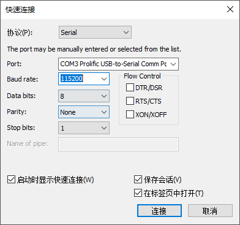
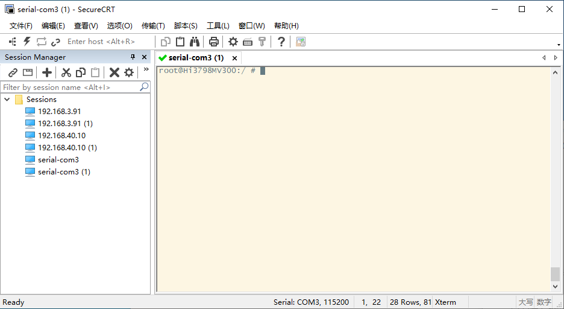

[toc]

### 1. 开启 ADB

**长虹现网开启 ADB 方法**

在 U 盘根目录下创建 cboxPrivOperation.json 文件，并在文件中输入如下内容：

```json
{
	"operation":"open-adb",
	"mac mode":"start-end",
	"mac":{
		"start":"00:00:00:00:00:00",
		"end":"00:00:00:00:00:00"
	}
}
```

然后将 U 盘插入设备中，启动设备即可。

**朝歌版本开启 ADB 方法**

+ 长虹、朝歌开发版本：

  根据[《新终端管理工具使用说明书》](https://kdocs.cn/l/spnYpd6t0N5b)连接。

+ 长虹、朝歌正式版本：

在 U 盘根目录创建一个 cmdcconfig 没有后缀的空文件。


### 2. 使用 SecureCRT 程序连接串口进行调试

+ 打开 SecureCRT 程序。
+ 打开 `文件 -> 快速连接(Q)...`.



+ 在弹出的对话框中，在协议选择框中选择 `serial`，Port 选择你的串口设备，Baud rate(波特率)选择 115200,，其他的保存默认，然后点击 `连接` 按钮。



+ 这时就可以调试设备了。

> 需要注意的是，执行完上面的操作后，SercureCRT 已经进入了设备的终端环境，因此，不需要再 adb 命令中输入 adb了。

> 提示：当设备可以进入调试模式后，U盘可以把出来，不会影响调试。