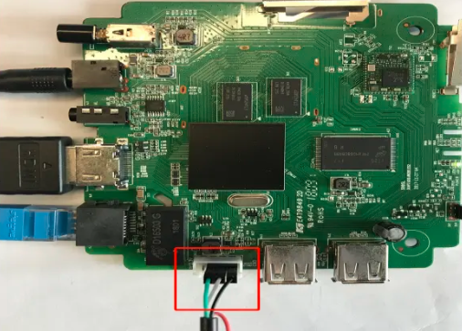

[toc]

### 串口工具与主板连接说明

#### 1. 朝歌盒子（101S/201-2/211-1/211-2）线序：黑绿白空

**CM101s:**

**CM201-2:**

#### 2. 长虹盒子（CM201-1/CM201-2_CH）线序：空绿白黑

**CM201-1:**

**CM201-2_CH:**

### 四根串口线

#### 1. 朝歌盒子（CM101S/CM201-2）/长虹盒子（CM201-1/CM201-2_CH）

#### 2. 朝歌盒子（CM101S/CM201-2）插入线位置：线口朝外

#### 3. 长虹盒子（CM201-1/CM201-2_CH）接入线位置：线口朝里

