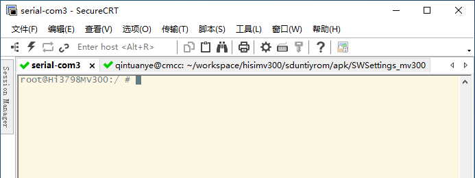

### 1. 使用串口通过SecureCRT连接机顶盒



具体连接方法请参考《[使用串口进行调试](./使用串口进行调试.md)》

### 2. 在 SecureCRT 窗口中输入如下命令：

```shell
$ mount -o remount rw /system;busybox vi /system/etc/init.bigfish.sh
```

### 3. 修改 init.bigfish.sh文件

在vi编辑器中打开init.bigfish.sh后，连续按“j”键，光标移动到“busybox date -s 2015...000.00”这一行的下面的空白行(第三行)，输入“i”进入编辑模式(或者按"o"换行，并进入编辑模式)。输入以下内容：

```
adb&
```

### 4. 使用网络连接机顶盒

在命令行窗口中输入如下命令：

```shell
$ adb connect 192.168.3.99 # 机顶盒 IP
connected to 192.168.3.99:5555
```

可以在命令行窗口中输入如下命令查看是否连接成功：

```shell
$ adb devices
List of devices attached
192.168.3.99:5555       device
```

