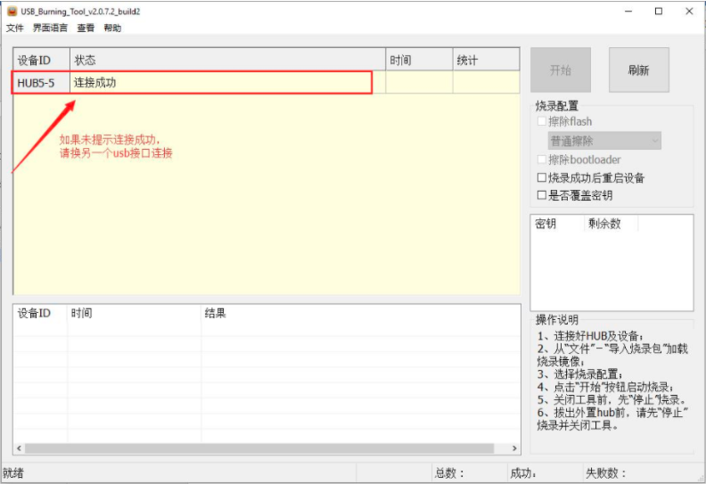
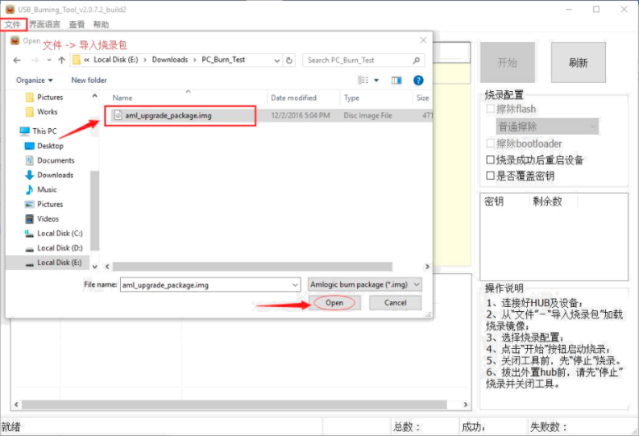
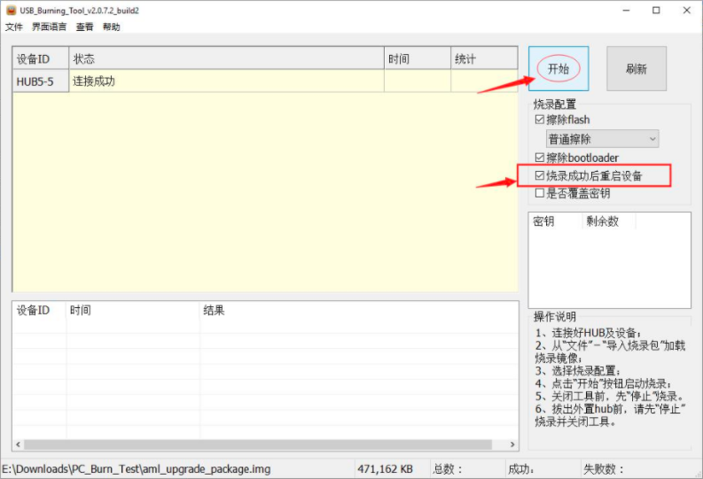
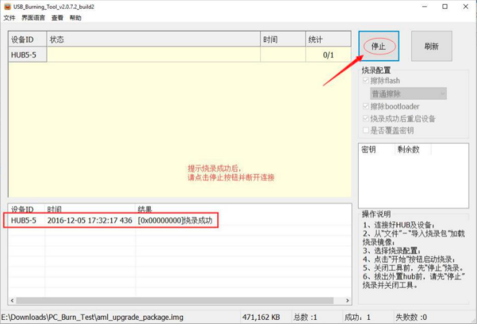

[toc]

### 1. 准备工作

**1. 安装 USB_Burning_Tool_v2.1.6.8.exe 软件**

> 注意：安装路径不能带空格且不能有中文字符，默认步骤安装即可。

**2. 准备烧录镜像文件**

> 注意：镜像文件的路径不能带有中文。

### 2. 烧录软件

第1步：打开 SecureCRT，使用串口连接机顶盒后输入命令 `reboot`，机顶盒重启，长按 <kbd>Ctrl</kbd> + <kbd>C</kbd> 键，输入 `store erase boot` 后继续输入 reboot。

第2步：双击打开 USB_Burning_Tool.exe 烧录软件，利用 USB 双公头线将板子与 PC 相连，将如下图显示连接成功（如果未显示，设备换一个 USB 端口再试）。

第3步：点击 “文件 -> 导入烧录包 -> 选择存放的 aml_upgrade_package.img 文件，然后点击 “打开” 按钮。

第4步：导入成功后，勾选 “烧录成功后重启设备”，并点击 “开始” 按钮。

第5步：等待进度条加载完成，中途请不要断开连接。

第6步：提示烧录成功后，盒子将会重启，请点击 “停止” 按钮，并断开连接。

> 提示：如果机顶盒连接上烧录线与 PC 相连，没有反应，可以尝试擦除全部数据，再重启新连接。具体操作：进入 uboot，输入命令 `store erase boot`。