[toc]

### 1. 登录 jenkins 网站

网站地址：<http://192.168.40.10:8080/>

### 2. 选择要编译的软件工程

#### 2.1 海思

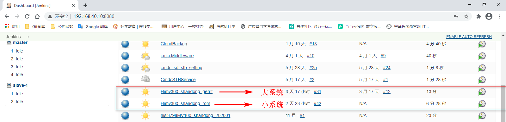

#### 2.2 Amlogic

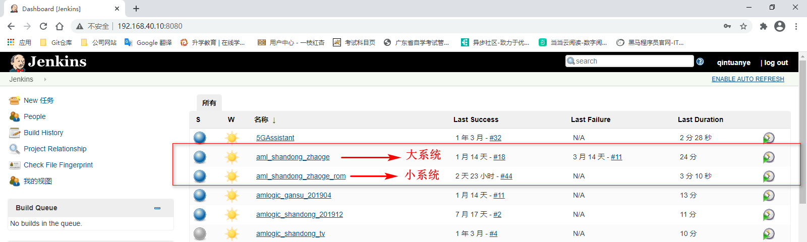

> 注意：可以通过后缀区分大系统工程和小系统工程，后缀带 `rom` 的是小系统工程，不带 `rom` 的是大系统工程。

### 3. 编译大系统（以海思为例）

点击界面中的立即构建即可编译大系统。

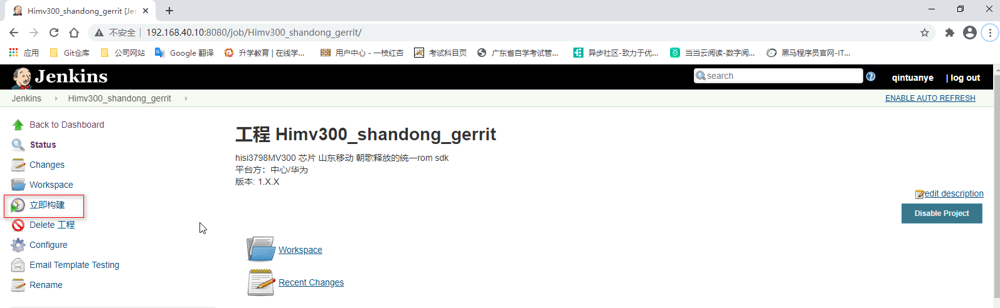

### 4. 下载编译生成的 release 压缩包

在工程界面中点击 Workspace 按钮

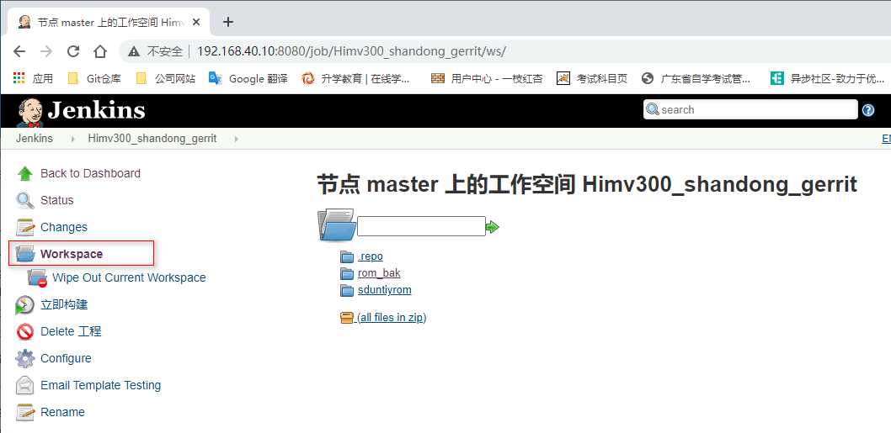

在右边界面中点击 rom_bak 项：

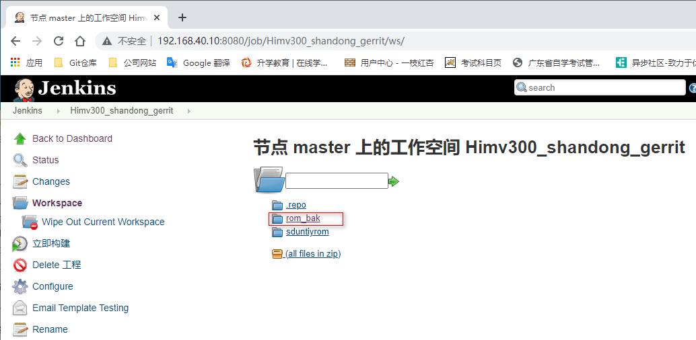

在 rom_bak 列表中选择对应日期时间的文件夹项：

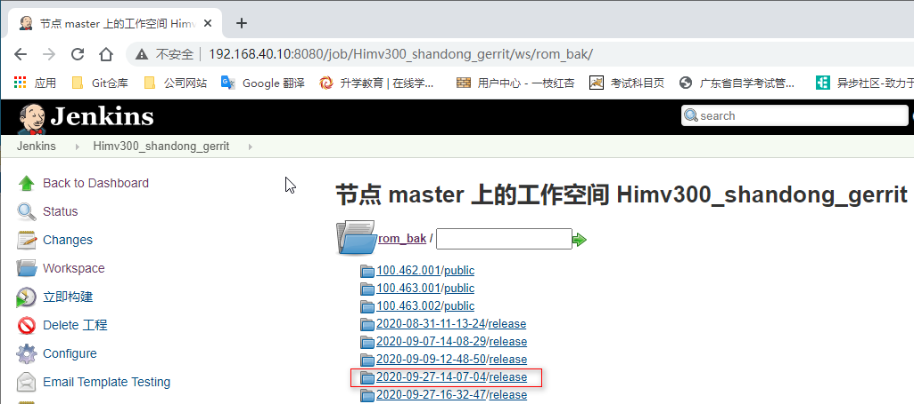

在显示的列表项中选择 release:

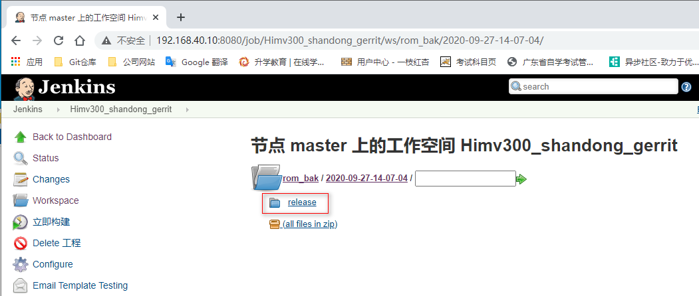

在显示的压缩包项中，点击下载该压缩包。

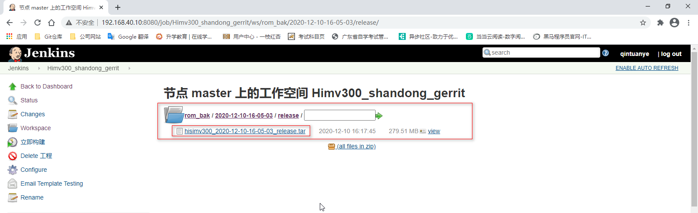

### 5. 解压缩 release 压缩包

将下载好的压缩包文件上传到自己的服务器空间，执行下面命令解压缩文件：

```console
$ tar -zxvf hisimv300_2020-12-10-16-05-03_release.tar
```

### 6. 生成有修改的文件到小系统中

只将有改动过的代码的编译生成文件替换到小系统的 release 目录下的对应文件。替换完成后提交代码到服务器上。

### 7. 编译小系统

进入到小系统的工程界面。

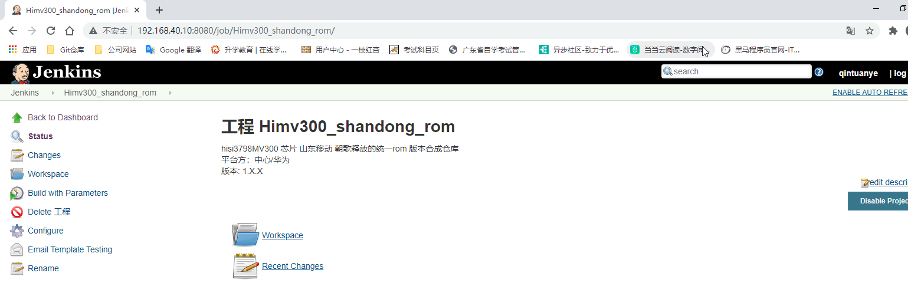

点击 Build with Parameters 按钮。在右边的界面中设置 PARAMETERS_BACKUP 和 VERSION 参数。

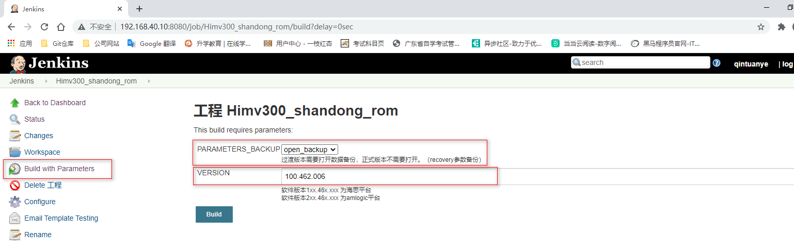

点击 Build 按钮开始编译。

> 注意：
>
> 如果要编译过渡版本，PARAMETERS_BACKUP 必须选择 open_backup，否则应该选择 close_backup。
>
> 统一ROM版本号必须比过渡版本号大，也就是加 1。

### 8. 下载最终软件

当小系统编译完成后，点击小系统工程界面的 Workspace 选项。

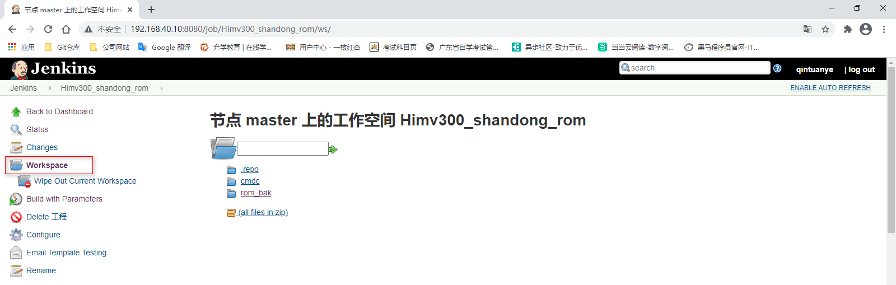

选择右边界面中的 rom_back 文件夹：

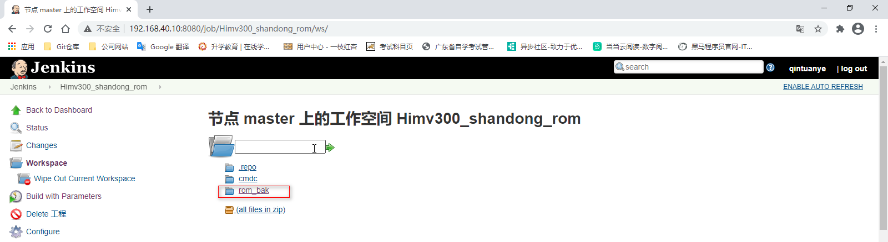

在显示的列表中选择编译版本号对应的文件夹：

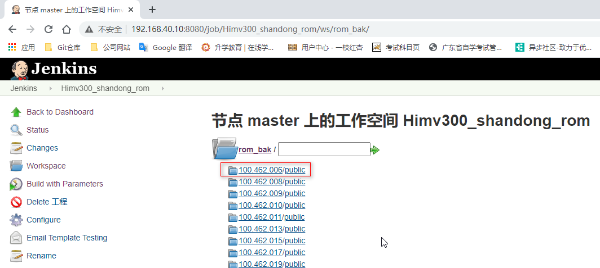

将类似 full-SDYD_Hi-100.462.006-20200831150342-cmdc-shandong.zip（海思）、full-SDYD_AML-200.463.026-20201211105525.zip（Amlogic） 格式的文件下载下来。

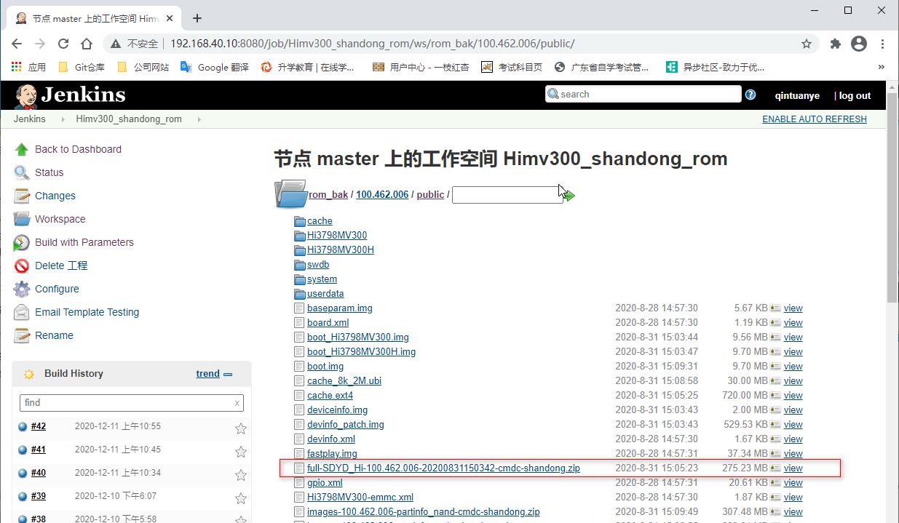

### 9. 修改压缩包文件

> 注意：该步骤只针对长虹过渡版本，其他版本软件不需要执行该步骤。

#### 9.1 海思平台

解压缩 full-SDYD_Hi-100.462.006-20200831150342-cmdc-shandong.zip 压缩包，将 META-INF/com/android/metadata 文件中的如下内容：

```txt
post-build=HiSTBAndroidV5/Hi3798MV300/Hi3798MV300:4.4.2/SDYD_Hi/100.463.026:eng/test-keys
```

修改为

```txt
post-build=CHANGHONG/Hi3798MV300/Hi3798MV300:4.4.2/SDYD_Hi/100.463.026:eng/test-keys
```

#### 9.2 Amlogic 平台

解压缩 full-SDYD_AML-200.463.026-20201211105525.zip 压缩包，将 META-INF/com/android/metadata 文件中的如下内容：

```txt
post-build=Android/Amlogic905L/Amlogic905L:4.4.2/SDYD_AML/200.463.010:eng/test-keys
```

修改为

```txt
post-build=CHANGHONG/p211/p201_iptv:4.4.2/SDYD_AML/200.462.010:eng/test-keys
```

#### 9.3 重新生成压缩包

> 注意：必须是以选择所有文件的方式来生成 zip 压缩包。

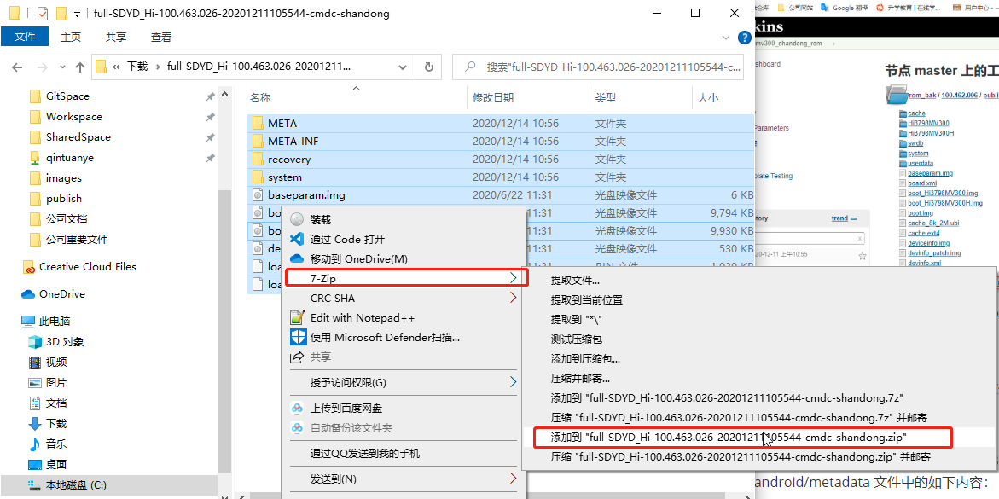

### 10. 签名压缩包

> 注意：此步骤只针对所有过渡版本，统一ROM版本不需要再签名。

#### 10.1 海思平台签名

没有签名文件，无法提供操作步骤。

#### 10.2 Amlogic平台签名

没有签名文件，无法提供操作步骤。

> 注意：每次出版本都需要出六个版本：
>
> 海思平台：
>
> + 过渡版本
> + 统一ROM版本
> + 统一ROM高版本
>
> Amlogic 平台：
>
> + 过渡版本
> + 统一ROM版本
> + 统一ROM高版本