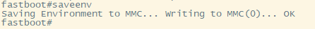

[toc]

### 1. 海思芯片 remoute 方法

#### 1.1  方法一

```shell
$ adb root
$ adb shell mount -o remount rw /system
```

### 1.2 方法二

```shell
$ adb root
$ adb remount
```

### 2. Amlogic 芯片 remoute 方法

```shell
$ adb root
$ adb shell echo 1 > /sys/class/remount/need_remount
$ adb shell mount -o remount /system
```

### 3. Android 9.0 系统 remount

#### 3.1 海思芯片

（1）按开机键启动设备时快速按下电脑键盘上的 <kbd>Ctrl</kbd> + <kbd>C</kbd> 组合键，使设备进入 fastboot 模式。


（2）在 fastboot 模式下输入如下设置参数命令，修复system和vendor分区可读写：

```console
setenv bootargs 'androidboot.hardware=bigfish androidboot.selinux=permissive androidboot.serialno=0123456789 console=ttyAMA0,115200 blkdevparts=mmcblk0:1M(fastboot),512K(bootargs),512K(bootargsbak),20M(recovery),2M(deviceinfo),8M(securestore),8M(baseparam),8M(pqparam),2M(dtbo),10M(logo),10M(logobak),20M(fastplay),20M(recoverybak),60M(boot),20M(misc),20M(trustedcore),1700M(system)rw,796M(cache),400M(vendor)rw,800M(backup),50M(private),-(userdata) hbcomp=/dev/block/mmcblk0p17 init=/init root=/dev/mmcblk0p17 androidboot.dtbo_idx=0 pq=noacmuhd'
```


（3）在 fastboot 模式下执行保存设置参数命令：

```console
saveenv
```



（4）按关机键关机重启设备。

> 注意：（1）、（2）、（3）、（4）步骤只需执行一次即可，恢复出厂设置后也无需再执行。

（5）开机完成后，执行 su 命令，切换到 root 模式。

```console
console:/ $ su
console:/ #
```

（6）执行下面命令修改system分区为可读写分区

```shell
mount -o remount -o rw /
```


（7）执行下面命令修改vendor分区为可读写

```shell
mount -o remount,rw /vendor
```


> 注意：（5）、（6）、（7）步骤需要在每次重启后执行。（5）、（6）、（7）步骤可以在通过 WiFi 连接设备后使用如下命令替换：
>
> ```shell
> $ adb root
> $ adb remount
> ```

