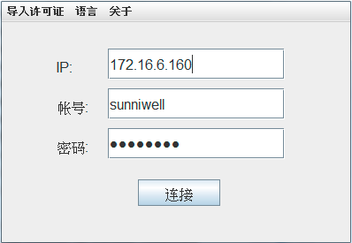
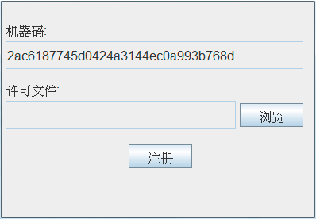
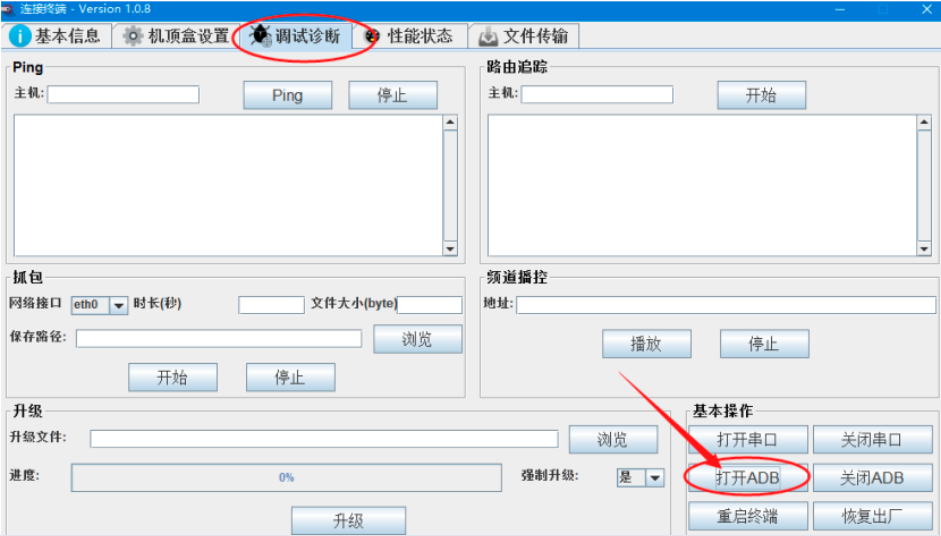

[toc]

### 1. 获取本机机器码

运行中的管理工具 PC 端工具，点击 “导入许可证” 菜单，在弹出的对话框中会显示你本机的机器码。

### 2. 提供机器码申请权限

把机器码提供给工具厂家申请开通，开通将生成一个授权许可文件的 License 文件。

### 3. 导入授权许可文件

点击 “导入许可证” 对话框中的 “浏览” 按钮，选择第2步生成的授权许可文件，然后点击 “注册”，提示注册成功即可关闭该注册窗口，接下来就可以正常使用管理工具了。

### 4. 连接客户端

运行中的管理工具 PC 端工具，在 IP 输入框中输入要连接的机顶盒的 IP 地址，在账号输入框中输入：sunniwell，在密码输入框中输入：82883008，点击 “连接” 按钮。

> 关闭电脑防火墙，关闭电脑杀毒软件，避免无法连接机顶盒。如无法连接上，请先 ping 机顶盒是否连接网络。

在弹出窗口中点击 “调试诊断” 按钮，然后再点击 “打开ADB” 按钮即可开启机顶盒的 adb。

