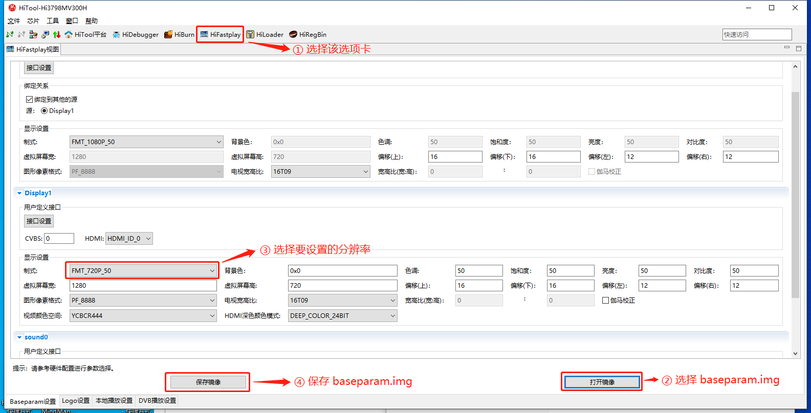

### 一、修改 `baseparam.img` 镜像

使用 HiTool 工具打开 `small/cmdc/small/platform/on-project/pub/image/baseparam.img` 文件。



将修改后的 `baseparam.img` 替换 `small/cmdc/small/platform/on-project/pub/image/baseparam.img` 。

### 二、修改 `sw_para.txt` 文件

打开 `small/cmdc/small/platform/on-project/pub/recovery/root/etc/sw_para.txt` 文件，文件内容如下：

```txt
#Some para to set when factory_reset
Standard=1080p_50Hz
Brightness=50
Contrast=50
Saturation=50
Hue=50
DisplayOutRange=12,16,12,16
```

将 `standard` 项设置成与第一步设置的值一致。比如在 `baseparam.img` 中设置的是 `FMT_720P_50`，则在 `sw_para.txt` 中将 `Standar` 设置为 `720p_50Hz`。

### 三、重新编译软件。

### 四、可以只烧录 `baseparam.img` 镜像即可。