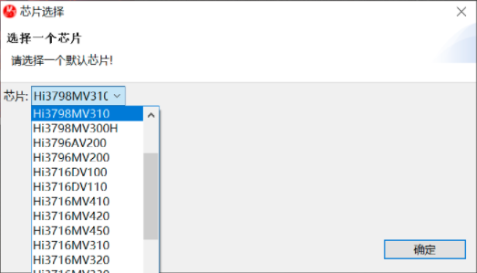
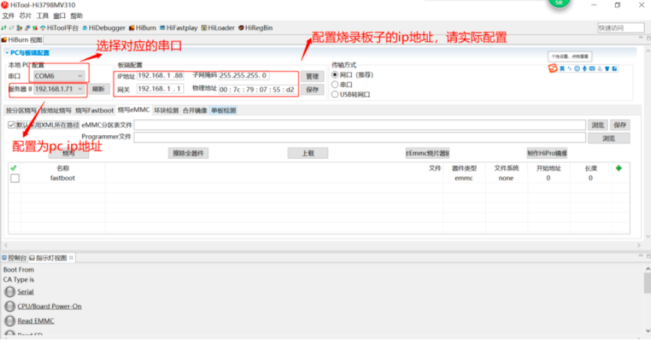
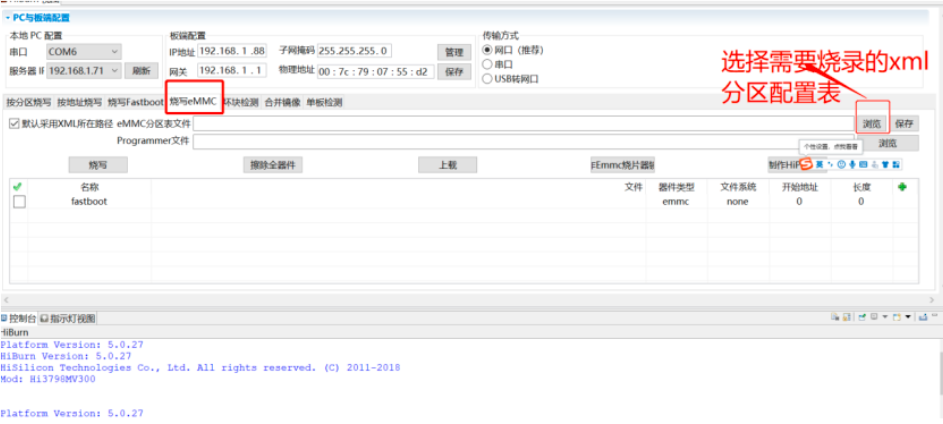
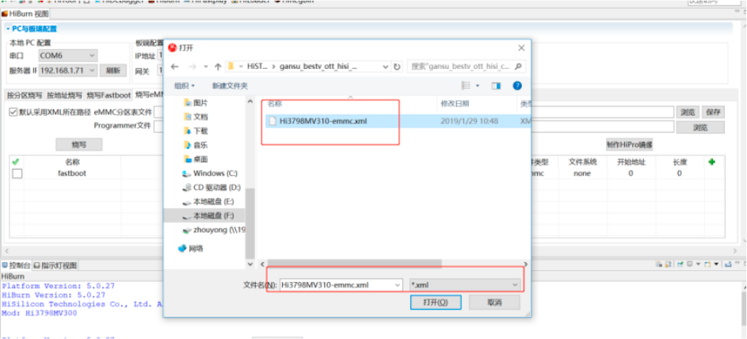
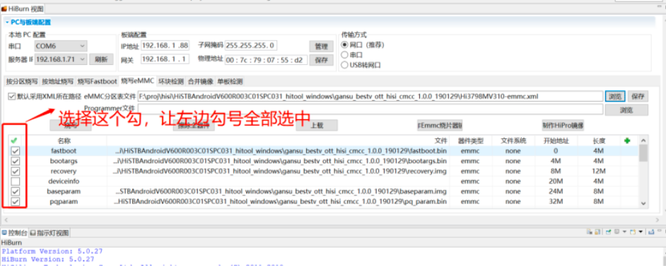
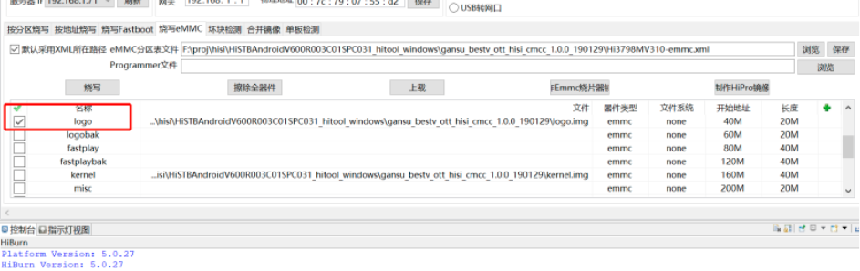
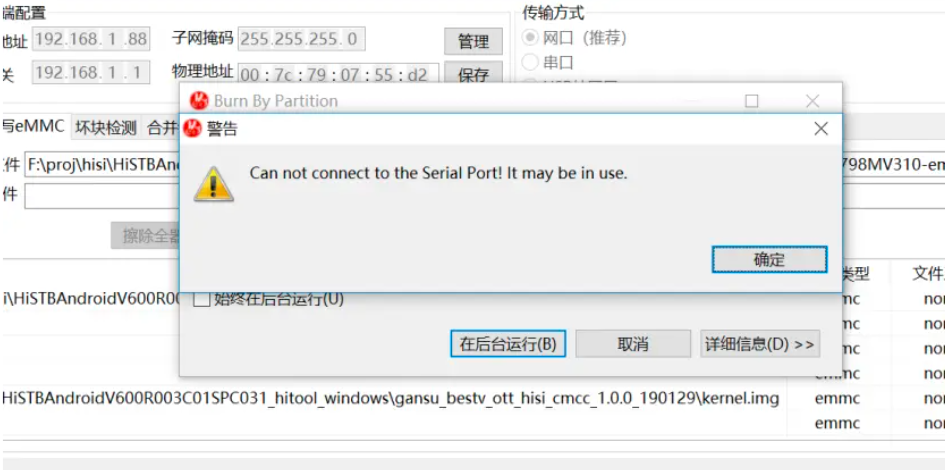
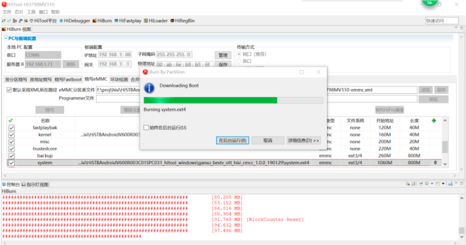
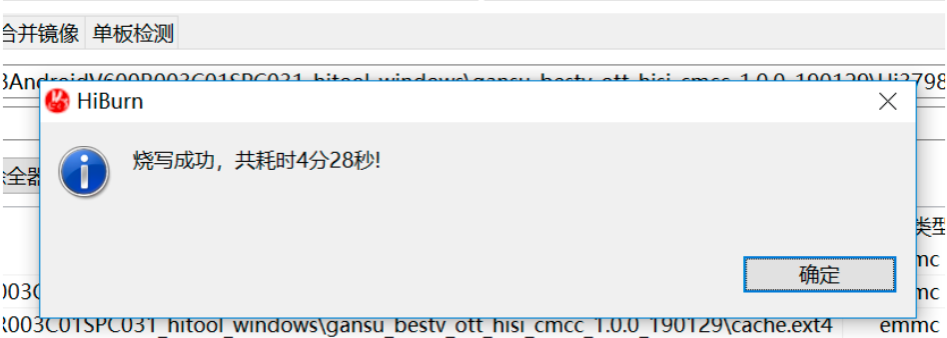

[toc]

### 1. 打开烧录工具 HiTool.ext，并选择 Hi3798MV300 芯片。

### 2. 配置 HiTool

### 3. 选择烧录 xml 分区表

### 4. 如果是首次烧录，可以选择擦除所有

### 5. 也可以只烧写勾选的分区

### 6 选择完毕后，点击 “烧写” 按钮，再弹出的提示框中点击 “确定” 按钮

### 7. 拔出串口线重新插入（避免其他应用占用端口），点击 “烧写按钮后，需要重启一下机顶盒。

### 8. 烧录完成后，会弹出提示框，点击 “确定” 南。

