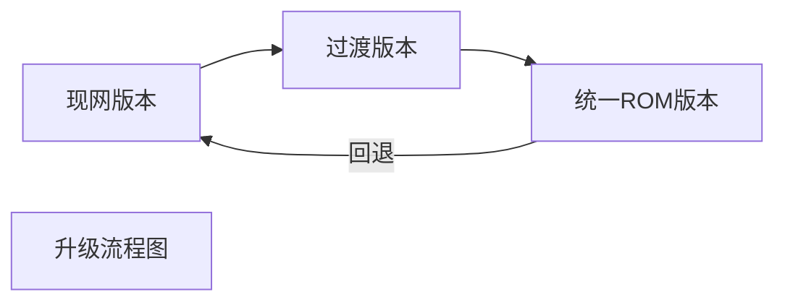

[toc]



### 1. 朝歌硬件型号升级方法

1. 将升级文件拷贝到 U 盘 upgrade 目录下。
2. 将 U 盘插入机顶盒，即可自动升级。

### 2. 长虹硬件型号（现网）升级方法

1. 将升级文件拷贝到 U 盘根目录下。
2. 在 U 盘根目录下创建 ChMobileconfig.json 的文件。
3. 将下面的内容写入到 ChMobileConfig.json 文件中：

```json
{
    "bForceupgrade":true,
    "bWipeUserData":false,
    "bWipeCache":false,
    "bWipePrivate":false,
    "pkgVersion":"299.468.006",
    "pkgName":"ch-full-SDTV_OS-100.462.001-20200731115918-cmdc-shandong_signed.zip"
}
```

`bForceupgrade` ：表示是否强制升级；

`bWipeUserData` ：表示是否擦除用户数据；

`bWipeCache` ：表示是否清除缓存数据；

`bWipePrivate` ：表示是否擦除私有数据；

`pkgVersion` ：表示升级包的版本号；

`pkgName`：表示升级包的文件名称

4. 将 U 盘插入机顶盒即可自动升级。