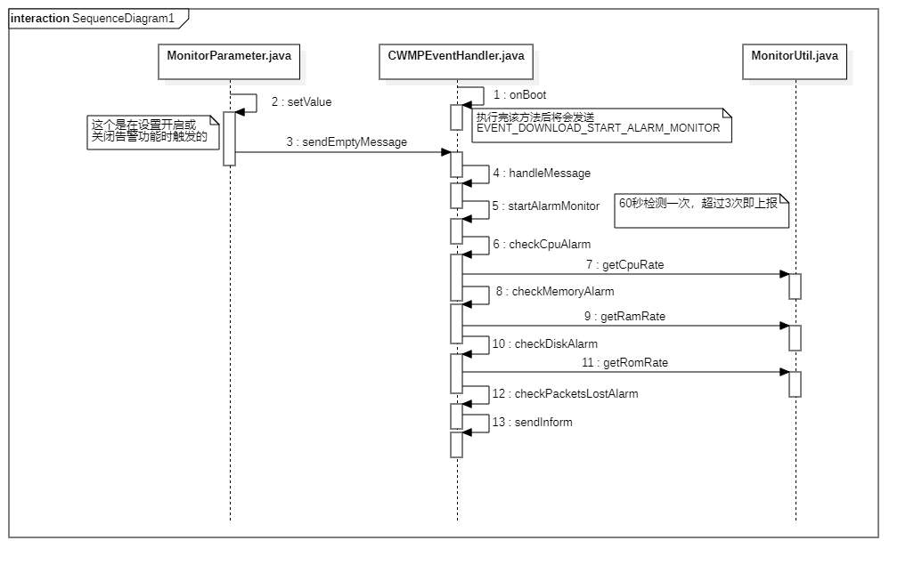

> 注意：由于代码中设置了如下条件：
>
> ```java
> int cpuAlarmReportLevel = 4;
> if (alarmReportLevel == null || Integer.valueOf(alarmReportLevel) < cpuAlarmReportLevel) {
>     return null;
> }
> ```
>
> 因此需要在网管网站中设置 alarmReportLevel 的基本大于或等于 4。