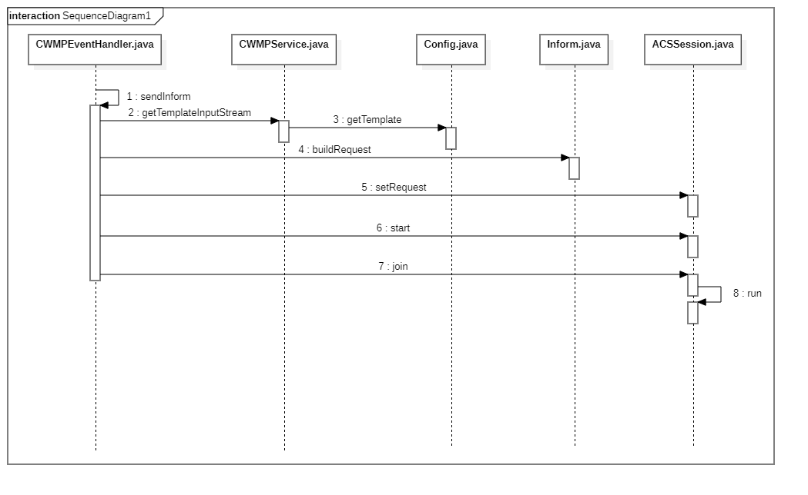

从上面的流程图中可以看出，客户端如果需要向服务器端发生数据，需要调用 `CWMPEventHandler.java` 类中的 `sendInform` 方法。

```java
private void sendInform(final String[] codes, final ArrayList object) throws IOException, InterruptedException {
    log.i("========sendInform=======codes=" + codes.toString() + " object=" + (object == null ? "null" : object.toString()));
    // Auto-generated method stub
    ACSSession session = new ACSSession(mContext);
    InputStream input;
    try {
        input = CWMPService.getInstance().getTemplateInputStream("Inform");
        Envelope request = Inform.getInstance().buildRequest(codes, input, object);
        input.close();
        session.setRequest(mPreferences, request);
        session.start();
        session.join();
    } catch (Exception e) {
        e.printStackTrace();
    }
}
```

在 `sendInform` 方法中，首先获取的 `Inform` 对应的文件内容，使用 `Inform` 类的 `buildRequest` 方法将文件内容转换成 `Envelop` 类，然后将 `Envelop` 添加到 `ACSSession` 类中，启动 `ACSSession` 线程，最后调用 `join` 方法，等待该类的其他实例运行完后开始执行这个请求。

首先我们来看下获取 "Inform" 对应文件的流程。先来看下 `CWMPService` 类的 `getTemplateInputStream` 方法：

```java
public InputStream getTemplateInputStream(String name) throws IOException {
    Context context = getApplicationContext();
    String template = config.getTemplate(name);
    if (template == null)
        return null;
    log.d("===getTemplateInputStream=======" + template);
    return context.getAssets().open(template);
}
```

该方法通过调用 `Config` 类的 `getTemplate()` 方法进行获取的，下面是 `getTemplate()` 方法的代码：

```java
public String getTemplate(String name) {
    for (Template template : templates) {
        if (template._name.equalsIgnoreCase(name))
            return template._xml;
    }
    return null;
}
```

那么，`config` 是怎么初始化的呢，下面是 `config` 的初始化方法：

```java
private void initConfig() throws IOException {
    Context context = getApplicationContext();
    AssetManager assets = context.getAssets();
    InputStream input = assets.open("config.xml");
    config = (Config) XMLBinding.getInstance().load(Config.class, input);
    if (config == null) {
        log.d("parsing config.xml failed");
        assert false;
    }
    input.close();
    log.d("loading config.xml success");
}
```

可以看出，`Config` 是从 `Assets` 目录下的 `config.xml` 文件创建的。下面是 `config.xml` 的内容：

```xml
<cwmpservice>
  <template name="Inform" xml="templates/inform/request.xml"/>
  <template name="GetRPCMethodsResponse" xml="templates/getrpcmethods/response.xml"/>
  <template name="GetParameterNamesResponse" xml="templates/getparameternames/response.xml"/>
  <template name="GetParameterValuesResponse" xml="templates/getparametervalues/response.xml"/>
  <template name="SetParameterValuesResponse" xml="templates/setparametervalues/response.xml"/>
  <template name="GetParameterAttributesResponse" xml="templates/getparameterattributes/response.xml"/>
  <template name="SetParameterAttributesResponse" xml="templates/setparameterattributes/response.xml"/>
  <template name="RebootResponse" xml="templates/reboot/response.xml"/>
  <template name="FactoryResetResponse" xml="templates/factoryreset/response.xml"/>
  <template name="DownloadResponse" xml="templates/download/response.xml"/>
  <template name="TransferComplete" xml="templates/transfercomplete/request.xml"/>
  <template name="UploadResponse" xml="templates/upload/response.xml"/>
  <template name="Fault" xml="templates/fault/request.xml"/>
  <template name="AddObject" xml="templates/addobject/response.xml"></template>
  <template name="DeleteObject" xml="templates/deleteobject/response.xml"></template>
  <template name="UninstallResponse" xml="templates/UninstallResponse/response.xml"></template>
  <template name="UninstallComplete" xml="templates/UninstallComplete/request.xml"></template>
    
  <module name="net.sunniwell.tms.transport.CPEListen">
    <variable name="url" field="Device.ManagementServer.ConnectionRequestURL" format="string"/>
    <variable name="username" field="Device.ManagementServer.ConnectionRequestUsername" format="string" default="admin"/>
    <variable name="password" field="Device.ManagementServer.ConnectionRequestPassword" format="string" default="admin"/>
  </module>
  <module name="net.sunniwell.tms.transport.ACSSession">
    <variable name="url" field="Device.ManagementServer.URL" format="string"/>
    <variable name="back_url" field="Device.ManagementServer.URLBackup" format="string"/>
    <variable name="username" field="Device.ManagementServer.Username" format="string" default="cpe"/>
    <variable name="password" field="Device.ManagementServer.Password" format="string" default="cpe"/>
    <variable name="enabled" field="Device.ManagementServer.PeriodicInformEnable" format="int" default="1"/>
    <variable name="period" field="Device.ManagementServer.PeriodicInformInterval" format="int" default="3600"/>
  </module>
  <module name="net.sunniwell.tms.transport.STUNClient">
    <variable name="local" field="Device.LAN.IPAddress" format="string"/>
    <variable name="enabled" field="Device.ManagementServer.STUNEnable" format="boolean"/>
    <variable name="server" field="Device.ManagementServer.STUNServerAddress" format="string"/>
    <variable name="port" field="Device.ManagementServer.STUNServerPort" format="int" default="3478"/>
    <variable name="username" field="Device.ManagementServer.STUNUsername" format="string" default="cms"/>
    <variable name="password" field="Device.ManagementServer.STUNPassword" format="string" default="cms"/>
    <variable name="maxperiod" field="Device.ManagementServer.STUNMaximumKeepAlivePeriod" format="int" default="50"/>
    <variable name="minperiod" field="Device.ManagementServer.STUNMinimumKeepAlivePeriod" format="int" default="30"/>
    <variable name="detected" field="Device.ManagementServer.NATDetected" format="boolean"/>
    <variable name="address" field="Device.ManagementServer.UDPConnectionRequestAddress" format="string"/>
    <variable name="udpurl" field="Device.ManagementServer.UDPConnectionRequestURL" format="string"/>
  </module>
</cwmpservice>
```

从 `config.xml` 的内容可以看出，里面定义了一些字符串对文件的映射和一些类的结构。因此我们找到 "Inform" 字符串对应的文件是 `Assets` 目录下的 `templates/inform/request.xml` 文件。

现在，我们再来看下 `Inform` 类的 `buildRequest` 方法是如何将该文件转换成请求类的。先来看下 `buildRequest` 的代码：

```java
public Envelope buildRequest(String[] codes, InputStream template, ArrayList object) {
    Envelope result = (Envelope) XMLBinding.getInstance().load(Envelope.class, template);
    result.body.informRequest.events.list.clear();
    for (String code : codes) {
        EventStruct ev = new EventStruct();
        ev.CommandKey = "";
        if (CWMPEvent.EVENT_CODE_STRING_M_REBOOT.equals(code) || CWMPEvent.EVENT_CODE_STRING_M_DOWNLOAD.equals(code)) {
            String key = new DataPreferences(CWMPService.getInstance().getApplicationContext()).getPreferences(DataPreferences.CommandKey);
            ev.CommandKey = key;
        }
        ev.EventCode = code;
        result.body.informRequest.events.list.add(ev);
        result.body.informRequest.events.type = EventList.buildTypeString(codes.length);
        if (code.compareToIgnoreCase(CWMPEvent.EVENT_CODE_STRING_BOOT) == 0 
            || code.compareToIgnoreCase(CWMPEvent.EVENT_CODE_STRING_BOOTSTARP) == 0 || code
            .compareToIgnoreCase(CWMPEvent.EVENT_CODE_STRING_CONNECTION_REQUEST) == 0) {
            result.body.informRequest.currentTime = Utility.getCurrentTime();
            result.body.informRequest.values.type = ParameterValueList.buildTypeString(result.body.informRequest.values.list.size());
        }
        log.d("empty=" + empty);
        // empty = true;
        if (code.compareToIgnoreCase(CWMPEvent.EVENT_CODE_STRING_TRANSFER_COMPLETE) == 0) {
            empty = false;
            if (object instanceof ArrayList) {
                ArrayList<Object> list = (ArrayList<Object>) object;
                log.d("list size=" + list.size());
                commandKey = new DataPreferences(CWMPService.getInstance().getApplicationContext()).getPreferences(DataPreferences.CommandKey);
                for (Object obj : list) {
                    if (obj instanceof FaultStruct) {
                        fault = (FaultStruct) obj;
                    } else if (obj instanceof String) {
                        commandKey = (String) obj;// 默认从datapreference获取，若list存在则覆盖
                    }
                }
                log.d("fault=" + fault + " key=" + commandKey);
            }
        }
        if (code.compareToIgnoreCase(CWMPEvent.EVENT_CODE_STRING_BOOT) == 0 || code.compareToIgnoreCase(CWMPEvent.EVENT_CODE_STRING_BOOTSTARP) == 0 || code
            .compareToIgnoreCase(CWMPEvent.EVENT_CODE_STRING_VALUE_CHANGE) == 0 || code.compareToIgnoreCase(CWMPEvent.EVENT_CODE_STRING_X_00E0FC_ALARM) == 0) {
            result.body.informRequest.values.list = getAddParameter(result.body.informRequest.values.list, object);
        }
        result.body.informRequest.values.type = ParameterValueList.buildTypeString(result.body.informRequest.values.list.size());
    }
    return result;
}
```

`buildRequest`  先通过 `templates/inform/request.xml` 文件创建 `Envelope` 类。然后再根据传递过来的 code 修改 `Envelope` 相应的值。

下面我们来看下 `Envelope` 类是如何根据 `templates/inform/request.xml` 创建的。下面是 `templates/inform/request.xml` 文件的内容：

```xml
<soap:Envelope encodingStyle="http://schemas.xmlsoap.org/soap/encoding/" xmlns:soap="http://schemas.xmlsoap.org/soap/envelope/" xmlns:soapenc="http://schemas.xmlsoap.org/soap/encoding/" xmlns:xsd="http://www.w3.org/2001/XMLSchema" xmlns:xsi="http://www.w3.org/2001/XMLSchema-instance" xmlns:cwmp="urn:dslforum-org:cwmp-1-0">
	<soap:Header>
		<cwmp:ID soap:mustUnderstand="1"></cwmp:ID>
	</soap:Header>
	<soap:Body>
		<cwmp:Inform>
			<DeviceId>
				<Manufacturer>${Device.DeviceInfo.Manufacturer}</Manufacturer> 
				<OUI>${Device.DeviceInfo.OUI}</OUI>
				<ProductClass>${Device.DeviceInfo.ProductClass}</ProductClass>
				<SerialNumber>${Device.DeviceInfo.SerialNumber}</SerialNumber>
			</DeviceId>
			<Event soapenc:arrayType="cwmp:EventStruct[1]">
				<EventStruct>
					<EventCode></EventCode>
					<CommandKey></CommandKey>
				</EventStruct>
			</Event>
			<MaxEnvelopes>1</MaxEnvelopes>
			<CurrentTime></CurrentTime>
			<RetryCount>0</RetryCount>
			<ParameterList soapenc:arrayType="cwmp:ParameterValueStruct[15]">
			    <ParameterValueStruct>
					<Name>Device.DeviceType</Name>
					<Value xsi:type="xsd:string">${Device.DeviceType}</Value>
				</ParameterValueStruct>
				<ParameterValueStruct>
					<Name>Device.DeviceSummary</Name>
					<Value xsi:type="xsd:string">${Device.DeviceSummary}</Value>
				</ParameterValueStruct>
				
				<ParameterValueStruct>
					<Name>Device.X_CMCC_OTV.STBInfo.UniformManufacturer</Name>
					<Value xsi:type="xsd:string">${Device.X_CMCC_OTV.STBInfo.UniformManufacturer}</Value>
				</ParameterValueStruct>
				<ParameterValueStruct>
					<Name>Device.X_CMCC_OTV.STBInfo.UniformManufacturerOUI</Name>
					<Value xsi:type="xsd:string">${Device.X_CMCC_OTV.STBInfo.UniformManufacturerOUI}</Value>
				</ParameterValueStruct>
				<ParameterValueStruct>
					<Name>Device.X_CMCC_OTV.STBInfo.UniformModel</Name>
					<Value xsi:type="xsd:string">${Device.X_CMCC_OTV.STBInfo.UniformModel}</Value>
				</ParameterValueStruct>
				<ParameterValueStruct>
					<Name>Device.X_CMCC_OTV.STBInfo.UniformFlag</Name>
					<Value xsi:type="xsd:string">${Device.X_CMCC_OTV.STBInfo.UniformFlag}</Value>
				</ParameterValueStruct>
				
				<ParameterValueStruct>
					<Name>Device.DeviceInfo.HardwareVersion</Name>
					<Value xsi:type="xsd:string">${Device.DeviceInfo.HardwareVersion}</Value>
				</ParameterValueStruct>
				<ParameterValueStruct>
					<Name>Device.DeviceInfo.SoftwareVersion</Name>
					<Value xsi:type="xsd:string">${Device.DeviceInfo.SoftwareVersion}</Value>
				</ParameterValueStruct>
				<ParameterValueStruct>
					<Name>Device.DeviceInfo.AdditionalHardwareVersion</Name>
					<Value xsi:type="xsd:string">${Device.DeviceInfo.AdditionalHardwareVersion}</Value>
				</ParameterValueStruct>
				<ParameterValueStruct>
					<Name>Device.DeviceInfo.AdditionalSoftwareVersion</Name>
					<Value xsi:type="xsd:string">${Device.DeviceInfo.AdditionalSoftwareVersion}</Value>
				</ParameterValueStruct>
				<ParameterValueStruct>
					<Name>Device.DeviceInfo.ModelName</Name>
					<Value xsi:type="xsd:string">${Device.DeviceInfo.ModelName}</Value>
				</ParameterValueStruct>
				<ParameterValueStruct>
					<Name>Device.DeviceInfo.Description</Name>
					<Value xsi:type="xsd:string">${Device.DeviceInfo.Description}</Value>
				</ParameterValueStruct>
				<ParameterValueStruct>
					<Name>Device.DeviceInfo.FirstUseDate</Name>
					<Value xsi:type="xsd:string">${Device.DeviceInfo.FirstUseDate}</Value>
				</ParameterValueStruct>
				<ParameterValueStruct>
					<Name>Device.DeviceInfo.UpTime</Name>
					<Value xsi:type="xsd:string">${Device.DeviceInfo.UpTime}</Value>
				</ParameterValueStruct>
				<ParameterValueStruct>
					<Name>Device.ManagementServer.ConnectionRequestURL</Name>
					<Value xsi:type="xsd:string">${Device.ManagementServer.ConnectionRequestURL}</Value>
				</ParameterValueStruct>
				<ParameterValueStruct>
					<Name>Device.Time.NTPServer</Name>
					<Value xsi:type="xsd:string">${Device.Time.NTPServer}</Value>
				</ParameterValueStruct>
				<ParameterValueStruct>
					<Name>Device.LAN.IPAddress</Name>
					<Value xsi:type="xsd:string">${Device.LAN.IPAddress}</Value>
				</ParameterValueStruct>
				<ParameterValueStruct>
					<Name>Device.LAN.DNSServers</Name>
					<Value xsi:type="xsd:string">${Device.LAN.DNSServers}</Value>
				</ParameterValueStruct>
				<ParameterValueStruct>
					<Name>Device.LAN.AddressingType</Name>
					<Value xsi:type="xsd:string">${Device.LAN.AddressingType}</Value>
				</ParameterValueStruct>
				<ParameterValueStruct>
					<Name>Device.LAN.MACAddress</Name>
					<Value xsi:type="xsd:string">${Device.LAN.MACAddress}</Value>
				</ParameterValueStruct>
				<ParameterValueStruct>
					<Name>Device.X_CMCC_OTV.STBInfo.STBID</Name>
					<Value xsi:type="xsd:string">${Device.X_CMCC_OTV.STBInfo.STBID}</Value>
				</ParameterValueStruct>
				<ParameterValueStruct>
					<Name>Device.X_CMCC_OTV.STBInfo.PPPoEID</Name>
					<Value xsi:type="xsd:string">${Device.X_CMCC_OTV.STBInfo.PPPoEID}</Value>
				</ParameterValueStruct>
				<ParameterValueStruct>
					<Name>Device.X_CMCC_OTV.STBInfo.AuthURL</Name>
					<Value xsi:type="xsd:string">${Device.X_CMCC_OTV.STBInfo.AuthURL}</Value>
				</ParameterValueStruct>
				<ParameterValueStruct>
					<Name>Device.X_CMCC_OTV.STBInfo.AreaCode</Name>
					<Value xsi:type="xsd:string">${Device.X_CMCC_OTV.STBInfo.AreaCode}</Value> 
				</ParameterValueStruct>
				<ParameterValueStruct>
					<Name>Device.X_CMCC_OTV.STBInfo.Platform</Name>
					<Value xsi:type="xsd:string">${Device.X_CMCC_OTV.STBInfo.Platform}</Value> 
				</ParameterValueStruct>
				<ParameterValueStruct>
					<Name>Device.X_CMCC_OTV.ServiceInfo.UserID</Name>
					<Value xsi:type="xsd:string">${Device.X_CMCC_OTV.ServiceInfo.UserID}</Value> 
				</ParameterValueStruct>
				<ParameterValueStruct>
					<Name>Device.X_CMCC_OTV.STBInfo.UserID</Name>
					<Value xsi:type="xsd:string">${Device.X_CMCC_OTV.STBInfo.UserID}</Value> 
				</ParameterValueStruct>
				<ParameterValueStruct>
					<Name>Device.X_CMCC_OTV.ServiceInfo.DHCPID</Name>
					<Value xsi:type="xsd:string">${Device.X_CMCC_OTV.ServiceInfo.DHCPID}</Value> 
				</ParameterValueStruct>
				<ParameterValueStruct>
					<Name>Device.X_CMCC_OTV.ServiceInfo.PPPoEID</Name>
					<Value xsi:type="xsd:string">${Device.X_CMCC_OTV.ServiceInfo.PPPoEID}</Value>
				</ParameterValueStruct>
				<ParameterValueStruct>
					<Name>Device.X_CMCC_OTV.ServiceInfo.AuthURL</Name>
					<Value xsi:type="xsd:string">${Device.X_CMCC_OTV.ServiceInfo.AuthURL}</Value>
				</ParameterValueStruct>
				<ParameterValueStruct>
					<Name>Device.X_CMCC_OTV.ServiceInfo.AuthURLBackup</Name>
					<Value xsi:type="xsd:string">${Device.X_CMCC_OTV.ServiceInfo.AuthURLBackup}</Value>
				</ParameterValueStruct>
				<ParameterValueStruct>
					<Name>Device.X_CMCC_OTV.ServiceInfo.AuthSucTime</Name>
					<Value xsi:type="xsd:string">${Device.X_CMCC_OTV.ServiceInfo.AuthSucTime}</Value>
				</ParameterValueStruct>
					<ParameterValueStruct>
					<Name>Device.ManagementServer.URL</Name>
					<Value xsi:type="xsd:string">${Device.ManagementServer.URL}</Value>
				</ParameterValueStruct>
				<ParameterValueStruct>
					<Name>Device.X_CMCC_OTV.ServiceInfo.IPoEID</Name>
					<Value xsi:type="xsd:string">${Device.X_CMCC_OTV.ServiceInfo.IPoEID}</Value>
				</ParameterValueStruct>
					
			</ParameterList>
		</cwmp:Inform>
	</soap:Body>
</soap:Envelope>

```

我们来看下 `Envelope` 类代码：

```java
public class Envelope {
	public static final String envprefix = "soap";
	public static final String env = "http://schemas.xmlsoap.org/soap/envelope/";
	public static final String encprefix = "soapenc";
	public static final String enc = "http://schemas.xmlsoap.org/soap/encoding/";
	public static final String xsdprefix = "xsd";
	public static final String xsd = "http://www.w3.org/2001/XMLSchema";
	public static final String xsiprefix = "xsi";
	public static final String xsi = "http://www.w3.org/2001/XMLSchema-instance";
	public static final String cwmpprefix = "cwmp";
	public static final String cwmp = "urn:dslforum-org:cwmp-1-0";
	
	@Attribute(name = "encodingStyle", required = false)
	public static final String encoding = "http://schemas.xmlsoap.org/soap/encoding/";

	@Element(name = "Header")
	@Namespace(reference = Envelope.env)
	public static Header head = new Header();

	@Element(name = "Body")
	@Namespace(reference = Envelope.env)
	public Body body = new Body();
	
	public int eventcode = CWMPEvent.EVENT_CWMP_BASE;
}
```

可以看出 `templates/inform/request.xml` 文件中除了 `Header` 节点以外，每个节点都对应着一个相同名字的类。那么 `Envelope` 类的数据是如何填充的呢。从 `request.xml` 文件中，我们可以看到每个节点都有类似如下的内容：

```xml
<Manufacturer>${Device.DeviceInfo.Manufacturer}</Manufacturer> 
或：
<Value xsi:type="xsd:string">${Device.X_CMCC_OTV.ServiceInfo.AuthURLBackup}</Value>
```

是的，`${Device.DeviceInfo.Manufacturer}` 这个就是它的值，那么这个值是如何获取的？其实它是通过数据库获取的，我们可以看下数据库结构数据就明白了。下面是用于初始化数据的文件的部分内容，它位于 `assets/data.xml`  文件中：

```xml
<parameters>
    ...
    <parameter name="Device.X_CMCC_OTV.ServiceInfo.AuthURLBackup" type="xsd:string" writable="1" notification="2" secure="0">
		<virtual name="PlatformURLBackup" type=".DevInfoManagerParameter"/>
		<!--<virtual name="CMSURLBackup" type=".DevInfoManagerParameter"/>-->
	</parameter>
    <parameter name="Device.DeviceInfo.Manufacturer" type="xsd:string" writable="0" notification="0" secure="0">
		 <virtual name="ro.factory.name" type=".PropertyParameter"/> 
	</parameter>
    ...
</parameters>
```

读取数据库填充数据的地方是在 `Value` 类中，下面是 `Value.java` 的代码：

```java
public class Value {
	private SWLogger log=SWLogger.getLogger(getClass());
	@Attribute(name = "type", required = false)
	@Namespace(reference = Envelope.xsi)
	public String type;

	@Text(required = false)
	public String content;

	@Validate
	public void validate() {
		if (content == null||content.length()<=0) {
			content = "";
		} else {
			Pattern pattern = Pattern.compile("^\\$\\{(.*)\\}$");
			Matcher matcher = pattern.matcher(content);
			if (matcher.matches()) {
				String variable = matcher.group(1);
				content = DataResolver.getInstance().getParameterValue(variable);
				if(Utility.isEmpty(content) && "Device.DeviceInfo.FirstUseDate".equals(variable)){
					final SimpleDateFormat dateFormat = new SimpleDateFormat("yyyy-MM-dd HH:mm:ss");
					final String time = dateFormat.format(new Date(System.currentTimeMillis()));
					DataResolver.getInstance().setParameterValue(Constant.FirstUseDate, time);
					content = time;
				}
			}else{
				log.d("====Device ip dns type===="+content);
			}
		}
	}

	@Override
	public int hashCode() {
		final int prime = 31;
		int result = 1;
		result = prime * result + ((content == null) ? 0 : content.hashCode());
		result = prime * result + ((type == null) ? 0 : type.hashCode());
		return result;
	}

	@Override
	public boolean equals(Object obj) {
		if (this == obj)
			return true;
		if (obj == null)
			return false;
		if (getClass() != obj.getClass())
			return false;
		Value other = (Value) obj;
		if (content == null) {
			if (other.content != null)
				return false;
		} else if (!content.equals(other.content))
			return false;
		if (type == null) {
			if (other.type != null)
				return false;
		} else if (!type.equals(other.type))
			return false;
		return true;
	}
}
```

可以看到，它是在 `validate` 方法中调用 `DataResolver` 类的 `getParameterValue` 方法进行获取的。