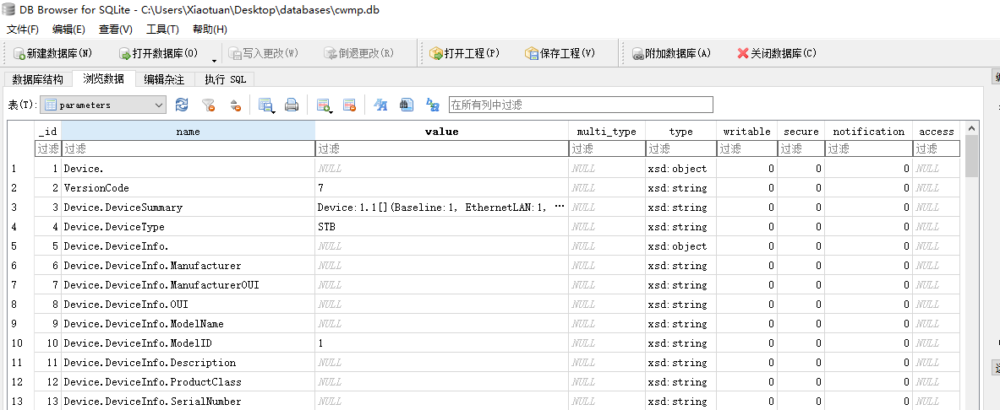
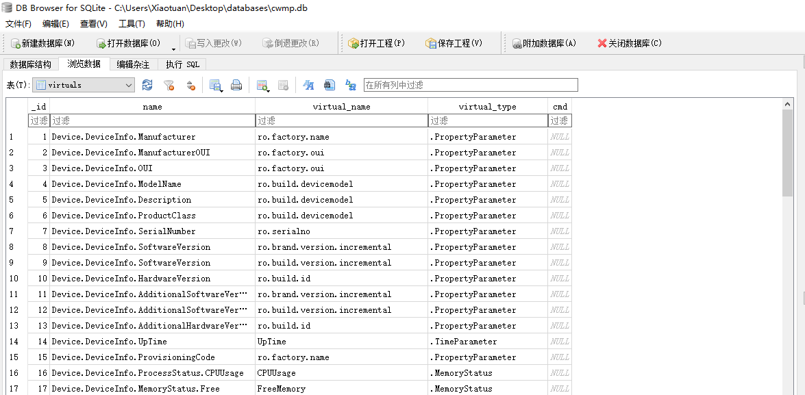

> 注：与数据库相关的代码都位于  **src/net/sunniwell/tms/data** 目录中。

数据库数据初始化是在 **src/net/sunniwell/tms/CWMPService.java** 中进行初始化的，下面是初始化的代码：

```java
@Override
public void onCreate() {
    super.onCreate();
    ......
    try {
        initConfig();
        Parameters data = initParameters();
        boolean isInsert = false;
        // 如果data.xml下version比数据库中存入的VersionCode大，或本地数据库无VersionCode则将data.xml全部插入本地数据库
        // 注意：provider端通过app版本号增加同样会清空表内原有数据，方式为删除并重新建表
        // 升级时修改data.xml下VersionCode只替换数据，app版本号增加可兼容表列及表结构的变化！
        String codeEndValue = mDataResolver.getParameterValue("CodeEND");
        for (Parameter parameter : data.records) {
            if (parameter.name.equals(UPDATE_FALG)) {
                String value = mDataResolver.getParameterValue(parameter.name);
                int code = 0;
                if (value != null && !value.equals(""))
                    code = Integer.valueOf(value);
                int eventcode = Integer.valueOf(parameter.value);
                log.d("===eventcode===" + eventcode + "==code=" + code);
                isInsert = eventcode > code ? true : false;
                break;
            }

        }
        log.d(isInsert+"---isInsert---"+codeEndValue+"codeEndValue");
        if (isInsert||codeEndValue.equals("")) {
            // 清空数据库
            for (Parameter parameter : data.records) {
                try {
                    // 清空本地数据库文件
                    ContentValues cv = parameter.getParameterTableContent();
                    // 本地有值优先存本地数据,只改变初值,其他仍读取assets
                    if (CWMPApplication.localParameters.containsKey(parameter.name)) {
                        cv.put("value", CWMPApplication.localParameters.getAsString(parameter.name));
                    }
                    DataResolver.getInstance().insert(TableName.PARAMETERS, cv);
                    ArrayList<ContentValues> virtalList = parameter.getVirtualTableContent();
                    if (virtalList != null && virtalList.size() > 0) {
                        for (ContentValues cv2 : virtalList) {
                            DataResolver.getInstance().insert(TableName.VIRTUAL, cv2);
                        }
                    }
                } catch (SQLException e) {// 单次数据库异常不跳出for循环
                    e.printStackTrace();
                }
            }
        }
        log.d("database initialized");
    } catch (IOException e) {
        e.printStackTrace();
        assert false;
    }
    registerBroadcastReceiver();
}
```

先来看下 data 变量的初始化方法：

```java
public Parameters initParameters() throws IOException {
    Context context = getApplicationContext();
    AssetManager assets = context.getAssets();
    InputStream input = assets.open(CWMP_DATA_PATH);// 在这里要判断一些事情，比如oui
    Parameters data = (Parameters) XMLBinding.getInstance().load(Parameters.class, input);
    mDataResolver = DataResolver.getInstance();
    // 首次启动时，需要根据data.xml初始化数据库
    if (data == null) {
        log.d("parsing " + CWMP_DATA_PATH + " failed");
        assert false;
    }
    input.close();
    log.d("data model loaded from template");
    return data;
}
```

可以看到它是通过将 `assets/templates/data.xml` 文件转化成  Parameters 类的。下面是 **src/net/sunniwell/tms/data/Parameters.java** 类的代码：

```java
@Root(name = "parameters", strict = false)
public class Parameters {
	@ElementList(entry = "parameter", inline = true)
	public ArrayList<Parameter> records = new ArrayList<Parameter>();
}
```

Parameters 类是使用一个 Parameter 数组集合将 data.xml 文件中的每一条数据封装成一项 Parameter 变量值。

现在再回到 onCreate() 方法中，可以看到它是通过判断当前数据的版本号与 data.xml 的版本号来决定是否将 data.xml 中的数据更新到数据中的。

下面我们来比较下数据库与 data.xml 的数据结构。下面是 data.xml 的部分内容：

```xml
<parameters >
	<parameter name="Device." type="xsd:object" writable="0" notification="0" secure="0">
	    <value></value>
	</parameter>
	<parameter name="VersionCode" type="xsd:string" writable="0" notification="0" secure="0">
		<value>7</value>
	</parameter>
	<parameter name="Device.DeviceSummary" type="xsd:string" writable="0" notification="0" secure="0">
		<value>Device:1.1[](Baseline:1, EthernetLAN:1, WiFiLAN:1, EthernetWAN:1, Time:1, IPPing:1)</value>
	</parameter>
	<parameter name="Device.DeviceType" type="xsd:string" writable="0" notification="0" secure="0">
		<value>STB</value>
	</parameter>
	<parameter name="Device.DeviceInfo." type="xsd:object" writable="0" notification="0" secure="0">
		<value></value>
	</parameter>
	<parameter name="Device.DeviceInfo.Manufacturer" type="xsd:string" writable="0" notification="0" secure="0">
		 <virtual name="ro.factory.name" type=".PropertyParameter"/> 
	</parameter>
	<parameter name="Device.DeviceInfo.ManufacturerOUI" type="xsd:string" writable="0" notification="0" secure="0">
		<virtual name="ro.factory.oui" type=".PropertyParameter"/>
	</parameter>
	<parameter name="Device.DeviceInfo.OUI" type="xsd:string" writable="0" notification="0" secure="0">
	    <virtual name="ro.factory.oui" type=".PropertyParameter"/>
	</parameter>
    ......
</parameters>
```

下面是数据结构的：



通过对比可以看到数据库每一项的内容都是和 data.xml 中的每一项一一对应的。但是仔细看的话，我们可以发现 virtual 节点的数据并没有在这个表中。其实它是被存储到 virtuals 表中了。我们来看下 virtuals 表的结构吧：




我们再回过头来看 data.xml ，你会发现它里面中的某些项并没有 Value 节点，在最终的数据库中它的值是 NULL。那么它的值是从哪里来的呢，或者说当取到该项的值时，真的是 NULL吗？其实不是的，它的值已经由 virtual 节点的内容决定了。该项的值是通过 virtual 节点中 type 属性的值对应的类中由 virtual_name 指定的属性的值获取到的。

我们先来看下数据提供访问数据的工具类 **src/net/sunniwell/tms/data/resolver/DataResolver.java** 中获取值的方法：

```java
public class DataResolver {
	private static DataResolver instance = null;
	private static final String METHOD_PATH = "net.sunniwell.tms.data.datamodel.methods";
	private final SWLogger log = SWLogger.getLogger(getClass());
	private ContentResolver resolver;

	public enum TableName {
		PARAMETERS, VIRTUAL
	}

	public static DataResolver getInstance() {
		if (instance == null) {
			instance = new DataResolver();
		}
		return instance;
	}

	private DataResolver() {
		resolver = CWMPService.getInstance().getApplicationContext().getContentResolver();
	}

	public Parameter getParameter(String name) {
		Uri uri = Uri.withAppendedPath(TableColumns.CONTENT_PARAMETER_URI, name);
		Cursor c = null;
		Parameter parameter = null;
		try {
			c = resolver.query(uri, null, null, null, null);
			if (c != null && c.getCount() > 0) {
				c.moveToFirst();
				parameter = new Parameter();
				parameter.fromCursor(c);
			} else {
				log.d(name + " not found!");
			}
		} catch (Exception e) {
		} finally {
			if (c != null) {
				c.close();
				c = null;
			}
		}
		return parameter;
	}

	public String getParameterValue(String name) {
		String value = null;
		if (name != null) {
			Parameter parameter = getParameter(name);
			if (parameter == null)
				return "";
			if (parameter.virtualList != null && parameter.virtualList.size() > 0) {
				for (Virtual virtual : parameter.virtualList) {
					String valueName = virtual.name;
					if (value != null && value.length() > 0 && !value.equals("null")) {
						if (parameter.multi_type != null && parameter.multi_type.equals("Substitution")) {
							// 该标记表示用上一次结果代入这一次方法
							valueName = value;
						} else
							break;
					}
					if (virtual != null && virtual.name != null) {
						String className = "";
						try {
							className = virtual.type;
							if (className.startsWith("\\.") || className.startsWith(".")) {
								className = METHOD_PATH + className;
							}
							Class<DataModelInterface> cls = (Class<DataModelInterface>) Class.forName(className);
							DataModelInterface dataModel = cls.newInstance();
							dataModel.setContext(CWMPService.getInstance().getApplicationContext());
							value = dataModel.getValue(valueName);
						} catch (Exception e) {
							log.e("className=" + (className == null ? "null" : className) + "\n parametersName=" + (name == null ? "null" : name) + " virtual.name=" + virtual.name);
							e.printStackTrace();
						}
					}
				}
			}
			if (value == null || value.trim().equals("")) {
				value = getProviderValue(name);
			}
		}
		// log.d("name=" + name + " value=" + value);
		return value;
	}
    
    public String getProviderValue(String name) {
		String value = "";
		Uri uri = Uri.withAppendedPath(TableColumns.CONTENT_PARAMETER_URI, name);
		Cursor c = resolver.query(uri, null, null, null, null);
		if (c != null && c.getCount() > 0) {
			c.moveToFirst();
			int index = c.getColumnIndex(TableColumns.PARAMETER_VALUE);
			value = c.getString(index);
		} else {
			log.d(name + " not found!");
		}
		c.close();
		return value;
	}
	......
}
```

通过上面的代码，我们可以知道它是先通过判断数据项是否存在 virtual 的值，如果有则通过 virtual 表中对应的 type 的值构建类，并通过该类的 getValue() 方法获取到值；否则直接取 parameters 表中 value 字段的值。例如 **src/net/sunniwell/tms/data/datamodel/methods/TimeParameters.java** 的代码：

```java
public class TimeParameter implements DataModelInterface{
	private Context mContext;
	@Override
	public void setContext(Context context) {
		mContext=context;
	}

	@Override
	public boolean setValue(String virtualName, String value) {
		boolean result=true;
		if (virtualName.equals("LocalTimeZone")) {
			result = TimeZoneSetUtil.setZones(mContext, TimeZoneSetUtil.getOffset(value));
		}
		return result;
	}

	@Override
	public String getValue(String virtualName) {
		String result = null;
		if (virtualName.equals("LocalTimeZone")) {
			TimeZone tz = java.util.Calendar.getInstance().getTimeZone();
			boolean daylight = tz.inDaylightTime(new java.util.Date());
			char[]offset = TimeZoneSetUtil.formatOffset(tz.getRawOffset() + (daylight ? tz.getDSTSavings() : 0));
			result=String.copyValueOf(offset);
		} else if (virtualName.equals("UpTime")) {
			DataPreferences preferences=new DataPreferences(mContext);
			Double upTime = System.currentTimeMillis() / 1000 - Double.parseDouble(preferences.getPreferences(DataPreferences.MBOOTTIME));
			result = upTime.toString();
		} else if (virtualName.equals("CurrentLocalTime")) {
			SimpleDateFormat dateFormat = new SimpleDateFormat("yyyy-MM-dd HH:mm:ss");
			result = dateFormat.format(new Date(System.currentTimeMillis()));
		}else if (virtualName.equals("CurrentLanguage")) {
				result = Locale.getDefault().getDisplayLanguage();
		}
		return result;
	}

}
```

至此，数据库初始化流程就分析到这里了。让我们来看下与数据相关的其他类吧。在上面，我们已经几乎谈完了与数据库相关的类，但是还有一个目录我们没有谈到，这个目录其实与数据库几乎没有任何关系，但是它又是不可忽略的，这个目录就是 **src/net/sunniwell/tms/data/observer**。

从目录名字，我们就可以看出它是用来监听数据改变的。其中除了 **src/net/sunniwell/tms/data/observer/DataObserver.java** 类是用于监听  **src/net/sunniwell/tms/data/provider/DataProvider.java** 中的值的改变外，其他的类都是用于监听包含 virtual 节点的数据项的值的改变，因为这些值并没有保存在数据库中，所以也可以说是对 DataObserver 的补充。DataObserver.java 我们就不说了。

首先我们来看下 BroadcastObserver.java 类。从名字看就知道是用来做广播监听的，也可以这样说，是用来监听 BroadcastParameter.java 中相关字段改变的监听，因为BroadcastParameter.java 中的字段都是可以通过广播来监听其值改变的。

下面再来看下 DevInfoObserver.java，其代码如下：

```java
public class DevInfoObserver extends FileObserver implements ICWMPObserver {
	private final static String DEVINFO_PATH = "/swdb/devinfo/deviceinfo.txt";
	private final Handler mHandler;
	private final String mFilterName = DevInfoManagerParameter.class.getSimpleName();
	private final static HashMap<String, String> mObservedMap = new HashMap<String, String>();
	private CWMPObserverManager mCallBack;

	public DevInfoObserver(Handler handler) {
		super(DEVINFO_PATH);
		mHandler = handler;
	}

	@Override
	public void registCallBack(CWMPObserverManager callBack) {
		mCallBack = callBack;
		this.startWatching();
	}

	@Override
	public void filter(Parameter parameter, String value) {
		for (Virtual virtual : parameter.virtualList) {
			if (virtual.type.contains(mFilterName)) {
				mObservedMap.put(parameter.name, value);
				break;
			}
		}
	}

	@Override
	public void onEvent(int event, String path) {
		switch (event) {
		// 文件被写入
			case FileObserver.CLOSE_WRITE:
				// 延时1秒，避免频繁读取
				mHandler.postDelayed(checkThread, 1000);
				break;
			default:
				break;
		}
	}

	Thread checkThread = new Thread() {
		public void run() {
			if (mCallBack != null)
				mCallBack.notifyDataChange(mObservedMap);
			mHandler.removeCallbacks(this);
		};
	};

	@Override
	public void unRegistCallBack() {
		this.stopWatching();
	}
}
```

通过上面代码，我们可以看出，它是通过监听文件改变的，该文件记录了设备的相关信息。

最后来看下 GlobalObserver.java 和 SecureObserver.java，它们都是监听 SettingsProvider 相关数据表中的数据改变的。

说完它们各自的功能后，那么它们是如何协作的呢？其实它们是通过 CWMPObserverManager.java 类管理的，当上面各个 Observer 的值发生改变时，它将会通知到 CWMPObserverManager 类。当 CWMPObserverManager 类接收到值改变后，会通知到 **src/net/sunniwell/tms/cache/ValueChangedCache.java** 类。而 ValueChangedCache 类会在接收到值改变后向 **src/net/sunniwell/tms/CWMPEventHandler.java** 发送 CWMPEvent.EVENT_CWMP_VALUECHANGE 消息。

现在所有的流程就已经解析完成了。