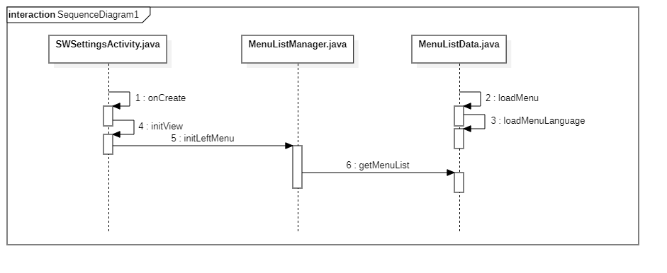

<center><font size="7">设置应用菜单项配置流程解析</font></center>


### 一、 设置菜单列表加载流程



### 二、设置菜单项配置文件的解析流程

​        设置菜单项配置文件的解析是有 `MenuListData.java` 文件中的 `loadMenu()` 方法进行解析的。具体解析说明如下：

#### 1. 读取蓝牙和 WiFi 相关属性

```java
// 隐藏蓝牙和 WiFi 设置选项
int hide_bt_and_wifi = SystemProperties.getInt("ro.NoBTModule", 0);
// 显示 WiFi 选项，该值用于控制非 publishReginList 变量指定区域显示 WiFi 菜单项
int open_wifi = Secure.getInt(mContext.getContentResolver(), "open_wifi", 1);
// 隐藏 WiFi 选项，该值用于控制 publishReginList 变量指的定区域隐藏 WiFi 选项
int hide_wifi = Secure.getInt(mContext.getContentResolver(), "hide_settings_wifi_cfg", 0);
// 获取发布区域（地区）
String publish_region = Secure.getString(mContext.getContentResolver(), "publish_region");
```

#### 2. 选择设置菜单项的配置文件

```java
file = new File("/system/etc/swsettings_NoBTModule.cfg");
if (hide_bt_and_wifi == 0 || !file.exists()) {
    // 由于湖北移动回存在回退版本，如果根据open_wifi来判断，会存升级到现网版本，读取配置文件不对现象
    List<String> publishRegionList = Arrays.asList(
        new String[] { "cmcc_hb", "cmcc_ln", "cmcc_sd", "cmcc_bj", "cmcc_nx", "cmcc_ah", "cmcc_gx" });
    if (publishRegionList.contains(publish_region)) {
        if (hide_wifi == 0) {
            file = new File("/system/etc/swsettings.cfg");// 展示wifi
        } else {
            file = new File("/system/etc/swsettings_none_wifi.cfg");// 屏蔽wifi
        }
    } else {
        if (open_wifi == 1) {
            file = new File("/system/etc/swsettings.cfg");// 展示wifi
        } else {
            file = new File("/system/etc/swsettings_none_wifi.cfg");// 屏蔽wifi
        }
    }
}
if (file.exists() && file.length() > 0) {
    in = new FileInputStream(file);
} else {
    in = new FileInputStream(new File("/system/etc/swsettings.cfg"));
}
```

上面的代码意思如下：

+ 如果设备默认不隐藏 WiFi 和蓝牙菜单选项，或者 `/system/etc/swsettings_NoBTModule.cfg` 文件存在，则有两种情况：
  + 当发布区域是 `"cmcc_hb", "cmcc_ln", "cmcc_sd", "cmcc_bj", "cmcc_nx", "cmcc_ah", "cmcc_gx"` （具体区域请看最新代码）其中的一个时，有两种情况：
    + 如果 `hide_wifi` （隐藏 WiFi 菜单项）的值为 0，则使用 `/system/etc/swsettings.cfg` 文件作为设置菜单项的配置文件。
    + 如果 `hide_wifi` 隐藏 WiFi 菜单项）的值不为 0，则使用 `/system/etc/swsettings_none_wifi.cfg` 文件作为设置菜单项的配置文件。
  + 当发布区域不在上述指定区域时，也有两种情况：
    + 如果 `open_wifi` (显示 WiFi 菜单项）的值为 1，则使用 `/system/etc/swsettings.cfg` 文件作为设置菜单项的配置文件。
    + 如果 `open_wifi` (显示 WiFi 菜单项）的值不为 1，则使用 `/system/etc/swsettings_none_wifi.cfg` 文件作为设置菜单项的配置文件。
+ 如果设备默认隐藏 WiFi 和蓝牙菜单选项，且 `/system/etc/swsettings_NoBTModule.cfg` 文件存在，则使用 `/system/etc/swsettings_NoBTModule.cfg` 文件作为设置菜单项的配置文件。
+ 如果通过上面步骤获取到的配置文件不存在，则使用 `/system/etc/swsettings.cfg` 文件作为设置菜单项的配置文件。

> 在 `small\platform\on-project\build\project_priv.sh` 脚本中的 Create_Project_Cfg_Files 函数会对 swsettings_NoBTModule.cfg、swsettings_none_wifi.cfg 和 swsettings.cfg 文件进行修改。

#### 3. 加载当前设备语言对应的菜单字符串配置文件

```java
// 获取指定语言的配置名称
HashMap<String, String> map = loadMenuLanguage();
```

> 这个文件中设置的菜单字符串优先于设置应用中设置的字符串。

该配置文件是 `/system/etc/swsettings-menu-" + 当前设备语言代码 + ".cfg"`，例如：`swsettings-menu-zh-CN.cfg`。

`loadMenuLanguage()` 方法会将该文件中的内容以键值对的方式保存在 HashMap 中。

#### 4. 解析菜单项配置文件

```java
bw = new BufferedReader(new InputStreamReader(in));
String line = null;
while ((line = bw.readLine()) != null) {
    if (line.startsWith("#")) {
        continue;
    }
    if (line.startsWith("$")) {
        String[] str = line.split(" ");
        if (str.length >= 2) {
            if (str[0].equals("$backkey")) {
                try {
                    SWSettings.mBackKey = Integer.parseInt(str[1]);
                } catch (Exception e) {

                }
            }
        }
        continue;
    }
    String[] str = line.split(" ");
    if (str.length < 2) {
        continue;
    }
    MenuBean bean = new MenuBean();
    bean.setId(str[0]);
    // bean.setName(getName(str[0]));
    bean.setName(getName(str[0], mContext, map));
    bean.setClassName(str[1]);
    if (str.length > 2) {
        String[] strs = new String[str.length - 2];
        for (int i = 2; i < str.length; i++) {
            strs[i - 2] = str[i];
        }
        bean.setParams(strs);
    }
    mMenuList.add(bean);
}
```

代码解析如下：

+ 如果一行以 # 开头，则该内容为注释，直接跳过。
+ 如果一行以 \$ 开头，则通过空格切分该行并保存到数组 str 中。如果 str 数组的第一个元素是 `$backkey`，则将数组的第二个元素转换整型，并赋给 `SWSettings.mBackKey`。也就是说，以 `$backkey` 开头的行用于设置在 `SWEditText` 类中返回键返回键的作用。具体可使用的值为：
  + 0：不处理返回键
  + 1：back键做删除键处理
  + 2：back键在有内容时做删除键，无内容时做返回键
+ 如果一行不是以 # 或 $ 开头的话，则通过空格切分该行并保存到数组 str 中，并通过 str 数组构建菜单模型类。
  + 数组第一个元素为菜单名称的字符串 ID（对应 Strings.xml 中定义的字符串的name值）；
  + 数组第二个元素为菜单界面的实现类的类名。
  + 数组的其他值则为菜单界面实现类的参数。
  + 菜单名称是通过如下规则获取的：
    + 如果在 `/system/etc/swsettings-menu-" + 当前设备语言代码 + ".cfg` 中有对应的设置，则使用该设置的字符串。
    + 否则，通过 str 数组第一个元素的获取对应的字符串。
+ 最后将菜单模型类对象添加到菜单项列表中。

#### 5. swsettings.cfg 文件结构说明

> swsettings_none_wifi.cfg，swsettings_NoBTModule.cfg 的结构和 swsettings.cfg 文件结构一样，这里只用 swsettings.cfg 文件进行说明。

`swsettings.cfg` 文件内容如下：

```
# id(对应strings.xml定义)  className(可以不包含包名) params
#账号设置
menu_account .content.FrameAccountSDLogin

#网络共存
menu_network .content.FrameNetworkLogin eth1_pppoe1-dhcp1-static1_ipoe1-pppoeRoute0-dhcpRoute0-staticRoute0_dhcpOption0_dhcpDns0 wifi1_pppoe0-dhcp1-static1_dhcpOption1 wifidirect0 wifidisplay0 wifihot0 bluetooth0 IPv4Network1 IPv6Network0 NetworkStack0

#网络信息
menu_info .content.FrameNetworkInfo wifi1 eth1 IPv6Info0

#蓝牙信息
menu_bluetooth .content.FrameBluetooth

#系统升级(需要输入密码) 
menu_upgrade .content.FrameUpgradeLogin upgradeTms0 upgradeServer0 upgradeServerEditFocus0 upgradeTime0 enforceUpgrade1 silentUpgrade0 forciblyUpgrade0 upgradeUsb0 focuse_sd

#日期和时间
menu_date .content.FrameDate auto0 manual0 ntp1_firstNtp1-secondNtp0

#声音 
#menu_sound .content.FrameDisplaySound standard0_display0_sound1  need_reboot1

#显示
menu_display .content.FrameDisplaySound standard1_display1_sound0  need_reboot0

#一键检测
#menu_test .content.TestNetSpeed  net0_test_net_ip1-test_net_access1-test_net_service0-test_net_dns1-test_net_mac1-test_net_systime1 cable1 ip1 getway1 center0 ntp1 dns1 speed1 multicast0
menu_test .content.FrameSpeedSD 

#管理应用程序
#menu_app .content.FrameApp

#存储
menu_memory .content.FrameMemory storageRemove1_mLlStroageFormat0

#平台信息
#menu_platform .content.FramePlatform platform1 terminal1  hdc1 testSpeed0 central_url0

#关于
menu_about .content.FrameAbout userinfo_business_account1 userinfo_network_account1 deviceModel1 hardDeviceModel1 kernelVersion0 factoryName1 cup1 ram1 flash1 softVersion1  hardVersion0 softModel0 complieTime0 androidVersion1 mac1 wifiMac0 terminal0 USERID0 AreaInfo0 stbID1 packageVersion0 AuthAccount0 termainanlBackupUrl0 termainalUrl0 AuthBackUpUrl0 AuthUrl0

#自动休眠
menu_sleep .content.FrameSleep sleep_time_auto_set0 sleep_hdmi1 sleep_auto1

#恢复出厂设置
menu_reset .content.FrameReset password1 720P_50_0 1080I_50_0 1080P_50_0
```

+ `swsettings.cfg` 文件是行作为一条完整的配置项。
+ `swsettings.cfg` 文件中以 # 开头的行为注释。
+ `swsettings.cfg` 文件中以 $backkey 开头是配置 `SWEditText` 类中返回键的响应方式。
+ `swsettings.cfg` 文件中每条完整的配置项是以空格作为分隔符分隔开多个参数。
+ 一条完整的配置项的第一个参数为菜单名字的字符串ID名称（对应于 strings.xml ），第二个参数是设置项界面的实现类名（可以不包含包名），如果还有后续参数，则该后续参数为该类的参数。

#### 6. swsettings-menu-" + 当前设备语言代码 + ".cfg 文件结构说明

下面以 `swsettings-menu-zh-CN.cfg` 为例，其内容如下：

```
# id(对应strings.xml定义)，指定语言界面显示内容

#网络
menu_network 网络配置
menu_test 网络测速
menu_memory 用户存储
menu_about 设备信息
menu_platform 平台配置
menu_date 日期时间
menu_display 显示设置
menu_reset 恢复出厂
```

+ `swsettings-menu-zh-CN.cfg` 文件也是以行作为配置项单元。
+ `swsettings-menu-zh-CN.cfg` 文件中以 # 开头的行为注释行。
+ 配置项是以空格作为分隔符，分隔多个参数。
+ 第一个参数是 Strings.xml 文件定义的字符串 ID 名称，第二个参数为该字符串资源的替换字符串。

#### 7. 理解 swsettings.cfg 和 swsettings-menu-zh-CN.cfg 中的 id 参数

比如在 SWSettings_mv300源代码目录 `SWSettings_mv300\res\values\stings.xml` 的文件中有如下定义：

```xml
<resources xmlns:xliff="urn:oasis:names:tc:xliff:document:1.2">

    ......
    <string name="menu_network">Network Setting</string>
    ......
</resources>
```

在 `swsettings.cfg` 和 `swsettings-menu-zh-CN.cfg` 中的 `menu_network` 即是上面 `name=` 后面的值。

> 上面提到的 `cfg` 文件可以在 `cmdc\small\platform\on-project\pub\system\etc` 目录下找到。

> 注意，如果需要新增设置菜单项，在配置 `swsettings.cfg` 和 `swsettings-menu-zh-CN.cfg` 文件时，id 值必须以 `menu_` 开头。因为在 `SWSettingsActivity` 中用于定位当前页面时，是通过 `menu_` 开头的字符串进行定位的。
>
> ```java
> // 根据 Intent 携带的信息跳转到相对应的设置界面
> private void dealIntent() {
>     Intent intent = this.getIntent();
>     String key = intent.getStringExtra("settings_key");
>     LOG.d("key: " + key);
>     if (key == null || key.length() == 0)
>         return;
>     if (!key.startsWith("menu_"))
>         key = "menu_" + key;
>     int index = mMenuListManager.getIndexByValue(key);
>     LOG.d("index : " + index);
>     mMenuListManager.setPosition(index);
> }
> ```