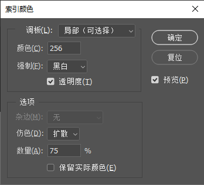
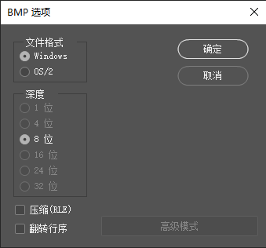

1. 将要转换的图片拖到 `Photoshop` 软件中打开图片。

2. 点击 `图像` -> `模式` -> `索引颜色...`，在弹出的对话框中保持默认值后点击 `确定` 按钮。

   

3. 点击 `文件` -> `存储为...` 菜单，在弹出的窗口中选择图片要保存的位置，在保存类型中选择 `BMP` 类型，然后点击 `保存` 按钮。

   

4. 在弹出的对话框中保持默认参数，然后点击 `确定` 按钮即可完成转换。

   

