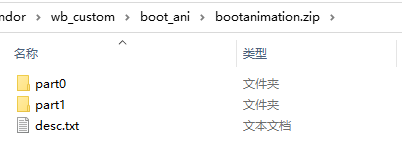
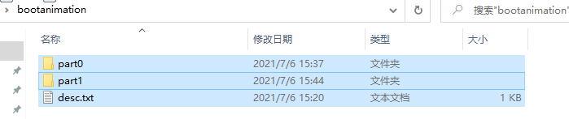
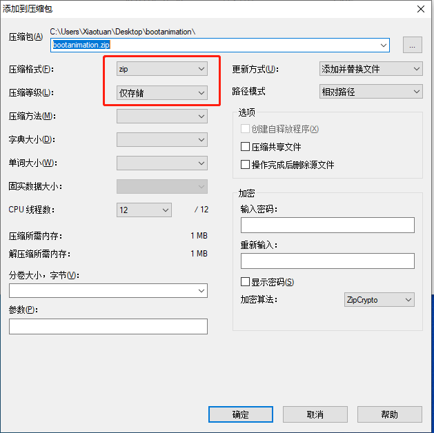

[toc]

### 1. 开关机动画压缩包目录结构如下



### 2. desc.txt 文件内容分析

```txt
800 1280 16
p 4 0 part0
p 0 0 part1
```

+ 第一行 `800 1280 16`，分别表示图片分辨率 `800 1280`（图片分辨率最好与设备屏幕分辨率一致），`16` 表示每秒播放多少张图片。

+ 第二行 `p 4 2 part0` ，`4` 表示播放多少次（0 表示循环播放），`2` 表示播放完后停顿 2 毫秒（单位需要验证），`part0` 表示需要播放的文件夹。
+ 第三行 `p 0 0 part1`，格式与第二行一样。

### 3. 开关机动画制作过程

#### 3.1 创建开关机动画目录结构

1. 创建 `bootanimation` 文件夹。
2. 在 `bootanimation` 文件夹中创建 `part0` 和 `part1` 文件夹，以及 desc.txt 文件。
3. 将图片文件拷贝到 `part0` 和 `part1` 文件夹中。通常我们将动画图片资源拷贝到 `part0` 文件夹中，然后拷贝 `part0` 文件夹中最后一张图片拷贝到 `part1` 文件中，意思是播放完动画后，如果系统还没有启动完成，则循环播放最后一帧动画，避免黑屏现象出现。
4. 按照 desc.txt 文件格式说明，填入正确的内容。
5. 使用 7zip 软件以存储方式压缩开关机动画文件成 zip 压缩包。

#### 3.2 注意事项

1. 开关机动画图片命名没有特殊要求，只要确保顺序正确即可。

2. 压缩时，必须在 bootanimation 文件夹内压缩，不能在 bootanimation 文件夹上右击选择压缩。如下图所示，全选所有文件和目录，右击选择压缩：

   

3. 压缩必须是 zip 格式，且是以 存储模式来压缩的。

   

