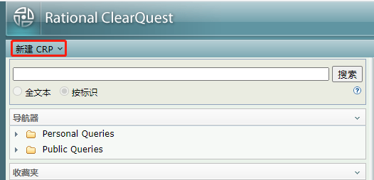
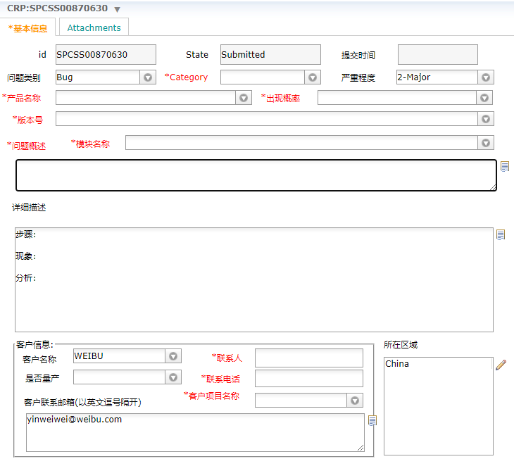
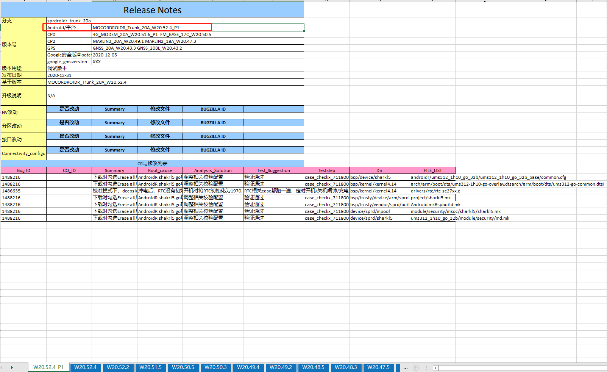
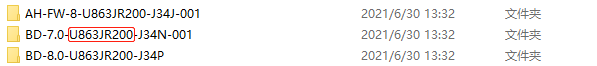
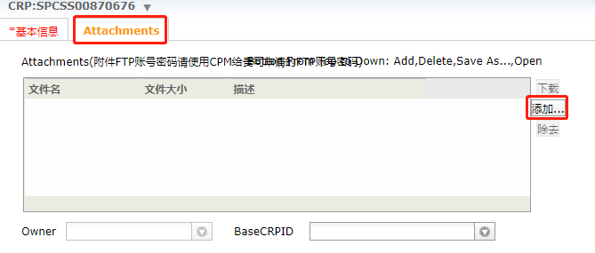
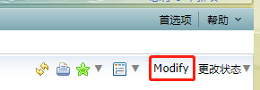

[toc]

### 1. 登录展讯 CRP 网站

网址：http://222.66.158.138:2008/cqweb/
账户：Weibu/weibu
密码：Weibu0728

### 2. 新建 CRP

在网址顶部点击 `新建 CRP` 菜单。

### 3. 填写表单

#### 3.1 问题类别

问题类别可以选择 `Bug`、`Question`、`Task`、`Request`、`Test Requirement`。

#### 3.2 Category

`Category` 项可以选择 `Software`、`Hardware`、`NPI`。

#### 3.3 严重程度

严重程度可以选择 `1-Critical`、`2-Major`、`3-Average`、`4-Minor`、`5-Improved`、`0-Urgent`。

#### 3.4 产品名称

产品名称大多数是 `SC9863A`，具体的可以在工程源代码中执行 `loading_customer_info.sh` 脚本后，查看 `device` 目录下修改了那个芯片的文件，那产品名称就是该芯片名称。

#### 3.5 模块名称

根据问题所在的模块，选择正确的模块即可。

#### 3.6 版本号

这个版本号可以通过查看 `vendor\sprd\release\IDH\CUS_Release_Notes\AP\CUS_releasenote_MOCORDROIDR_Trunk_20A.xlsx` 表格进行获取。

#### 3.6 问题概述

这里填写下问题的简要描述即可。

#### 3.7 详细描述

在这里对问题进行详细的描述。

#### 3.8 联系人

联系人填写自己的名字

#### 3.9 联系电话号码

填写自己的电话号码

#### 3.10 客户项目名称

客户名称可以通过查看 `wb_project` 目录下的工程名，客户名称在工程名中，如下图红线框住部分。

#### 3.11 客户联系邮箱

需要添加万传明和自己的邮箱进去，用逗号隔开，原先的邮箱保留。

#### 3.12 添加附件

点击 `基本信息` 选项卡旁边的 `Attachments` 选项卡，在文件列表框右边点击 `添加...` 按钮即可添加附件。

#### 3.13 提交 CRP

点击网页顶部的 `保存` 按钮即可提交 CRP。

> 注意：
>
> 如果需要重新修改 CRP 可以点击网页顶部右边的 `Modify` 按钮，即可将 CRP 切换到可编辑状态。如果点击 `Modify` 按钮后弹出错误弹框，可以点击网页顶部右边的 `更改状态` 下拉菜单按钮，在下拉菜单中选择 `Reopen` 项，即可重新打开该 CRP，并处于可编辑状态。
>
> 