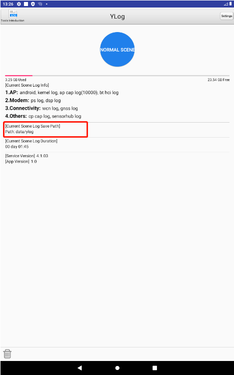
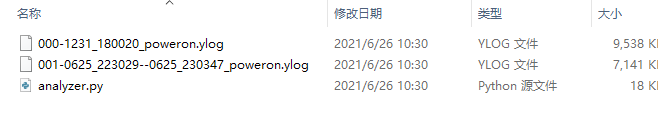
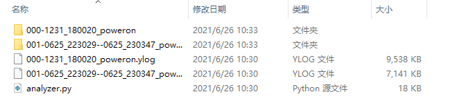

展讯平台的日志打印应用名称为 `YLog`，它会在桌面创建启动图标，点击它即可打开应用。下面是 `YLog` 应用界面：



点击应用界面上的圆形按钮可以开启或关闭日志记录。

在 `[Current Scene Log Save Path]` 栏的副标题中显示了日志文件存储位置。可以通过如下命令将日志导出：

```shell
$ adb pull data/ylog
```

大部分日志都存储在 `ap` 目录中，但是 `ap` 目录的日志文件并不能直接阅读：



需要通过运行 `analyzer.py` 脚本后才可以得到可阅读的日志文件，运行该命令如下：

```shell
$ python3 analyzer.py
```

运行 `analyzer.py` 脚本后得到如下内容：



