[toc]

### 步骤一：

按仪器上的 `Local` 按钮。

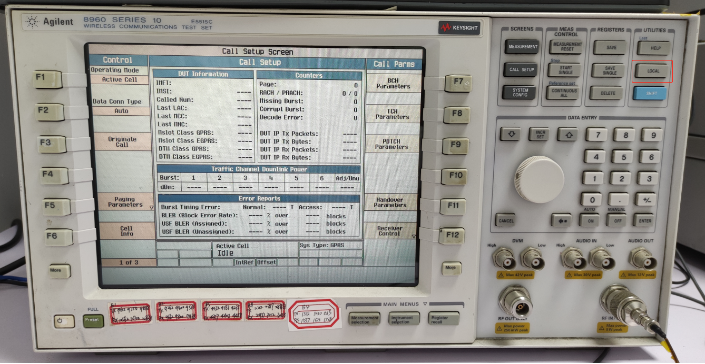

### 步骤二：

按仪器上的 `Preset` 按钮恢复参数到默认值。

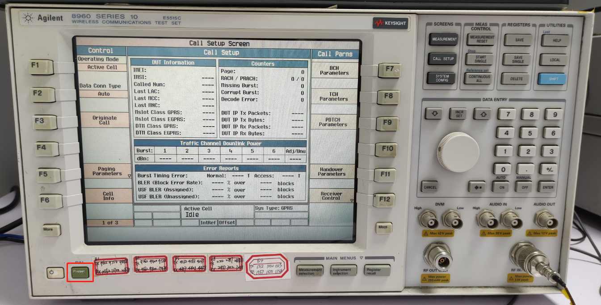

### 步骤三：

按仪器上的 `F7` 按钮，设置 `BCH Parameters` 参数。

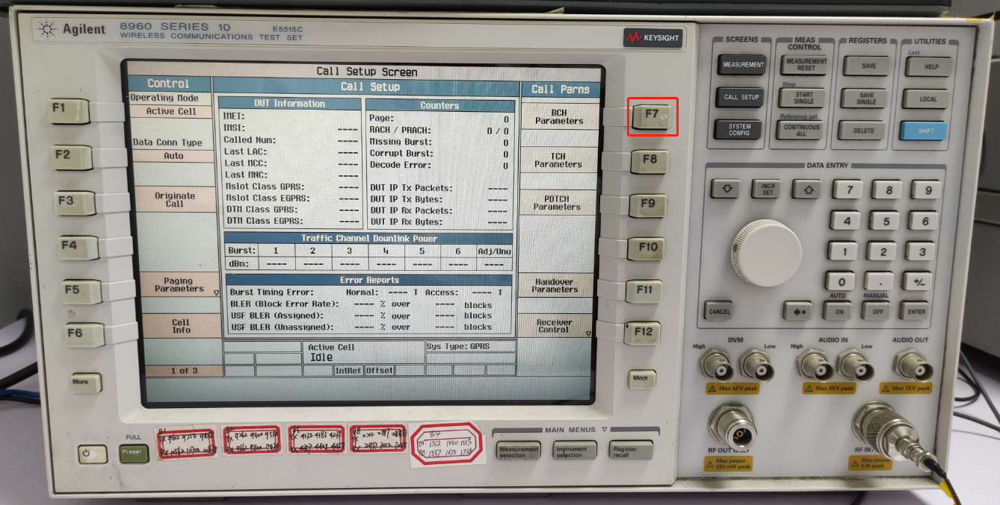

### 步骤四：

按照下图设置 `BCH Parameters` 参数。

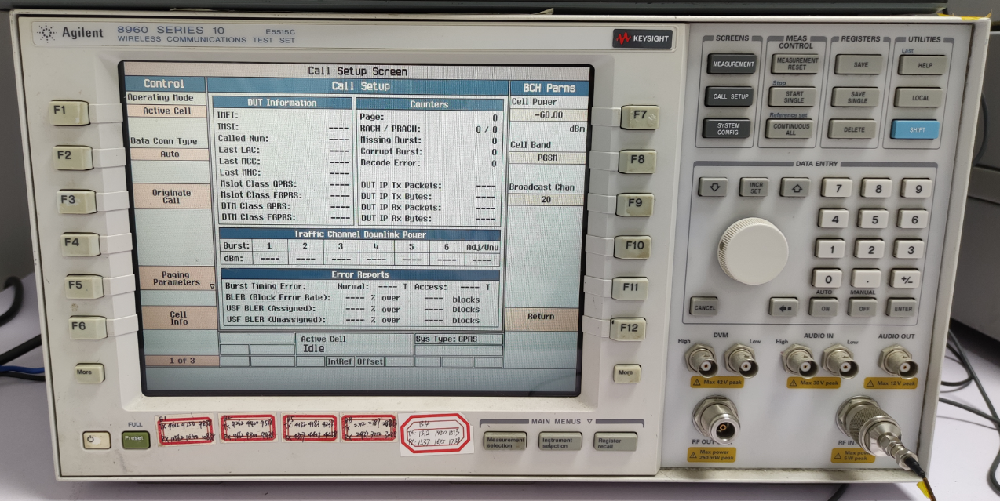

设置完成后按 `F12` 按钮退出设置。

### 步骤五：

按 `F8` 按钮，进入 `TCH Parameters` 设置界面。

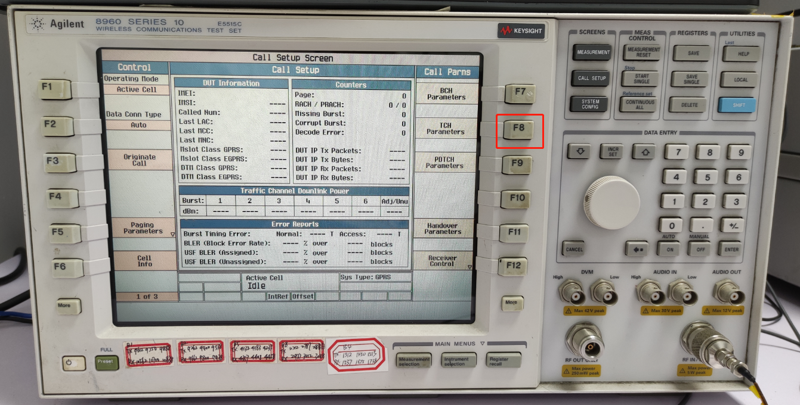

### 步骤六：

按照下图设置 `TCH Parameters` 参数。

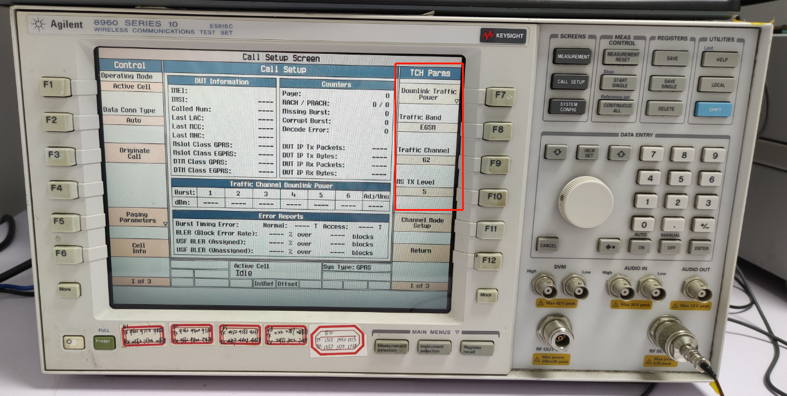

设置完成后，按 `F12` 按钮退出设置界面。

> 注意：结束这一步骤操作后，请将射频线连接到平板的射频端口上，查看平板是否有信号，如果没有，请按下上图的 <kbd>F3</kbd>（Originate Call）按键，请求连接平板。

### 步骤七：

按左侧 `More` 按钮一次，进入如下界面：

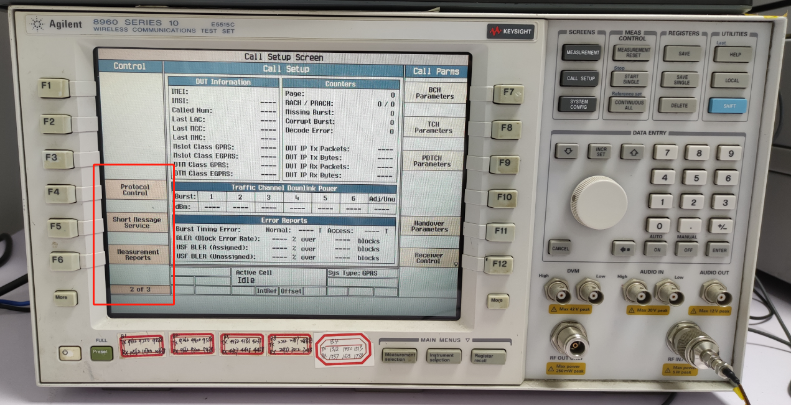

### 步骤八：

按 `F5` 按钮，进入如下界面。

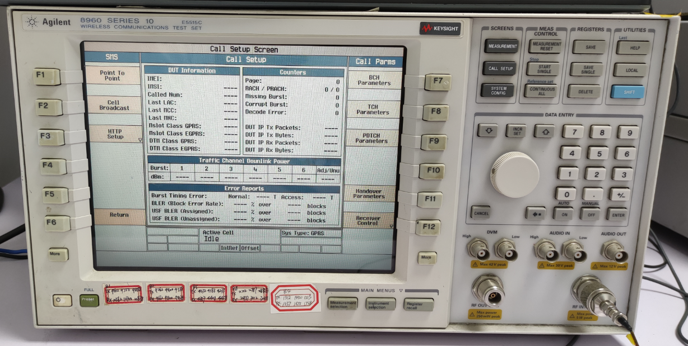

### 步骤九：

按 `F2` 按钮进入小区广播设置界面。

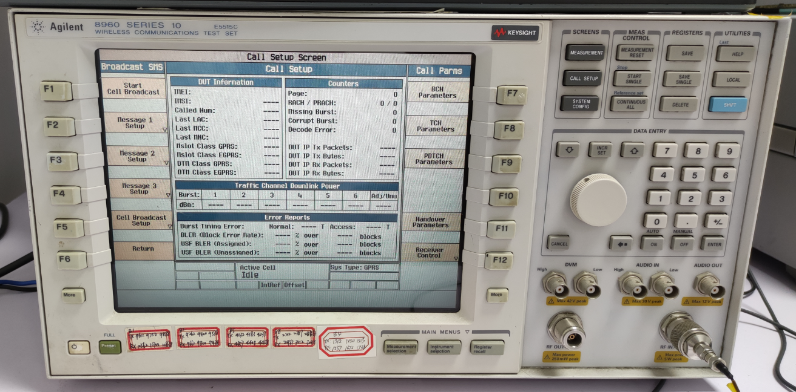

### 步骤十：

按 `F2` 按钮进入小区广播通道 ID 设置界面。

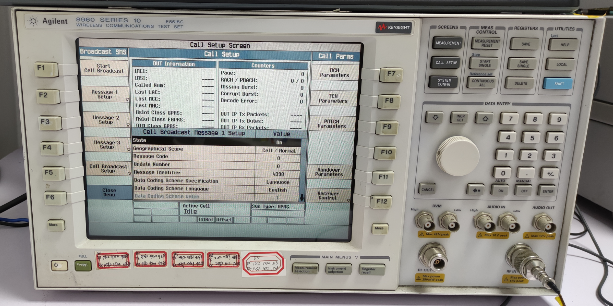

### 步骤十一：

使用旋转按钮将焦点切换到 `Message Identifier` 栏，然后按下旋转按钮进入编辑状态，在右边的数字键盘中输入要设置的小区广播通道 ID。设置完成后再按一次旋转按钮，然后按 `F6` 按钮退出设置界面。

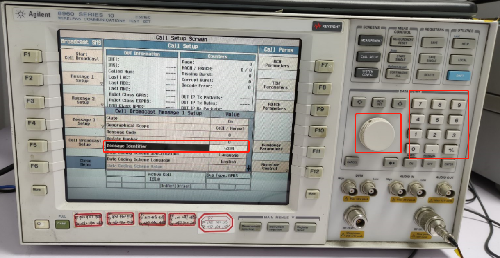

### 步骤十二：

按 `F1` 按钮开始发送小区广播，如果需要停止发送则再次按下 `F1` 按钮即可。

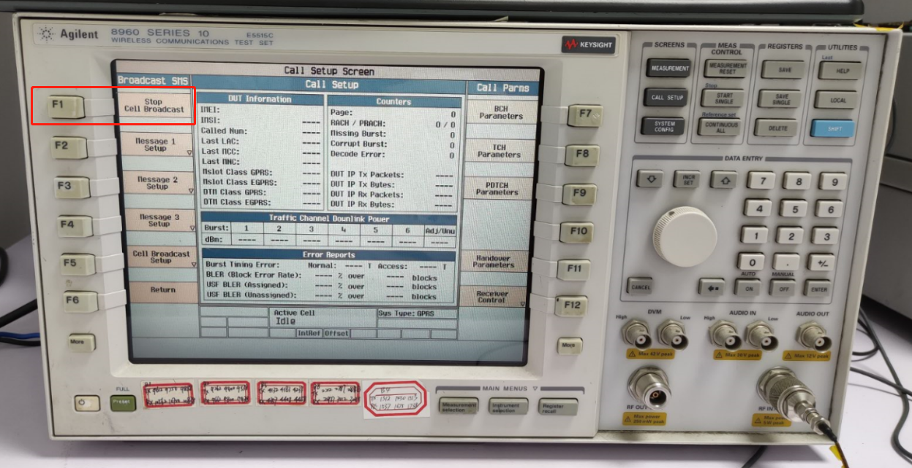

### 注意：

+ 当测试设备重启后，需要在重启完成后开启飞行模式，然后在关闭飞行模式，这样设备才能连接上要测试的机子。
+ 如果需要重新设置小区广播通道 ID，需要先停止发送小区广播，然后再设置。