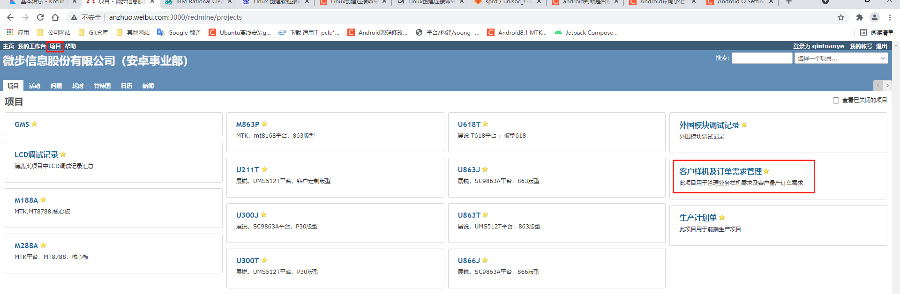
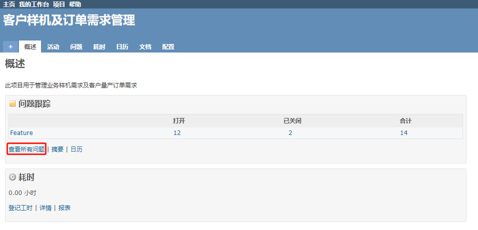
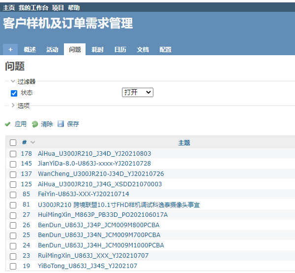
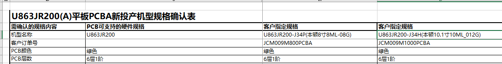

[toc]

### 1. 下载代码

主仓库下载地址：git@192.168.0.24:sprd/unisoc_r.git

客制化仓库下载地址：git@192.168.0.24:sprd/sprd_r_customer.git

1.1 使用下面命令创建一个目录，比如 unisoc：

```shell
mkdir unisoc
```

1.2 在 `unisoc` 目录下执行如下命令下载代码：

```shell
git clone git@192.168.0.24:sprd/unisoc_r.git sprd_r
git clone git@192.168.0.24:sprd/sprd_r_customer.git sprd_r_customer
```

执行上面命令后会在 `unisoc` 目录下生成 `sprd_r` 和 `sprd_r_customer` 两个目录，它们分别对应主仓库代码和客制化代码。

### 2. 创建 `sprd_r_customer` 的软链接

在 `unisoc` 目录下执行如下命令为 `sprd_r_customer` 在 `sprd_r/weibu/project/` 目录创建一个软链接：

```shell
cd sprd_r/weibu/project
ln -s ../../../sprd_r_customer customer
```

### 3. 创建项目目录

在 `sprd_r_customer` 目录下创建项目目录，目录名称规则如下：

`公版项目名-客户项目名`

> 注意：公版项目名和客户项目名字符串不能包含 `-` 字符，如果需要间隔两个字符可以使用下划线 `_`。

#### 3.1 公版项目名命名规则

```
绿色：已经有
黄色：进行中
uj300asb_ac（刘）  			-- u300j 10.1寸项目竖屏竖放横用，5g wifi，带通话，外部功放，非go版本
uj300asb_ac_go  		-- u300j 10.1寸项目竖屏竖放横用，5g wifi，带通话，外部功放，go版本
uj300asb_ac_wifionly（项目/硬件）		-- u300j 10.1寸项目竖屏竖放横用，5g wifi，不带通话，外部功放，非go版本
uj300asb_ac_wifionly_go	-- u300j 10.1寸项目竖屏竖放横用，5g wifi，不带通话，外部功放，go版本
uj300asb（项目/硬件）		 		-- u300j 10.1寸项目竖屏竖放横用，2.4g wifi，带通话，外部功放，非go版本
uj300asb_go 			-- u300j 10.1寸项目竖屏竖放横用，2.4g wifi，带通话，外部功放，go版本
uj300asb_wifionly		-- u300j 10.1寸项目竖屏竖放横用，2.4g wifi，不带通话，外部功放，非go版本
uj300asb_wifionly_go		-- u300j 10.1寸项目竖屏竖放横用，2.4g wifi，不带通话，外部功放，go版本

uj863asb_ac（）  			-- u863j 10.1寸项目竖屏竖放横用，5g wifi，带通话，外部功放，非go版本
uj863asb_ac_go  		-- u863j 10.1寸项目竖屏竖放横用，5g wifi，带通话，外部功放，go版本
uj863asb_ac_wifionly（无机器）		-- u863j 10.1寸项目竖屏竖放横用，5g wifi，不带通话，外部功放，非go版本
uj863asb_ac_wifionly_go	-- u863j 10.1寸项目竖屏竖放横用，5g wifi，不带通话，外部功放，go版本
uj863asb_go（） 			-- u863j 10.1寸项目竖屏竖放横用，2.4g wifi，带通话，外部功放，go版本
uj863asb		 		-- u863j 10.1寸项目竖屏竖放横用，2.4g wifi，带通话，外部功放，非go版本
uj863asb_wifionly（无机器）		-- u863j 10.1寸项目竖屏竖放横用，2.4g wifi，不带通话，外部功放，非go版本
uj863asb_wifionly_go		-- u863j 10.1寸项目竖屏竖放横用，2.4g wifi，不带通话，外部功放，go版本

uj863asc_ac（无机器）  			-- u863j 10.1寸项目竖屏横放横用，5g wifi，带通话，外部功放，非go版本
uj863asc_ac_go  		-- u863j 10.1寸项目竖屏横放横用，5g wifi，带通话，外部功放，go版本
uj863asc_ac_wifionly（无机器）		-- u863j 10.1寸项目竖屏横放横用，5g wifi，不带通话，外部功放，非go版本
uj863asc_ac_wifionly_go	-- u863j 10.1寸项目竖屏横放横用，5g wifi，不带通话，外部功放，go版本
uj863asc_go 			-- u863j 10.1寸项目竖屏横放横用，2.4g wifi，带通话，外部功放，go版本
uj863asc		 		-- u863j 10.1寸项目竖屏横放横用，2.4g wifi，带通话，外部功放，非go版本
uj863asc_wifionly（无机器）		-- u863j 10.1寸项目竖屏横放横用，2.4g wifi，不带通话，外部功放，非go版本
uj863asc_wifionly_go		-- u863j 10.1寸项目竖屏横放横用，2.4g wifi，不带通话，外部功放，go版本

uj8637sa_ac  			-- u863j 7寸项目竖屏竖放竖用，5g wifi，带通话，内部功放，非go版本
uj8637sa_ac_go  		-- u863j 7寸项目竖屏竖放竖用，5g wifi，带通话，内部功放，go版本
uj8637sa_ac_wifionly		-- u863j 7寸项目竖屏竖放竖用，5g wifi，不带通话，内部功放，非go版本
uj8637sa_ac_wifionly_go	-- u863j 7寸项目竖屏竖放竖用，5g wifi，不带通话，内部功放，go版本
uj8637sa_go（江） 			-- u863j 7寸项目竖屏竖放竖用，2.4g wifi，带通话，内部功放，go版本
uj8637sa（江）		 		-- u863j 7寸项目竖屏竖放竖用，2.4g wifi，带通话，内部功放，非go版本
uj8637sa_wifionly（江）		-- u863j 7寸项目竖屏竖放竖用，2.4g wifi，不带通话，内部功放，非go版本
uj8637sa_wifionly_go	（江）	-- u863j 7寸项目竖屏竖放竖用，2.4g wifi，不带通话，内部功放，go版本

uj8638sa_ac（江）  			-- u863j 8寸项目竖屏竖放竖用，5g wifi，带通话，内部功放，非go版本
uj8638sa_ac_go（江）  		-- u863j 8寸项目竖屏竖放竖用，5g wifi，带通话，内部功放，go版本
uj8638sa_ac_wifionly		-- u863j 8寸项目竖屏竖放竖用，5g wifi，不带通话，内部功放，非go版本
uj8638sa_ac_wifionly_go	-- u863j 8寸项目竖屏竖放竖用，5g wifi，不带通话，内部功放，go版本
uj8638sa_go（江） 			-- u863j 8寸项目竖屏竖放竖用，2.4g wifi，带通话，内部功放，go版本
uj8638sa（江）		 		-- u863j 8寸项目竖屏竖放竖用，2.4g wifi，带通话，内部功放，非go版本
uj8638sa_wifionly		-- u863j 8寸项目竖屏竖放竖用，2.4g wifi，不带通话，内部功放，非go版本
uj8638sa_wifionly_go		-- u863j 8寸项目竖屏竖放竖用，2.4g wifi，不带通话，内部功放，go版本

uj8638ka（江）		 		-- u863j 8寸项目横屏竖放竖用，2.4g wifi，带通话，内部功放，非go版本

ut300asb_ac 				-- u300t 10.1寸项目竖屏竖放横用，5g wifi，带通话，外部功放，非go版本
ut300asb_ac_wifionly		-- u300t 10.1寸项目竖屏竖放横用，5g wifi，不带通话，外部功放，非go版本

ut863asb_ac 				-- u863t 10.1寸项目竖屏竖放横用，5g wifi，带通话，外部功放，非go版本
ut863asb_ac_wifionly(无硬件)		-- u863t 10.1寸项目竖屏竖放横用，5g wifi，不带通话，外部功放，非go版本

ut863asc_ac（无硬件） 				-- u863t 10.1寸项目竖屏横放横用，5g wifi，带通话，外部功放，非go版本
ut863asc_ac_wifionly		-- u863t 10.1寸项目竖屏横放横用，5g wifi，不带通话，外部功放，非go版本

ut8637ka_ac（无机器） 				-- u863t 7寸项目横屏竖放竖用，5g wifi，带通话，内部功放，非go版本
ut8637ka _ac_wifionly		-- u863t 7寸项目横屏竖放竖用，5g wifi，不带通话，内部功放，非go版本

ut8638sa_ac （无机器）				-- u863t 8寸项目竖屏竖放竖用，5g wifi，带通话，内部功放，非go版本
ut8638sa_ac_wifionly		-- u863t 8寸项目竖屏竖放竖用，5g wifi，不带通话，内部功放，非go版本
```

#### 3.2 客户项目名命名规则

命名规则如下：

`客户名称全拼(驼峰命名)_机型名称_订单号`

如果是样机项目的话，客户项目名命名规则为：

`客户名称全拼(驼峰命名)_机型名称_YJ日期`

#### 3.3 查看机型名称、订单号和样机时间

**方法一：**

通过 `Redmine` （<http://anzhuo.weibu.com:3000/redmine/>）系统获取。打开 `Redmine` 主页， 在网址顶部点击 `项目`；在 `项目` 界面右边点击 `客户样机及订单需求管理` 项。



在 `客户样机及订单需求管理` 界面点击 `查看所有问题`。



这时我们可以看到客户样机及订单列表。



这时，我们可以看到项目的机型号和样机时间。

例如，样机项目 `AiHua_U300JR210_J34D_YJ20210803`，它的机型名称为 `J34D`，样机时间为：20210803。

例如，订单项目 `BenDun_U863J_J34P_JCM009M800PCBA`，它的机型名称为 `J34P`，订单号为 JCM009M800PCBA。

**方法二：**

可以在 `\\192.168.0.24\wbshare\产品\新投产机型规格确认表` 中找到对应硬件PCB版本对应的文件，例如：`BD-8.0-U863JR200-J34P-001` 对应的硬件 PCB 版本文件是 `U863JR200A平板PCBA新投产机型规格确认_2021-7-5.xls`。打开文件后可以看到如下内容：



机型名称可以从机型名称一栏看出，比如：`U863JR200-J34H(本顿10.1寸10ML_012G)` 的机型名称是 `J34H`。

在 `客户订单号` 订单一栏可以获取项目订单号，比如上面这个项目的订单号为 `JCM009M1000PCBA`。

