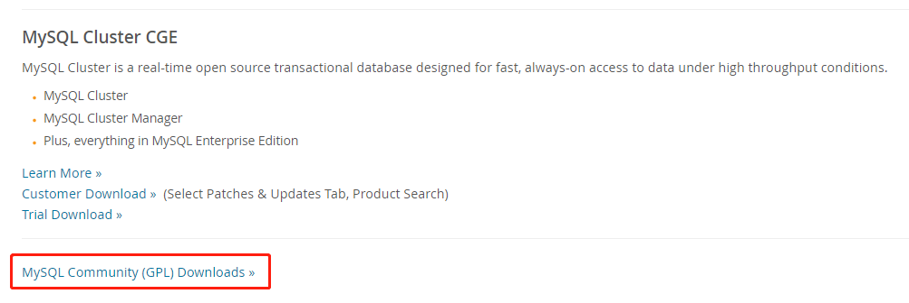
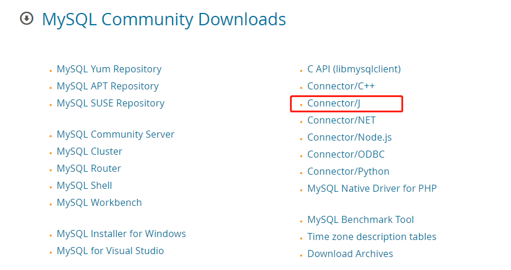
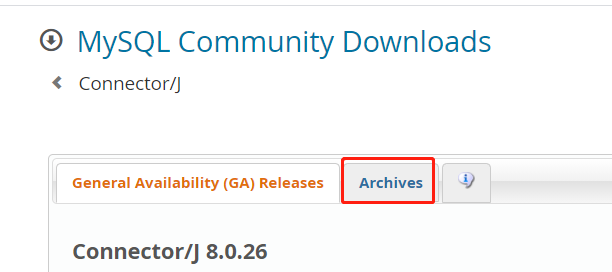
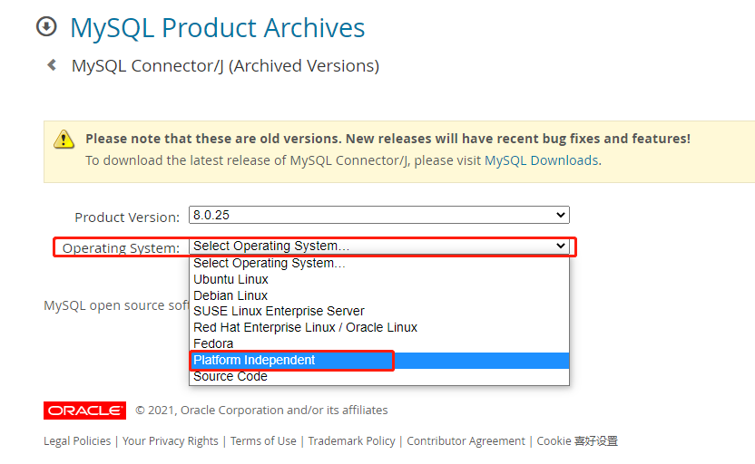
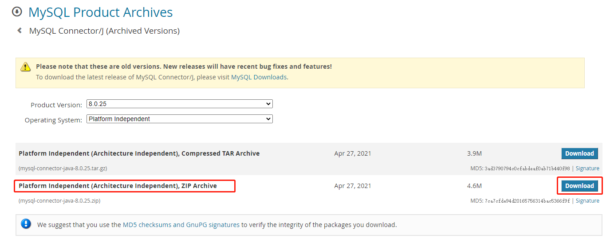

1. 打开 [MySQL](https://www.mysql.com) 官网。

2. 在官网上点击 `DOWNLOADS` 菜单。

   

3. 把页面拉到下面，找到 [MySQL Community (GPL) Downloads](https://dev.mysql.com/downloads/) 连接。

   

4. 在下载界面找到 [Connector/J](https://dev.mysql.com/downloads/connector/j/) 链接。

   

5. 在打开的界面选择 [Archives](https://downloads.mysql.com/archives/c-j/) 选项卡。

   

6. 在打开的界面中的 `Operating System` 输入框中点击下拉按钮选择 `Platform Independent` 项。

   

7. 在 `Operating System` 下面的列表中点击 `Platform Independent (Architecture Independent), ZIP Archive` 项后面的下载按钮，即可下载 `mysql-connector-java.jar` 文件了。

   

