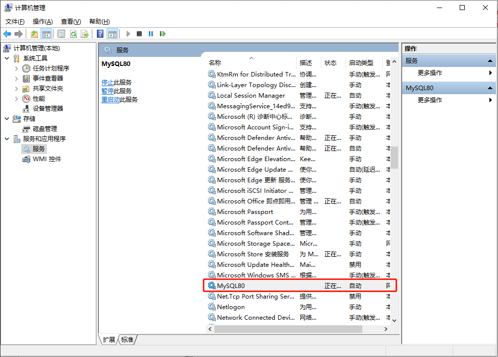

[toc]

### 1. Windows

#### 1.1 noinstall 安装的 MySQL

对于 noinstall 安装的 MySQL，可以在 DOS 窗口下通过命令行方式启动和关闭 MySQL 服务。

##### 1.1.1 启动服务（未验证）

```shell
$ cd C:\Program Files\MySQL\MySQL Server 8.0\bin
$ mysqld --console
```

##### 1.1.2 关闭服务（未验证）

```shell
$ mysqladmin -uroot shutdown
```

#### 1.2 图形方式安装的 MySQL

##### 1.2.1 获取 MySQL 服务名称

在桌面 `此电脑` 图标上右击单击，在弹出的菜单中选择 `管理`。在打开的 `计算机管理` 界面的左侧选择 `服务和应用程序` 下的 `服务` 项，然后在右侧服务列表中找到 MySQL 服务名称，例如：MySQL80。



##### 1.2.2 启动服务

```shell
$ net start mysql80
```

##### 1.2.3 关闭服务

```shell
$ net stop mysql80
```

### 2. Linux

#### 2.1 命令行方式

##### 2.1.1 启动服务（无效）

```shell
$ cd /usr/bin
$ sudo ./mysqld_safe &
```

##### 2.1.2 关闭服务

```shell
$ cd /usr/bin
$ sudo mysqladmin shutdown -u root -p
```

> 注意：在命令行启动 MySQL 时，如果不加 `--console`，启动关闭信息将不会再界面中显示，而是记录在安装目录下的 data 目录里面，文件名一般是 hostname.err，可以通过此文件查看 MySQL 的控制台信息。

#### 2.2 服务的方式

##### 2.2.1 启动服务

```shell
$ service mysql start
```

##### 2.2.2 关闭服务

```shell
$ service mysql stop
```

##### 2.2.3 重启服务

```shell
$ service mysql restart
```

