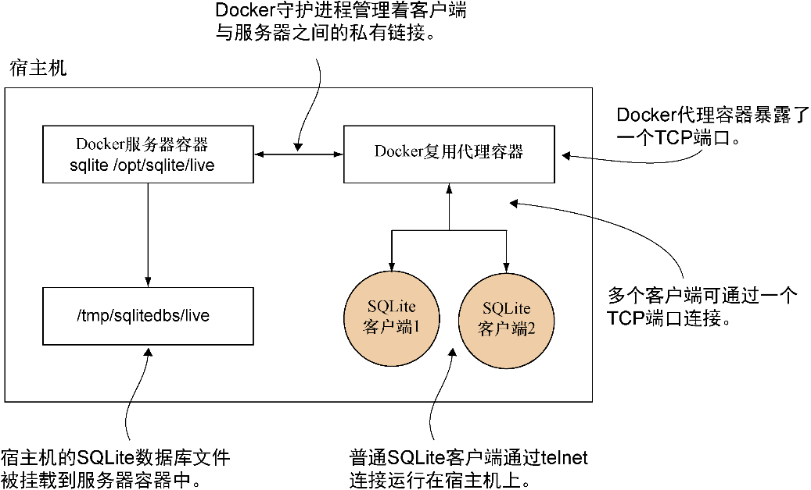

### 技巧77　一个使用Docker Compose的SQLite服务器

默认情况下，SQLite没有任何TCP服务器的概念。本技巧在前面的技巧的基础上，提供了一种使用Docker Compose来实现TCP服务器功能的方法。

具体说来，它是使用此前介绍过的工具和概念来构建的：

+ 卷；
+ 使用socat代理；
+ Docker Compose。

我们也将介绍链接的替代品：网络。


**注意**

本技巧要求在宿主机上安装SQLite 3版本。同时建议安装rlwrap，以便在与SQLite服务器交互时让行编辑变得更友好一些（这不是必需的）。这些软件包在标准的包管理器中都能免费获得。


本技巧对应的代码可在https://github.com/docker-in-practice/docker-compose-sqlite下载。

#### 问题

想要使用Docker高效地开发一个复杂的引用宿主机外部数据的应用程序。

#### 解决方案

使用Docker Compose。

图10-1给出了本技巧架构的一个概述。从高层次上看，有两个运行中的Docker容器：一个负责执行SQLite客户端，另一个用于将不同的TCP连接代理到这些客户端上。需要注意的是，执行SQLite的容器并未公开给宿主机，代理容器则实现了这一点。将职责分离成离散单元是微服务构架的一个共同特点。


<center class="my_markdown"><b class="my_markdown">图10-1　SQLite服务器工作原理</b></center>

所有节点都将使用同一个镜像。设置代码清单10-5所示的Dockerfile。

代码清单10-5　SQLite服务器、客户端及代理合一的Dockerfile

```c
FROM ubuntu:14.04
RUN apt-get update && apt-get install -y rlwrap sqlite3 socat　　⇽---　安装必要的应用程序
 EXPOSE 12345　　⇽---　公开12345端口以便节点可通过Docker守护进程进行通信
```

代码清单10-6展示的是docker-compose.yml的内容，它定义了容器将如何启动。

代码清单10-6　SQLite服务器与代理的docker-compose.yml

```c
version: "3"
services:
  server: 　　⇽---　服务器与代理容器定义在这一节中
     command: socat TCP-L:12345,fork,reuseaddr >
EXEC:'sqlite3 /opt/sqlite/db',pty　　⇽---　创建一个socat代理，用于将SQLite调用的输出链接到一个TCP端口上
     build: . 　　⇽---　在启动时从同一目录的Dockerfile构建镜像
     volumes: 　　⇽---　将SQLite测试数据库文件挂载到容器内的/opt/sqlite/db上
     - /tmp/sqlitedbs/test:/opt/sqlite/db
    networks:
     - sqlnet　　⇽---　两个服务都将成为sqlnet Docker网络的一部分
    proxy: 　　⇽---　服务器和代理都定义在这一节中
       command: socat TCP-L:12346,fork,reuseaddr TCP:server:12345　　⇽---　创建一个socat代理，用于把12346端口的数据传递到服务器容器的12345端口上
       build: . 　　⇽---　在启动时从同一目录的Dockerfile构建镜像
       ports: 　　⇽---　向宿主机发布12346端口
       - 12346:12346
       networks:
       - sqlnet　　⇽---　两个服务都将成为sqlnet　Docker网络的一部分
    networks: 　　⇽---　定义当前Docker Compose文件中的容器可以加入的网络列表
      sqlnet:
      driver: bridge
```

参数 `TCP-L:12345,fork,reuseaddr` 指定服务器容器中的socat进程监听12345端口，并允许接入多个连接。后面的 `EXEC:` 部分告诉 `socat` 针对每个连接在/opt/sqlite/db文件上运行SQLite，并为此进程分配一个伪终端。客户端容器中的socat进程与服务器容器的监听行为一样（除了端口不同），不过它将建立一个与SQLite服务器的TCP连接，而不是为呼入的连接运行某个程序。

与技巧76的显著差异在于网络而不是链接的使用——网络提供了一种在Docker里创建新的虚拟网络的方法。Docker Compose默认总是使用新的“桥接”虚拟网络，后者是在上述Compose配置中明确命名的（bridge）。因为任何新的桥接网络都允许使用容器的服务名来访问容器，就没必要再使用链接了（当然，如果你需要服务的别名，仍然可以使用）。

尽管这项功能可以在一个容器内实现，但服务器/代理容器的设置可以让这个系统的架构更易于扩展，因为每个容器只对一项任务负责。服务器负责打开SQLite连接，而代理负责将服务公开给宿主机。

代码清单10-7（从仓库的原始版本简化而来，见https://github.com/docker-in-practice/docker- compose-sqlite）将在宿主机上创建两个最小化的SQLite数据库，即test和live。

代码清单10-7　setup_dbs.sh

```c
#!/bin/bash
echo "Creating directory"
SQLITEDIR=/tmp/sqlitedbs
rm -rf $SQLITEDIR　　⇽---　删除上一次运行的所有目录
 if [ -a $SQLITEDIR ] 　　⇽---　如果目录依然存在则抛出一个错误
 then
    echo "Failed to remove $SQLITEDIR"
    exit 1
fi
mkdir -p $SQLITEDIR
cd $SQLITEDIR
echo "Creating DBs"
echo 'create table t1(c1 text);' | sqlite3 test　　⇽---　创建test数据库以及一张表
echo 'create table t1(c1 text);' | sqlite3 live　　⇽---　创建live数据库以及一张表
echo "Inserting data"
echo 'insert into t1 values ("test");' | sqlite3 test　　⇽---　插入一行"test"字符串到表中
echo 'insert into t1 values ("live");' | sqlite3 live　　⇽---　插入一行"live"字符串到表中
cd - > /dev/null 2>&1　　⇽---　返回到此前的目录
echo "All done OK"
```

要运行这个示例，可如代码清单10-8所示设置数据库并调用 `docker-compose up` 。

代码清单10-8　启动Docker Compose集群

```c
$ chmod +x setup_dbs.sh
$ ./setup_dbs.sh
$ docker-compose up
Creating network "tmpnwxqlnjvdn_sqlnet" with driver "bridge"
Building proxy
Step 1/3 : FROM ubuntu:14.04
14.04: Pulling from library/ubuntu
[...]
Successfully built bb347070723c
Successfully tagged tmpnwxqlnjvdn_proxy:latest
[...]
Successfully tagged tmpnwxqlnjvdn_server:latest
[...]
Creating tmpnwxqlnjvdn_server_1
Creating tmpnwxqlnjvdn_proxy_1 ... done
Attaching to tmpnwxqlnjvdn_server_1, tmpnwxqlnjvdn_proxy_1
```

接着，在一个或多个其他终端中，可以针对一个SQLite数据库运行Telnet来创建多个会话，如代码清单10-9所示。

代码清单10-9　连接SQLite服务器

```c
$ rlwrap telnet localhost 12346　　⇽---　使用Telnet连接代理，将其包装在rlwrap里，实现命令行的编辑和历史功能
 Trying 127.0.0.1... 　　⇽---　
 Connected to localhost.
 Escape character is '^]'. 　　⇽---　 Telnet连接的输出
 SQLite version 3.7.17　　⇽---　 SQLite连接在此时建立
 Enter ".help" for instructions
sqlite> select * from t1; 　　⇽---　在sqlite提示符下运行SQL命令
 select * from t1;
test
sqlite>
```

如果要切换到live服务器，通过修改docker-compose.yml的 `volumes` 这一行来修改配置，从

```c
- /tmp/sqlitedbs/test:/opt/sqlite/db
```

变为

```c
- /tmp/sqlitedbs/live:/opt/sqlite/db
```

然后执行这个命令：

```c
$ docker-compose up
```


**警告**

尽管我们对这个SQLite客户端的多路复用做了一些基本的测试，但我们不对任何类型负载下该服务器的数据完整性及性能做保证。SQLite客户端设计时并未考虑这种方式。本技巧的目的在于演示通过这种方式公开二进制文件的通用方法。


本技巧演示了 Docker Compose 如何能把相对棘手和复杂的事务变得健壮且简单。这里以SQLite为例，通过连接容器，将SQLite调用代理到宿主机的数据上，从而赋予它类似服务器的功能。使用Docker Compose的YAML配置，使容器复杂度的管理变得十分简单，它把编排容器的复杂事务从手工且易出错的过程变成了可通过源代码控制的更安全和自动化的过程。这是编排之路的开端，本书第四部分将对此做更多介绍。

#### 讨论

使用Docker Compose的depends_on特性的网络让你可以通过控制启动顺序有效地模拟链接的功能。要了解Docker Compose提供的所有可能选项，我们建议你阅读一下官方文档。

如果你想了解Docker虚拟网络的更多信息，可以看一下技巧80，该技巧详述了Docker Compose为了设置虚拟网络在幕后都做了什么。

