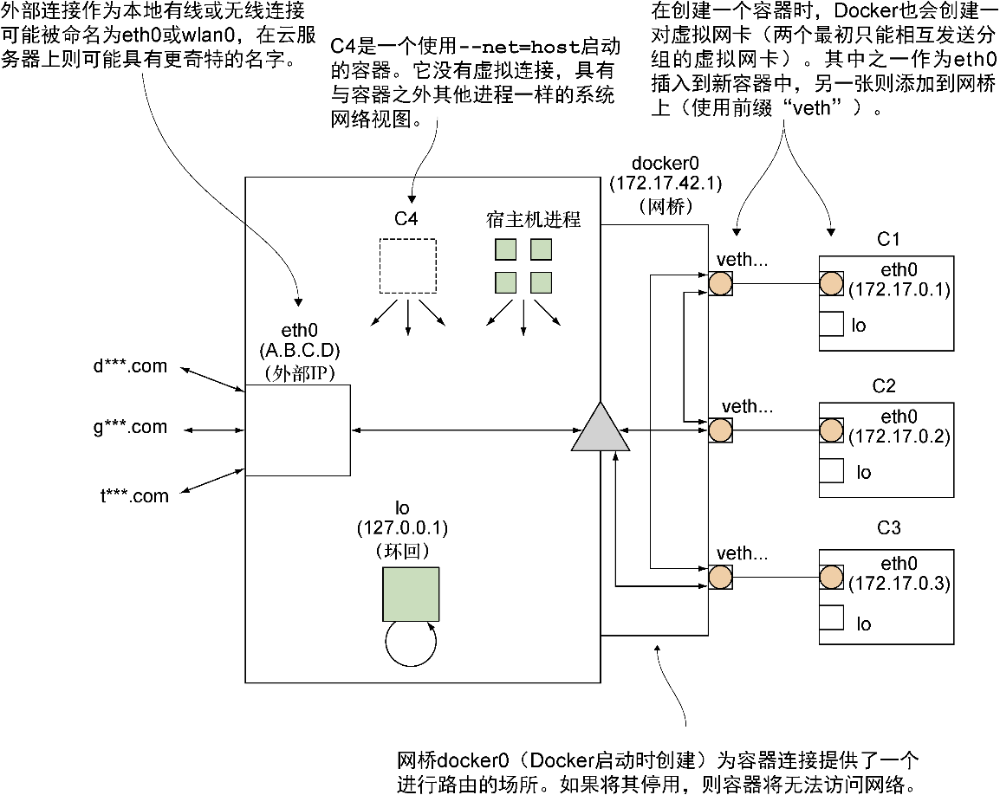

### 10.3　Docker和虚拟网络

Docker的核心功能都与隔离性有关。前面几章已经展示了进程和文件系统隔离的好处，而本章呈现的是网络隔离。

可以认为网络隔离具有以下两个方面：

+ **个体沙盒** ——每个容器具有各自用于监听的IP地址及端口集合，不会与其他容器（或宿主机）发生重叠；
+ **群组沙盒** ——这是个体沙盒的逻辑扩展，所有隔离的容器都被分组在同一个私有网络中，可以在不干扰主机网络（惹恼公司网络管理员）的情况下进行试验。

前面的两个技巧提供了这两个方面的一些实例——Comcast操纵个体沙盒来为每个容器应用规则，而Blockade中的分区依赖对私有容器网络的全面监管能力来将其拆分成几部分。这些场景的背后看起来有点儿像图10-2。

<b class="my_markdown">图10-2　宿主机上的Docker内部网络</b>

网桥工作的具体细节并不重要。简单来说，网桥在容器之间创建了一个扁平化网络（无须中间步骤即可直接通信），并将对外界的请求转发到外部连接上。

而后Docker公司在用户反馈基础上对该模型进行了修改，让用户可以通过 **网络驱动** 这个扩展Docker网络能力的插件系统来创建自己的虚拟网络。这些插件要么是内建的，要么由第三方提供，将完成所有网络连接所需的工作，让你能接着使用它。

你创建的新网络可以看作是额外的群组沙盒，通常在沙盒里提供访问，但不允许跨沙盒通信。（不过网络行为的确切细节取决于驱动）。

