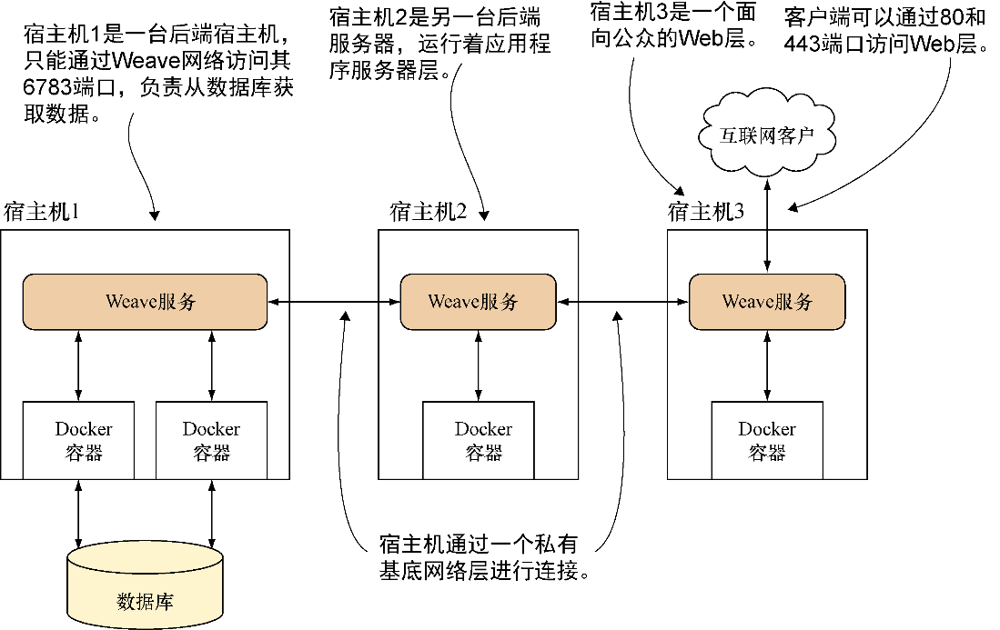

### 技巧81　使用Weave建立一个基底网络

基底网络是构建于其他网络之上的软件级网络层。从效果上看，它像是一个本地网络，但其背后还是通过其他网络进行通信。这代表着性能代价，这个网络比本地网络的稳定性要差一些，不过从可用性角度来看还是大有好处的：位置完全不同的节点可以像在同一个空间里一样进行通信。

这一点对Docker容器来说尤为有趣——与通过网络连接宿主机一样，容器可以跨宿主机无缝地进行连接。这么做消除了规划单个宿主机上能容纳多少容器的迫切需要。

#### 问题

想要跨宿主机进行容器间无缝通信。

#### 解决方案

使用Weave Net（本技巧后续仅简称为“Weave”）来创建一个网络，让容器可以相互通信，就像它们都在一个本地网络上一样。

接下来将使用Weave来演示基底网络的原理，Weave是为这个目的设计的工具。图10-3展示了一个典型Weave网络的梗概。


<center class="my_markdown"><b class="my_markdown">图10-3　一个典型的Weave网络</b></center>

在图10-3中，宿主机1无法访问宿主机3，不过它们可以像本地连接一样通过Weave网络相互通信。Weave网络不对公众开放——只对在Weave下启动的容器开放。这使得跨不同环境的代码开发、测试与部署变得相对简单，因为可以将所有情景中的网络拓扑都做成一样的。

##### 1．安装Weave

Weave是一个单一的二进制文件，可以在其官方网站上找到其安装说明。

Weave需要安装在要作为Weave网络一部分的所有宿主机上。可执行以下命令：

```c
$ sudo curl -L git.io/weave -o /usr/local/bin/weave
$ sudo chmod +x /usr/local/bin/weave
```


**警告**

如果在此处遇到问题，机器上可能已经存在一个作为其他软件包一部分的Weave二进制文件。


##### 2．设置Weave

要操作本示例，需要使用两台宿主机。此处分别将其命名为 `host1` 和 `host2` 。使用ping确保它们可以相互通信。接着需要获取启动Weave的第一台宿主机的IP地址。需要注意的是你可能需要为这两台宿主机打开防火墙以便连接到开放的互联网上。如果你选择了正确的IP地址，也可以在本地网络上运行Weave。


**提示**

如果在此处遇到问题，网络中可能存在某种形式的防火墙。如果不清楚，请与网络管理员确认。特别需要注意的是，TCP与UDP的6783端口和UDP的6784端口需要同时打开。


在第一台宿主机上运行第一个Weave路由器：

```c
host1$ weave launch　　⇽---　在host1上启动Weave服务。这一步需要在每台宿主机上进行一次，它将下载并在后台运行一些容器，以便管理基底网络
 [...]
host1$ eval $(weave env) 　　⇽---　在这个shell里设置docker命令以便使用Weave。如果你关闭或打开新的shell，则需要再次运行这条命令
host1$ docker run -it --name a1 ubuntu:14.04 bash　　⇽---　启动容器
root@34fdd53a01ab:/# ip addr show ethwe　　⇽---　获取Weave网络上该容器的IP地址
43: ethwe@if44: <BROADCAST,MULTICAST,UP,LOWER_UP> mtu 1376 qdisc noqueue
➥ state UP group default
    link/ether 72:94:41:e3:00:df brd ff:ff:ff:ff:ff:ff
    inet 10.32.0.1/12 scope global ethwe
       valid_lft forever preferred_lft forever
```

Weave负责将额外的网卡插入到容器中，网卡名为 `ethwe` ，它提供了Weave网络上的一个IP地址。

在 `host2` 上可以执行类似的步骤，不过需要将 `host1` 的位置通知Weave：

```c
host2$ sudo weave launch 1.2.3.4　　⇽---　以root身份在host2上启动Weave服务。这一次添加了第一台宿主机的公共IP地址，以便它可以附加到另一台宿主机上
host2$ eval $(weave env) 　　⇽---　为Weave服务设置适当的环境
host2$ docker run -it --name a2 ubuntu:14.04 bash　　⇽---　
root@a2:/# ip addr show ethwe　　⇽---　与host1一样执行
 553: ethwe@if554: <BROADCAST,MULTICAST,UP,LOWER_UP> mtu 1376 qdisc noqueue
➥ state UP group default
link/ether fe:39:ca:74:8a:ca brd ff:ff:ff:ff:ff:ff
inet 10.44.0.0/12 scope global ethwe
   valid_lft forever preferred_lft forever
```

`host2` 上唯一的不同是要告诉Weave，让它与 `host1` 上的Weave建立对等连接（指定IP地址或主机名及可选的“ **:端口** ”进行指定， `host2` 可借此进行连接）。

##### 3．测试连接

现在万事俱备，可以进行测试，看看容器是否能相互通信。以 `host2` 的容器为例：

```c
root@a2:/# ping -qc1 10.32.0.1　　⇽---　 ping 另一台服务器分配到的IP地址
 PING 10.32.0.1 (10.32.0.1) 56(84) bytes of data.
--- 10.32.0.1 ping statistics ---
1 packets transmitted, 1 received, 0% packet loss, time 0ms　　⇽---　一个成功的ping响应
 rtt min/avg/max/mdev = 1.373/1.373/1.373/0.000 ms
```

如果ping成功了，即可证实自行分配的私有网络内部跨两台宿主机的连通性。如果使用自定义网桥，你也可以通过容器名称来ping。


**提示**

如果（ping使用的）ICMP协议信息被防火墙阻塞，这一步就无法工作。如果出现这种情况，可以尝试telnet到另一台宿主机的6783端口来测试是否可以建立连接。


#### 讨论

基底网络是一个强大的工具，可以对网络和防火墙偶尔出现的混乱世界施加某种秩序。Weave甚至宣称可以智能地路由流量跨越部分分区网络，比如某台宿主机B可以看到A和C，但是A和C无法通信——与技巧80中的情况相似。不过，需要注意的是有时这些复杂的网络设置是有原因的——堡垒机的意义在于为了安全而隔离。

所有的能力都需要付出代价——有报告称Weave网络有时比“原始”网络要慢很多，你不得不在后台运行额外的管理机制（因为网络的插件模型并未覆盖所有用例）。

Weave网络具有很多附加功能，从可视化到与Kubernetes集成（我们将在技巧88介绍Kubernetes这个编排器）。建议阅读一下Weave Net的概述，以便了解更多信息并充分利用你的网络。

有一点我们这里还没介绍到，那就是内建的overlay网络插件。根据你的用例，可能值得将它作为Weave的替代品进行一些研究，不过它需要使用swarm模式（见技巧87）或设置一个全局可访问的键/值存储（例如，来自技巧74的etcd）。

