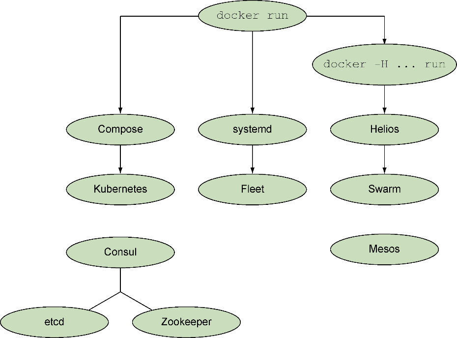

### 第11章　容器编排入门

**本章主要内容**

+ 使用Systemd管理简单的Docker服务
+ 使用Helios管理多宿主机Docker服务
+ 使用Hashicorp的Consul来进行服务发现
+ 使用Registrator进行服务注册

Docker依赖的技术实际上已经以不同形式存在一段时间了，但Docker是那个成功抓住技术行业兴趣点的解决方案。这把Docker推到了一个令人羡慕不已的位置——Docker社区的先驱们完成了这一系列工具的开创工作，这些工具又吸引使用者加入社区并不断地回馈社区，形成了一个自行运转的生态系统。

这片繁荣的景象在编排领域尤为明显。在这一领域提供服务的公司可以列出一大堆，看过这些公司名字的清单之后读者会发现，关于如何实现编排，它们都有自己的看法，也都开发了自己的工具。

虽然该生态系统是Docker的一个巨大优势（也是我们在本书中用如此大的篇幅介绍它的原因），然而编排工具数量众多，无论对新手还是老手都有点儿难以抉择。本章将浏览一些最受瞩目的工具，感受一下这些高端工具，以便在需要选用适合自己的框架时能更加了解情况。

有多种不同的方式来组合编排工具的家族树。图11-1展示了我们熟悉的一些工具。树的根节点是 `docker run` 命令，这是启动容器最常用的方式。Docker家族的几乎所有工具都衍生于这一命令。树的左侧分支上的工具将一组容器视为单个实体，中间分支的工具借助systemd和服务文件管理容器，右侧分支上的工具将单个容器视为单个实体。沿着这些分支往下，这些工具做的事情越来越多，例如，它可以跨多台宿主机工作，或者让用户远离手动部署容器的烦琐操作。

读者可能会注意到图 11-1 中看似孤立的两个区域——Mesos和Consul/etcd/Zookeeper组。Mesos是一个有趣的东西，它在Docker出现之前就已经存在了，并且它对Docker的支持是一个附加功能，而不是核心功能。虽然它做得不错，但是也需要仔细评估，如果仅仅是从功能特性上来看，用户可能在其他工具中也想要有这些功能。相比之下，Consul、etcd和Zookeeper根本不是编排工具。相反，它们为编排提供了重要的补充功能——服务发现。

本章和第12章会介绍这一编排生态系统。在本章中，我们会介绍一些能提供更细粒度的控制的工具，而且不会感觉从手动管理容器有很大的跳跃性。我们会研究管理单宿主机上的Docker容器和管理多宿主机上的Docker容器，之后会保存和检索关于Docker部署在哪里的信息。在第12章中我们会了解一些抽象了很多细节的更全面的解决方案。

<b class="my_markdown">图11-1　Docker生态系统中的编排工具</b>

阅读这两章时，时不时地回顾每个编排工具，并尝试提出一个这一工具可能适用的场景，可能会有助于确定哪款特定的工具适合用户的需求。我们还会提供一些示例，供读者开始学习。

接下来先从单台宿主机开始。

