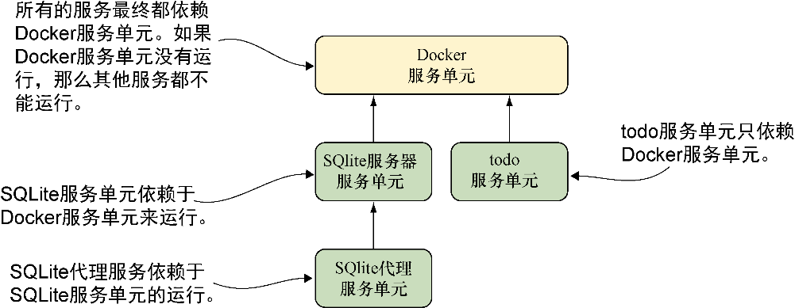

### 技巧83　编排宿主机上的容器的启动


不同于docker-compose（编写本书时），systemd已经是一个用于生产的成熟技术。在本技巧中，我们将展示如何使用systemd来实现和docker-compose类似的本地编排功能。

**注意**

如果读者在学习本技巧的过程中遇到问题，可能需要升级一下Docker版本，1.7.0及以上版本应该会正常工作。


#### 问题

想要在生产环境的宿主机上管理更复杂的容器编排。

#### 解决方案

使用systemd和相应的依赖服务来管理容器。

为了展示systemd在更复杂的场景中的应用，我们会在systemd中重新实现一遍技巧77中提到的SQLite TCP服务器示例。图11-2展示了我们计划实现的systemd服务单元配置中的依赖。

这里的模式和技巧77中Docker Compose例子中的模式是类似的。其中有一个关键的差别：SQLite服务在这里不再被当成一个单体实体，每个容器都是一个离散的实体。在这个场景下，SQLite代理可以独立于SQLite服务器，被单独停止。


<center class="my_markdown"><b class="my_markdown">图11-2　systemd单元依赖图</b></center>

代码清单11-3展示了SQLite服务器服务的代码。像以前一样，它依赖Docker服务，但和技巧82中介绍的to-do实例有一些不同之处。


**提示**

systemd中使用的路径必须是绝对路径。

代码清单11-3　/etc/systemd/system/sqliteserver.service


```c
[Unit] 　　⇽---　 Unit小节定义了该systemd对象的通用信息
 Description=SQLite Docker Server
 After=docker.service　　⇽---　 Docker服务启动之后启动该单元
 Requires=docker.service　　⇽---　为了让该单元正常运行，Docker服务必须处于正常运行状态
[Service]
Restart=always
ExecStartPre=-/bin/touch /tmp/sqlitedbs/test　　⇽---　
ExecStartPre=-/bin/touch /tmp/sqlitedbs/live　　⇽---　这几行代码确保服务启动之前SQLite的数据库文件是存在的，touch命令行之前的-告诉systemd：如果该命令返回错误代码则表明启动失败
ExecStartPre=/bin/bash \
 -c '/usr/bin/docker kill sqliteserver || /bin/true'　　⇽---　
ExecStartPre=/bin/bash \　　⇽---　ExecStartPre定义了服务单元被启动之前执行的命令。为了确保容器在用户启动之前已被删除，这里使用了一个前置命令将其删除
 -c '/usr/bin/docker rm -f sqliteserver || /bin/true'
ExecStartPre=/usr/bin/docker \
 pull dockerinpractice/docker-compose-sqlite　　⇽---　确保运行容器之前镜像已下载完成了
ExecStart=/usr/bin/docker run --name sqliteserver \　　⇽---　 ExecStart定义了服务被启动之后执行的命令。这里值得注意的是，我们在另一个/bin/bash–c 调用中包含了socat命令，因为在ExecStart这一行定义的命令是由sys- temd来执行的
 -v /tmp/sqlitedbs/test:/opt/sqlite/db \
 dockerinpractice/docker-compose-sqlite /bin/bash -c \
 'socat TCP-L:12345,fork,reuseaddr \
 EXEC:"sqlite3 /opt/sqlite/db",pty'
ExecStop=/usr/bin/docker rm -f sqliteserver　　⇽---　 ExecStop定义了服务停止之后运行的命令
[Install]
WantedBy=multi-user.target
```

代码清单11-4列出的是SQLite代理服务。这里最大的区别在于，代理服务依赖于刚刚定义的服务器进程，而服务器进程又依赖于Docker服务。

代码清单11-4　/etc/systemd/system/sqliteproxy.service

```c
[Unit]
Description=SQLite Docker Proxy
After=sqliteserver.service　　⇽---　该代理单元必须在前面定义的sqliteserver服务之后运行
Requires=sqliteserver.service　　⇽---　启动该代理之前要求服务器实例在运行
[Service]
Restart=always
ExecStartPre=/bin/bash -c '/usr/bin/docker kill sqliteproxy || /bin/true'
ExecStartPre=/bin/bash -c '/usr/bin/docker rm -f sqliteproxy || /bin/true'
ExecStartPre=/usr/bin/docker pull dockerinpractice/docker-compose-sqlite
ExecStart=/usr/bin/docker run --name sqliteproxy \
 -p 12346:12346 --link sqliteserver:sqliteserver \
dockerinpractice/docker-compose-sqlite /bin/bash \
 -c 'socat TCP-L:12346,fork,reuseaddr TCP:sqliteserver:12345'　　⇽---　该命令用于运行容器
ExecStop=/usr/bin/docker rm -f sqliteproxy
[Install]
WantedBy=multi-user.target
```

通过这两个配置文件，我们为在systemd的控制下安装和运行SQLite服务奠定了基础。现在我们可以启用这些服务了：

```c
$ sudo systemctl enable /etc/systemd/system/sqliteserver.service
ln -s '/etc/systemd/system/sqliteserver.service' \
'/etc/systemd/system/multi-user.target.wants/sqliteserver.service'
$ sudo systemctl enable /etc/systemd/system/sqliteproxy.service
ln -s '/etc/systemd/system/sqliteproxy.service' \
'/etc/systemd/system/multi-user.target.wants/sqliteproxy.service'
```

然后启动它们：

```c
$ sudo systemctl start sqliteproxy
$ telnet localhost 12346
[vagrant@centos ~]$ telnet localhost 12346
Trying ::1...
Connected to localhost.
Escape character is '^]'.
SQLite version 3.8.2 2013-12-06 14:53:30
Enter ".help" for instructions
Enter SQL statements terminated with a ";"
sqlite> select * from t1;
select * from t1;
test
```

值得注意的是，SQLite代理服务依赖于SQLite服务器服务的运行。我们只需要启动SQLite代理服务——依赖的服务就会自动启动。

#### 讨论

在本地机器上监管长时间运行的应用的时候遇到的挑战之一就是依赖服务的管理。例如，一个Web应用可能希望作为服务在后台运行但又依赖于数据库和Web服务器。这听上去可能很熟悉——在技巧13中讲到过web-app-db结构。

技巧76展示了如何构建这种带有依赖的结构，但是systemd这样的工具已经用在这种问题上很久了，可以提供Docker Compose提供不了的灵活性。例如，一旦我们写了服务文件，就可以启动想要的任意一个，systemd可以处理任意依赖服务的启动，甚至在必要的时候启动Docker守护进程本身。

