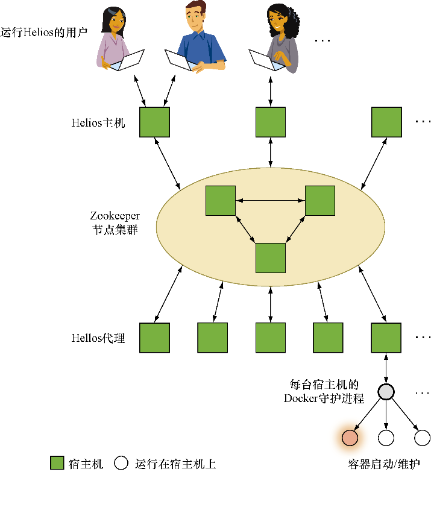
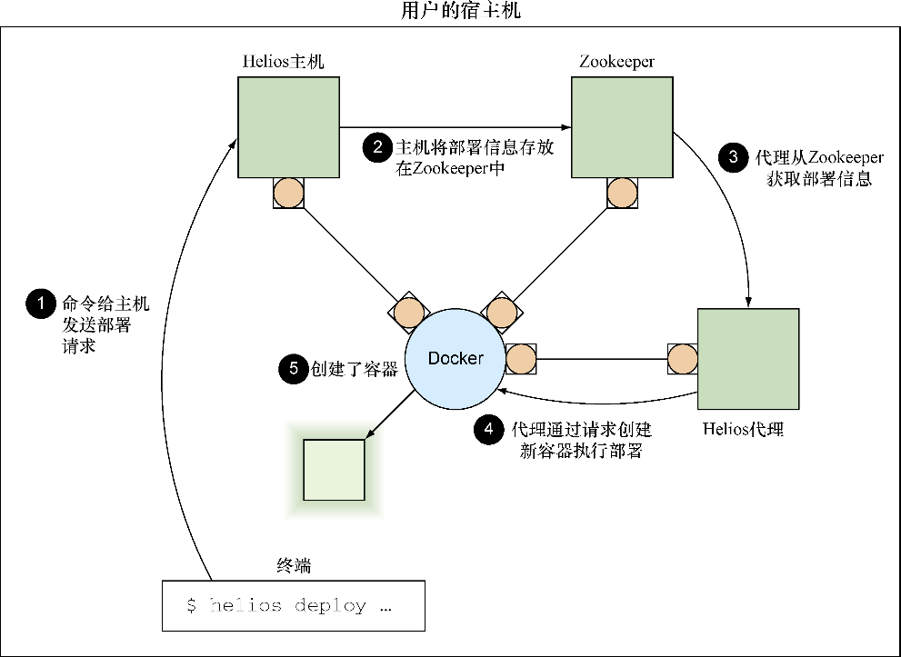

### 技巧84　使用Helios手动管理多宿主机Docker

将一组机器的部署工作都交给一个应用程序确实容易让人恐慌，如果能有一种手动的方式来操作就可以缓解这种恐慌。

对主要采用静态基础设施并且希望将 Docker 用于关键业务时这一过程能够有人力监督（可以理解）的公司来说，Helios是理想的选择。

#### 问题

想要部署多台Docker宿主机环境来运行容器，同时又保留对整个过程的手动控制。

#### 解决方案

使用Spotify公司的Helios工具精准管理其他宿主机上的容器。

Helios是Spotify公司目前在生产环境中用来管理其服务器的工具，它具有易于上手和稳定的友好特性（如你所望）。Helios允许用户管理Docker容器在多台宿主机上的部署。它提供了一个简单的命令行接口，用户可以用它来指定运行的内容以及运行的位置，也可以查看当前运行的状态。

因为这里只是介绍Helios，简单起见，我们将在Docker内的单个节点上运行所有内容——不用担心，与多宿主机运行场景有关的一切都会被清楚地着重标示出来。Helios的整体架构如图11-3所示。

如图11-3所示，运行Helios时只需要运行一个额外的服务Zookeeper即可。Helios使用Zookeeper跟踪所有宿主机的状态，同时它也作为主机和代理节点之间的通信通道。


**提示**

Zookeeper是一款轻量级的分布式数据库，用Java编写，它经过优化用于存储配置信息。它是Apache开源软件产品套件之一，功能类似于etcd。（第9章介绍过该工具，本章也会再次出现。）


在本技巧中读者只需要知道Zookeeper是用来存放数据的，以便通过运行多个Zookeeper实例的方式将数据分布在多个节点上，从而实现可扩展性和可靠性。这可能听起来和第9章中对etcd的描述有些类似——这两个工具在功能上有很大的重叠。


<center class="my_markdown"><b class="my_markdown">图11-3　Helios安装的鸟瞰图</b></center>

执行如下命令来运行我们将在本技巧中使用的单个Zookeeper实例：

```c
$ docker run --name zookeeper -d jplock/zookeeper:3.4.6
cd0964d2ba18baac58b29081b227f15e05f11644adfa785c6e9fc5dd15b85910
$ docker inspect -f '{{.NetworkSettings.IPAddress}}' zookeeper
172.17.0.9
```


**注意**

在自身节点启动Zookeeper实例时，用户需要公开一些服务器端口供其他宿主机访问，并且使用卷来持久化数据。查看Docker Hub上的Dockerfile来了解应该使用哪些端口和文件夹等细节。读者也可能想要在多个节点上运行Zookeeper，但是配置一个Zookeeper集群超出了本技巧的范畴。


可以使用zkCli.sh工具以交互的方式或通过管道输入方式来检查Zookeeper存储的数据。该工具的启动过程提示信息非常丰富，但它会立马进入一个交互式命令行，用户可以针对存储Zookeeper数据的文件树状结构执行一些命令：

```c
$ docker exec -it zookeeper bin/zkCli.sh
Connecting to localhost:2181
2015-03-07 02:56:05,076 [myid:] - INFO   [main:Environment@100] - Client >
environment:zookeeper.version=3.4.6-1569965, built on 02/20/2014 09:09 GMT
2015-03-07 02:56:05,079 [myid:] - INFO   [main:Environment@100] - Client >
environment:host.name=917d0f8ac077
2015-03-07 02:56:05,079 [myid:] - INFO   [main:Environment@100] - Client >
environment:java.version=1.7.0_65
2015-03-07 02:56:05,081 [myid:] - INFO   [main:Environment@100] - Client >
environment:java.vendor=Oracle Corporation
[...]
2015-03-07 03:00:59,043 [myid:] - INFO
➥ [main-SendThread(localhost:2181):ClientCnxn$SendThread@1235] -
➥ Session establishment complete on server localhost/0:0:0:0:0:0:0:1:2181,
➥ sessionid = 0x14bf223e159000d, negotiated timeout = 30000
WATCHER::
WatchedEvent state:SyncConnected type:None path:null
[zk: localhost:2181(CONNECTED) 0] ls /
[zookeeper]
```

目前还没有对Zookeeper进行任何操作，仅存储了一些Zookeepr内部信息。先保留这个命令行提示符开放，稍后我们会继续用到它。

Helios本身由以下3部分组成：

+ **主机** （master）——它通常用作对Zookeeper中数据进行修改的接口；
+ **代理** （agent）——运行在每台Docker宿主机上，启动和停止基于Zookeeper的容器，然后报告状态；
+ **命令行工具** ——用于向主机发起请求。

图11-4展示了完成对系统发起的操作时最终系统是如何处理的（箭头表示数据流）。


<center class="my_markdown"><b class="my_markdown">图11-4　在安装了Helios的单台宿主机上启动容器</b></center>

现在Zookeeper已经运行起来了，是时候去启动Helios了。启动主机时需要指定前面启动的Zookeeper节点的IP地址：

```c
$ IMG=dockerinpractice/docker-helios
$ docker run -d --name hmaster $IMG helios-master --zk 172.17.0.9
896bc963d899154436938e260b1d4e6fdb0a81e4a082df50043290569e5921ff
$ docker logs --tail=3 hmaster
03:20:14.460 helios[1]: INFO  [MasterService STARTING] ContextHandler: >
Started i.d.j.MutableServletContextHandler@7b48d370{/,null,AVAILABLE}
03:20:14.465 helios[1]: INFO  [MasterService STARTING] ServerConnector: >
Started application@2192bcac{HTTP/1.1}{0.0.0.0:5801}
03:20:14.466 helios[1]: INFO  [MasterService STARTING] ServerConnector: >
Started admin@28a0d16c{HTTP/1.1}{0.0.0.0:5802}
$ docker inspect -f '{{.NetworkSettings.IPAddress}}' hmaster
172.17.0.11
```

现在看看Zookeeper里面新增了些什么：

```c
[zk: localhost:2181(CONNECTED) 1] ls /
[history, config, status, zookeeper]
[zk: localhost:2181(CONNECTED) 2] ls /status/masters
[896bc963d899]
[zk: localhost:2181(CONNECTED) 3] ls /status/hosts
[]
```

看起来Helios主机已经创建了一堆新的配置，包括将自身注册为主机。遗憾的是，现在还没有任何宿主机。

让我们通过启动一个代理来解决这个问题。该代理将使用当前宿主机的Docker套接字来启动容器：

```c
$ docker run -v /var/run/docker.sock:/var/run/docker.sock -d --name hagent \
dockerinpractice/docker-helios helios-agent --zk 172.17.0.9
5a4abcb271070d0171ca809ff2beafac5798e86131b72aeb201fe27df64b2698
$ docker logs --tail=3 hagent
03:30:53.344 helios[1]: INFO  [AgentService STARTING] ContextHandler: >
Started i.d.j.MutableServletContextHandler@774c71b1{/,null,AVAILABLE}
03:30:53.375 helios[1]: INFO  [AgentService STARTING] ServerConnector: >
Started application@7d9e6c27{HTTP/1.1}{0.0.0.0:5803}
03:30:53.376 helios[1]: INFO  [AgentService STARTING] ServerConnector: >
Started admin@2bceb4df{HTTP/1.1}{0.0.0.0:5804}
$ docker inspect -f '{{.NetworkSettings.IPAddress}}' hagent
172.17.0.12
```

再次检查Zookeeper：

```c
[zk: localhost:2181(CONNECTED) 4] ls /status/hosts
[5a4abcb27107]
[zk: localhost:2181(CONNECTED) 5] ls /status/hosts/5a4abcb27107
[agentinfo, jobs, environment, hostinfo, up]
[zk: localhost:2181(CONNECTED) 6] get /status/hosts/5a4abcb27107/agentinfo
{"inputArguments":["-Dcom.sun.management.jmxremote.port=9203", [...]
[...]
```

可以看到 `/status/hosts` 现在有了一条数据。深入该宿主机的Zookeeper目录可以看到这里面有Helios针对该宿主机存储的内部信息。


**注意**

如果运行在多宿主机环境下，将需要把 `--name $(hostname -f)` 作为Helios主机和代理使用的参数传递进去。用户还需要为主机暴露5801和5802端口，对代理公开5803和5804端口。


让我们一起来简化和Helios的交互：

```c
$ alias helios="docker run -i --rm dockerinpractice/docker-helios \
helios -z http://172.17.0.11:5801"
```

上面的别名意味着调用 `helios` 将会启动一个一次性容器来执行所需的操作，并且在开头指向正确的Helios集群。注意，命令行接口需要指向Helios主机而不是Zookeeper。

现在一切准备就绪。我们可以轻松地和Helios集群进行交互了，不妨尝试下面这个示例：

```c
$ helios create -p nc=8080:8080 netcat:v1 ubuntu:14.04.2 -- \
sh -c 'echo hello | nc -l 8080'
Creating job: {"command":["sh","-c","echo hello | nc -l 8080"], >
"creatingUser":null,"env":{},"expires":null,"gracePeriod":null, >
"healthCheck":null,"id": >
"netcat:v1:2067d43fc2c6f004ea27d7bb7412aff502e3cdac", >
"image":"ubuntu:14.04.2","ports":{"nc":{"externalPort":8080, >
"internalPort":8080,"protocol":"tcp"}},"registration":{}, >
"registrationDomain":"","resources":null,"token":"","volumes":{}}
Done.
netcat:v1:2067d43fc2c6f004ea27d7bb7412aff502e3cdac
$ helios jobs
JOB ID            NAME   VERSION HOSTS COMMAND                  ENVIRONMENT
netcat:v1:2067d43 netcat v1      0     sh -c "echo hello | nc -l 8080"
```

Helios是围绕 **作业** （job）的概念建立的——所有被执行的对象都必须被表示为一个作业，然后才能被发送到要执行的主机。至少，用户需要一个镜像，带上Helios需要知道的如何启动容器的基本信息：一个要执行的命令以及任意端口、卷或环境选项。用户可能还需要一些其他高级选项，包括健康检查、过期时间和服务注册等。

上面的第一条命令创建了一个监听8080端口的作业，访问该端口时会先输出 `hello` ，然后终止运行。

可以使用 `helios hosts` 列出可用于作业部署的主机，然后使用 `helios deploy` 命令实际完成部署。然后用 `helios status` 命令展示作业已成功启动：

```c
$ helios hosts
HOST         STATUS        DEPLOYED RUNNING CPUS MEM  LOAD AVG MEM USAGE >
OS                      HELIOS  DOCKER
5a4abcb27107.Up 19 minutes 0        0       4    7 gb 0.61     0.84      >
Linux 3.13.0-46-generic 0.8.213 1.3.1 (1.15)
$ helios deploy netcat:v1 5a4abcb27107
Deploying Deployment{jobId=netcat:v1: >
2067d43fc2c6f004ea27d7bb7412aff502e3cdac, goal=START, deployerUser=null} >
on [5a4abcb27107]
5a4abcb27107: done
$ helios status
JOB ID            HOST         GOAL  STATE   CONTAINER ID PORTS
netcat:v1:2067d43 5a4abcb27107.START RUNNING b1225bc      nc=8080:8080
```

当然，我们现在要验证服务是否正常工作：

```c
$ curl localhost:8080
hello
$ helios status
JOB ID            HOST         GOAL  STATE         CONTAINER ID PORTS
netcat:v1:2067d43 5a4abcb27107.START PULLING_IMAGE b1225bc      nc=8080:8080
```

`curl` 命令的结果清楚地表明服务正在正常工作，但是 `helios status` 当前展示了一些有趣的信息。在定义作业时我们注意到，在输出完 `hello` 之后作业会终止，但上面的输出结果中显示的是 `PULLING_IMAGE` 状态。这涉及Helios是如何管理作业的——一旦将其部署到一台宿主机上，Helios会尽可能地确保作业处于运行状态。这个状态说明Helios正在进行完整的作业启动过程，包括确保镜像被成功拉取。

最后，我们需要自己手动做一些清理：

```c
$ helios undeploy -a --yes netcat:v1
Undeploying netcat:v1:2067d43fc2c6f004ea27d7bb7412aff502e3cdac from >
[5a4abcb27107]
5a4abcb27107: done
$ helios remove --yes netcat:v1
Removing job netcat:v1:2067d43fc2c6f004ea27d7bb7412aff502e3cdac
netcat:v1:2067d43fc2c6f004ea27d7bb7412aff502e3cdac: done
```

我们要求从所有节点中删除该作业（如有必要就终止它，并且停止所有自动重启的设置），然后删除作业本身，这意味着它不能再被部署到任何节点。

#### 讨论

Helios是一个将容器部署到多台宿主机的简单可靠的方案。和后续将讲到的一些技巧不同的是，它的背后没有“魔法”来确定合适的部署位置——它会严格地部署到给定的位置，不会出现意外。

但是这种简洁是有代价的，一旦你迁移到更加高级的部署场景——像资源限制、动态扩容以及一系列目前缺失的特性，可能就会发现你正在重新发明一些像Kubernetes（见技巧88）这样的工具的部分功能来达成想在部署中达到的效果。

