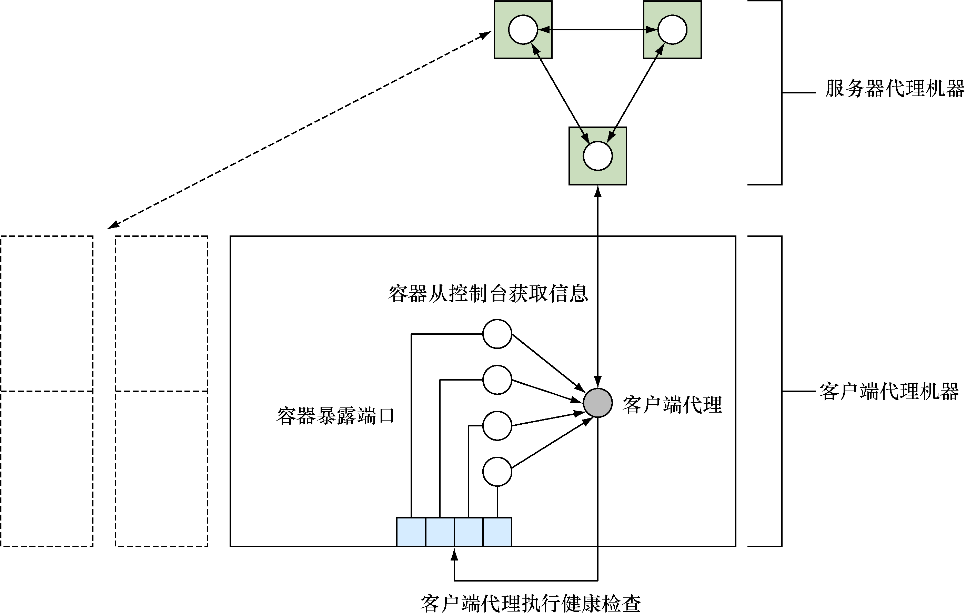

### 技巧85　使用Consul发现服务

etcd是一款非常流行的工具，但它有一个特别的竞争者，谈论它时总会被提及，那就是Consul。这有点儿奇怪，因为业内有其他更像etcd的工具（Zookeeper具有与etcd相似的功能，但是是用不同的语言实现的），而Consul通过一些有意思的附加功能与其区别开来，如服务发现和健康检查。事实上如果仔细看，Consul有点儿像是etcd、SkyDNS和Nagios的整个打包。

#### 问题

想要能分发消息给一组容器、在一组容器中发现服务以及监控一组容器。

#### 解决方案

在每台Docker宿主机上启动带有Consul的容器，从而提供服务目录和配置通信系统。

当用户需要协同一些独立的服务时，Consul试图成为用于完成一些重要任务的通用工具。其他工具当然也可以完成这些任务，但 Consul 提供了统一的配置界面，这对用户而言非常方便。Consul从宏观来说提供了以下功能：

+ **服务配置** ——用于存储和共享小值的键/值存储，类似于etcd和Zookeeper；
+ **服务发现** ——用于注册服务的API和用于发现服务的DNS端点，就像SkyDNS；
+ **服务监控** ——用于注册健康检查的API，就像Nagios。

用户可以使用这里面的全部或部分功能，因为它们之间没有任何联系。如果用户已经有了监控应用服务的基础设施，则无须替换成Consul。

本技巧会覆盖Consul的服务发现和服务监控部分，但是不包括键/值存储。熟读Consul的文档，etcd和Consul之间的强相似性也使第9章的最后两个技巧（技巧74和技巧75）是可以相互转换的。

图11-5展示了典型的Consul设置。

存储在 Consul 中的数据由 **服务器** 代理负责。它们负责对存储的信息达成 **共识** ——这个概念存在于大多数分布式数据存储系统中。简而言之，如果丢失了少于一半的服务器代理，该分布式系统将仍然能够确保数据是可恢复的（见技巧74中与etcd相关的示例）。因为这些服务器代理很重要，而且有更高的资源要求，所以将其部署到专用的机器上是典型的选择。


<center class="my_markdown"><b class="my_markdown">图11-5　一个典型的Consul设置</b></center>


**注意**

虽然本技巧中的命令会将Consul数据目录（/data）保存在容器中，但通常至少针对服务器而言，最好将此目录指定为卷，从而可以保留备份。


这里建议用户控制的所有可能要与Consul交互的机器都应该运行客户端代理。这些代理会将请求转发给服务器并运行健康检查。

让Consul运行的第一步是启动服务器代理：

```c
c1 $ IMG=dockerinpractice/consul-server
c1 $ docker pull $IMG
[...]
c1 $ ip addr | grep 'inet ' | grep -v 'lo$\|docker0$\|vbox.*$'
    inet 192.168.1.87/24 brd 192.168.1.255 scope global wlan0
c1 $ EXTIP1=192.168.1.87
c1 $ echo '{"ports": {"dns": 53}}' > dns.json
c1 $ docker run -d --name consul --net host \
-v $(pwd)/dns.json:/config/dns.json $IMG -bind $EXTIP1 -client $EXTIP1 \
-recursor 8.8.8.8 -recursor 8.8.4.4 -bootstrap-expect 1
88d5cb48b8b1ef9ada754f97f024a9ba691279e1a863fa95fa196539555310c1
c1 $ docker logs consul
[...]
       Client Addr: 192.168.1.87 (HTTP: 8500, HTTPS: -1, DNS: 53, RPC: 8400)
      Cluster Addr: 192.168.1.87 (LAN: 8301, WAN: 8302)
[...]
==> Log data will now stream in as it occurs:
    2015/08/14 12:35:41 [INFO] serf: EventMemberJoin: mylaptop 192.168.1.87
[...]
    2015/08/14 12:35:43 [INFO] consul: member 'mylaptop' joined, marking >
health alive
    2015/08/14 12:35:43 [INFO] agent: Synced service 'consul'
```

由于我们想要把 Consul 当作一台 DNS 服务器使用，因此，我们将一个文件放到了 Consul读取配置的文件夹里，使Consul监听53端口（DNS协议的注册端口）。然后，我们使用在之前的技巧中学到的一个命令序列来尝试查找机器的面向外部的 IP 地址，以便与其他代理进行通信并监听客户端请求。


**注意**

IP地址 `0.0.0.0` 通常用于指示应用程序应该监听机器上的所有可用接口。我们故意没有这样做，因为一些Linux发行版有一个DNS缓存守护进程，监听 `127.0.0.1` ，它不允许监听 `0.0.0.0:53` 。


在前面的 `docker run` 命令里有以下3个注意事项。

+ 使用了 `--net host` 。虽然这可以被视为 Docker 世界的一个人造天地，但是另外一种选择是在命令行上公开8个端口——这是个人偏好的问题，但是我们认为这是合理的。它还有助于绕过UDP通信的潜在问题。如果是手动设置的路由，则不需要设置DNS端口——可以将默认的Consul DNS端口（8600）作为端口53公开在宿主机。
+ 两个  `recursor` 参数告诉Consul，如果Consul本身不知道请求的地址，可以通过哪些DNS服务器查看。
+ `-bootstrap-expect 1` 参数表明Consul集群启动运转之初只需要运行一个代理即可，这不是很健壮。一个典型的设置是将数量设置为3（或更多），以确保直到所需数量的服务器已加入后，集群才会启动。要启动其他服务器代理，可以添加一个 `-join` 参数，我们将在启动客户端时讨论。

现在让我们配置第二台机器，启动客户端代理，并将其添加到集群中。


**警告**

由于Consul与其他代理通信时期望能够监听到一组特别的端口，这样一来在单机上配置多个代理来演示现实世界中 Consul 的工作方式，就会有点儿困难。现在，我们将使用不同的宿主机——如果决定使用IP别名，一定要确保带上了 `-node newAgent` 参数，因为Consul默认会使用主机名，而这会引起冲突。


```c
c2 $ IMG=dockerinpractice/consul-agent
c2 $ docker pull $IMG
[...]
c2 $ EXTIP1=192.168.1.87
c2 $ ip addr | grep docker0 | grep inet
    inet 172.17.42.1/16 scope global docker0
c2 $ BRIDGEIP=172.17.42.1
c2 $ ip addr | grep 'inet ' | grep -v 'lo$\|docker0$'
    inet 192.168.1.80/24 brd 192.168.1.255 scope global wlan0
c2 $ EXTIP2=192.168.1.80
c2 $ echo '{"ports": {"dns": 53}}' > dns.json
c2 $ docker run -d --name consul-client --net host \
-v $(pwd)/dns.json:/config/dns.json $IMG -client $BRIDGEIP -bind $EXTIP2 \
-join $EXTIP1 -recursor 8.8.8.8 -recursor 8.8.4.4
5454029b139cd28e8500922d1167286f7e4fb4b7220985ac932f8fd5b1cdef25
c2 $ docker logs consul-client
[...]
    2015/08/14 19:40:20 [INFO] serf: EventMemberJoin: mylaptop2 192.168.1.80
[...]
    2015/08/14 13:24:37 [INFO] consul: adding server mylaptop >
(Addr: 192.168.1.87:8300) (DC: dc1)
```


**注意**

我们使用的镜像是基于gliderlabs/consul-server:0.5和gliderlabs/consul-agent:0.5的，并且它们附带一个较新版本的Consul，以避免UDP通信的可能的问题，这可以通过不断记录的日志行（如“Refuting a suspect message.”）获得提示。在镜像的0.6版本发布后，用户可以切换回gliderlabs中的镜像。


所有的客户端服务（HTTP、DNS等）都已配置为监听Docker网桥IP地址。这为容器提供了一个周知的位置来获取Consul的信息，而它只能在机器的内部公开Consul，这迫使其他机器直接访问服务器代理，而不是由客户端代理再到服务器代理这样一条更慢的路径。为了确保所有宿主机的网桥IP地址一致，可以查看Docker守护进程的 `--bip` 参数。

跟之前一样，我们已经找到了外部的IP地址并且将集群的通信绑定到了上面。 `-join` 参数告诉Consul以哪里为起点寻找集群。用户无须担心集群信息的管理细节——当两个代理最初相遇时，它们 **会协同交流** （gossip），传递关于在集群中发现其他代理的信息。最后的 `-recursor` 参数告诉Consul，在处理本意并非是查找已注册服务的DNS请求时应该使用上游的哪些DNS服务器。

我们来验证代理是否已经通过客户端机器上的HTTP API连接到服务器。我们将用到的API调用会返回客户端代理当前认为在集群中的成员列表。在很大的、快速变化的集群中，这可能并不总是与集群的成员相匹配——针对这一点，这里还有一个API（更慢）调用可供使用：

```c
c2 $ curl -sSL $BRIDGEIP:8500/v1/agent/members | tr ',' '\n' | grep Name
[{"Name":"mylaptop2"
{"Name":"mylaptop"
```

现在 Consul 的基础设施已经建立起来了，是时候查看如何注册和发现服务了。典型的注册过程是让应用程序初始化后对本地客户端代理进行API的调用，提醒客户端代理将信息分发给服务器代理。出于演示的目的，我们手动执行这一注册步骤：

```c
c2 $ docker run -d --name files -p 8000:80 ubuntu:14.04.2 \
python3 -m http.server 80
96ee81148154a75bc5c8a83e3b3d11b73d738417974eed4e019b26027787e9d1
c2 $ docker inspect -f '{{.NetworkSettings.IPAddress}}' files
172.17.0.16
c2 $ /bin/echo -e 'GET / HTTP/1.0\r\n\r\n' | nc -i1 172.17.0.16 80 \
| head -n 1
HTTP/1.0 200 OK
c2 $ curl -X PUT --data-binary '{"Name": "files", "Port": 8000}' \
$BRIDGEIP:8500/v1/agent/service/register
c2 $ docker logs consul-client | tail -n 1
    2015/08/15 03:44:30 [INFO] agent: Synced service 'files'
```

这里我们在容器中设置了一个简单的HTTP服务器，将其公开在宿主机的8000端口，并检查其是否工作。然后使用curl和Consul的HTTP API来注册服务定义。这里唯一一件必不可少的事情便是给服务配一个名字——端口和Consul文档中列出的其他字段都是可选的。ID字段值得一提，它默认便是服务的名称，但在所有服务中必须是唯一的。如果想要同一个服务的多个实例，就需要指定它。

Consul的日志行告诉我们服务已经同步，所以我们应该可以通过服务的DNS接口来检索服务的信息。该信息来自服务器代理，所以它可以作为验证该服务已经被Consul目录接受的依据。可以使用 `dig` 命令查询服务DNS信息并检查它是否出现：

```c
c2 $ EXTIP1=192.168.1.87
c2 $ dig @$EXTIP1 files.service.consul +short　　⇽---　通过服务器代理DNS查找files服务的IP 地址。该 DNS 服务对于任何不在Consul 集群的机器都是可用的，允许它们享用服务发现的好处
 192.168.1.80
c2 $ BRIDGEIP=172.17.42.1
c2 $ dig @$BRIDGEIP files.service.consul +short　　⇽---　从客户端代理DNS查找files服务的IP地址。如果使用$BRIDGEIP失败，可能希望尝试使用$EXTIP1
 192.168.1.80
c2 $ dig @$BRIDGEIP files.service.consul srv +short　　⇽---　从客户端代理DNS请求files服务的SRV记录
 1 1 8000 mylaptop2.node.dc1.consul.
c2 $ docker run -it --dns $BRIDGEIP ubuntu:14.04.2 bash　　⇽---　启动一个使用本地客户端代理作为唯一DNS服务器的容器
 root@934e9c26bc7e:/# ping -c1 -q www.××××.com　　⇽---　验证外部地址的查找是否依然有效
 PING www.××××.com (216.58.210.4) 56(84) bytes of data.
--- www.××××.com ping statistics ---
1 packets transmitted, 1 received, 0% packet loss, time 0ms
rtt min/avg/max/mdev = 25.358/25.358/25.358/0.000 ms
root@934e9c26bc7e:/# ping -c1 -q files.service.consul　　⇽---　验证服务查找是否在容器内仍然自动工作
 PING files.service.consul (192.168.1.80) 56(84) bytes of data.
--- files.service.consul ping statistics ---
1 packets transmitted, 1 received, 0% packet loss, time 0ms
rtt min/avg/max/mdev = 0.062/0.062/0.062/0.000 ms
```


**注意**

SRV记录是一种通过DNS交流服务信息的方式，包括协议、端口以及其他入口。在之前的案例中，可以看到返回信息中有端口号，而且提供了经典的提供服务的机器的主机名而不是IP地址。


高级用户可能想通过配置Docker守护进程的 `-dns` 和 `-bip` 参数来避免手动设置 `--dns` 参数，但是切记，对于Consul代理，请覆盖该默认设置，否则就会遇到意料之外的行为。

Consul DNS服务和技巧80中的Docker虚拟网络之间的相似性引人注目——二者都允许我们通过人类可读的名字来发现容器，Docker有内置的能力，在多个节点间通过覆盖网络来达到此目的。它们之间的主要区别在于Consul存在于Docker之外，所以集成到现有系统可能会更容易一些。

然而，正如本技巧开始时提到的那样，Consul还有一个我们将会了解到的有趣特性，即健康检查。

健康检查是一个大的话题，我们留几分钟给Consul的综合文档，看一下监控的其中一个选项，即脚本检查。配置该选项将会执行一个命令，并根据返回值设置健康状态，0代表成功，1代表警告，其他值代表致命错误。可以在初始化服务时就注册健康检查，也可以在单独的API调用中进行注册，就像这里做的一样：

```c
c2 $ cat >check <<'EOF'　　⇽---　创建检查脚本，验证服务中的HTTP状态代码是否为200 OK。将服务ID作为参数传递给脚本，用来查找服务器端口
 #!/bin/sh
set -o errexit
set -o pipefail
SVC_ID="$1"
SVC_PORT=\
"$(wget -qO - 172.17.42.1:8500/v1/agent/services | jq ".$SVC_ID.Port")"
wget -qsO - "localhost:$SVC_PORT"
echo "Success!"
EOF
c2 $ cat check | docker exec -i consul-client sh -c \
 'cat > /check && chmod +x /check'　　⇽---　复制检查脚本到Consul代理容器中
c2 $ cat >health.json <<'EOF'　　⇽---　创建一个健康检查的定义，发送给Consul HTTP API。在ServiceID字段和脚本命令行中指定服务ID
 {
  "Name": "filescheck",
  "ServiceID": "files",
  "Script": "/check files",
  "Interval": "10s"
}
EOF
c2 $ curl -X PUT --data-binary @health.json \
 172.17.42.1:8500/v1/agent/check/register　　⇽---　提交健康检查JSON给Consul代理
c2 $ sleep 300　　⇽---　等待与服务器代理通信后的检查输出
c2 $ curl -sSL 172.17.42.1:8500/v1/health/service/files | \
 python -m json.tool | head -n 13　　⇽---　从注册的检查中获取健康检查信息
 [
    {
        "Checks": [
            {
                "CheckID": "filescheck",
                "Name": "filescheck",
                "Node": "mylaptop2",
                "Notes": "",
                "Output": "/check: line 6: jq: not \
found\nConnecting to 172.17.42.1:8500 (172.17.42.1:8500)\n",
                "ServiceID": "files",
                "ServiceName": "files",
                "Status": "critical"
            },
c2 $ dig @$BRIDGEIP files.service.consul srv +short　　⇽---　试图查找files服务，结果为空
 c2 $
```


**注意**

因为健康检查的输出在每次执行时都会改变（例如，它包括时间戳），Consul只会在服务器状态更改时或每5分钟（尽管这个时间间隔是可配置的）同步检查输出。由于状态开始时是 `critical` ，因此在这种情况下没有初始状态的更改，也就需要等待一个时间间隔才能获得输出。


我们为files服务添加了每10秒运行一次的健康检查，但是检查显示服务为 `critical` 状态。因此，Consul自动将失败的端点从DNS返回的条目中删除，我们也就没有服务器可用。这对于在生产环境中自动从多后端服务中删除服务器特别有用。

我们曾经遇到的一个错误的根本原因，也就是在容器内运行 Consul 时需要注意的一个很重要的点。所有检查也都在容器中运行，因此必须将检查脚本复制到容器中，还需要确保需要的任何命令都已安装在容器中。在当前特定场景下，我们缺少 `jq` 命令（用于从JSON中提取信息的实用工具）。我们可以手动安装，但是在生产环境里正确的方法是在镜像中添加层：

```c
c2 $ docker exec consul-client sh -c 'apk update && apk add jq'
fetch http://dl-4.alpinelinux.org/alpine/v3.2/main/x86_64/APKINDEX.tar.gz
v3.2.3 [http://dl-4.alpinelinux.org/alpine/v3.2/main]
OK: 5289 distinct packages available
(1/1) Installing jq (1.4-r0)
Executing busybox-1.23.2-r0.trigger
OK: 14 MiB in 28 packages
c2 $ docker exec consul-client sh -c \
'wget -qO - 172.17.42.1:8500/v1/agent/services | jq ".files.Port"'
8000
c2 $ sleep 15
c2 $ curl -sSL 172.17.42.1:8500/v1/health/service/files | \
python -m json.tool | head -n 13
[
    {
        "Checks": [
            {
                "CheckID": "filescheck",
                "Name": "filescheck",
                "Node": "mylaptop2",
                "Notes": "",
                "Output": "Success!\n",
                "ServiceID": "files",
                "ServiceName": "files",
                "Status": "passing"
            },
```

我们现在已经借助Alpine Linux软件包管理器（见技巧57）将 `jq` 安装到了镜像，可以通过手动执行以前在脚本中失败的行来验证这一点，然后等待检查重新运行。现在成功了！

借助在前面的例子中用到的脚本来实施健康检查，现在用户拥有了一个重要的构建块来组建应用程序的监控——如果能够将健康检查表示为在终端中执行的一组命令，那么便可以让Consul自动执行它，这不限于HTTP状态。如果你发现自己想要检查的状态代码可以由一个HTTP端口返回，那么你是幸运的——这是一个普通任务的常见做法，Consul的3种类型的健康检查的其中一种就是专为它设计的，并且不需要健康检查版本（上文我们为了演示目的使用了）。

最后一种健康检查——存活时间，需要和应用程序进行更深入的集成。状态必须定期设置为健康的，否则检查将自动设置为失败。通过结合这3种类型的健康检查，用户可以在自己的系统之上构建一套全面的应用层健康状况的监控。

在本技巧最后，我们将看看服务器代理镜像附带的可选的Consul Web界面，它会帮助用户了解集群的当前状态。可以访问服务器代理外部IP地址的8500端口来打开界面。这里用户可以访问 `$EXTIP1:8500` 。请记住，即使用户在服务器代理的宿主机上， `localhost` 或 `127.0.0.1` 也将是无法正常工作的。

#### 讨论

我们在本技巧中已经介绍了很多内容——Consul 是一个很大的话题！幸运的是，正如使用技巧74中的etcd 一样，使用键/值存储的知识可以转换到其他的键/值存储（如Consul），服务发现的相关知识也可以类比到其他提供DNS接口的工具（SkyDNS是可能遇到的一款）。我们所涉及的使用宿主机网络栈和使用外部 IP 地址的一些细节之处也是能够以此类推的。大多数容器化的分布式工具需要跨多个节点进行服务发现时都面临类似的问题，而且这些潜在的问题值得注意。

