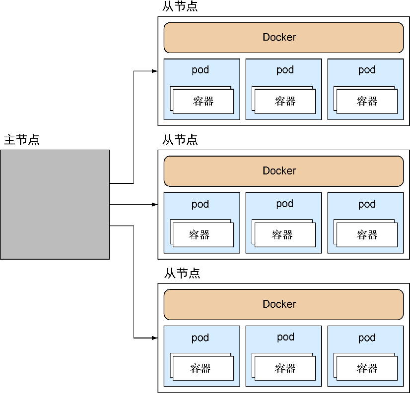
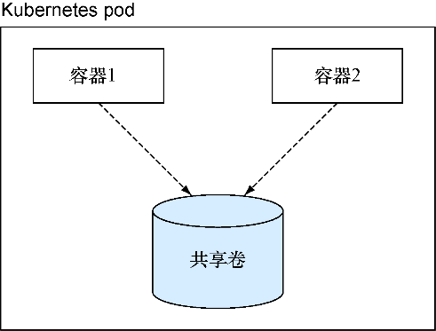

### 技巧88　使用Kubernetes集群

现在读者已经了解了容器编排的两种极端方式——比较保守的Helios方式以及更自由的Docker swarm方式。但有些用户或公司可能期望他们使用的工具更复杂一些。这种可定制编排的需求有很多工具可以满足，不过有些工具的使用率和讨论度比其他工具要高一些。从某种角度讲，一部分原因无疑在于其背后的品牌，而用户寄希望于谷歌公司知道如何构建编排软件。

#### 问题

想要跨宿主机管理Docker服务。

#### 解决方案

使用Kubernetes以及它强大的抽象能力来管理容器舰队。

Kubernetes是谷歌公司创建的一种工具，它适合那种希望对编排应用程序和应用程序之间的状态的关系具有清晰的指引和最佳实践的公司。它允许用户使用专门设计的工具来管理基于特定结构的动态基础设施。

在正式介绍Kubernetes的细节之前，让我们快速浏览一下图12-1所示的Kubernetes宏观架构图。

Kubernetes有一个主从架构（master-minion architecture）。主节点的职责是接收需要在集群上执行的命令，以及编排自身的资源。每个从节点上都安装了Docker，以及一个kubelet服务，kubelet用于管理每个节点上的pod（一组容器）。集群的信息交由etcd维护，etcd是一个分布式的键/值数据存储（见技巧74），它是集群中信息的真实来源。


**提示**

我们将在本技巧的稍后部分再探讨这一块，所以现在不必有过多疑问，只需要知道pod是一组相关的容器即可。这个概念是为了便于Docker容器的管理和维护。


Kubernetes的最终目标是让系统以简单可扩展的方式来运行用户容器，用户只需要声明他需要什么，让Kubernetes确保集群满足用户的需求。在本技巧中，读者将可以看到如何通过执行一条命令将一个简单的服务扩展到指定的规模。


**注意**

Kubernetes起初是由谷歌公司开发的，作为一种大规模管理容器的手段。谷歌公司大规模运行容器已达10年之久，在Docker开始流行时即决定开发这个容器编排系统。Kubernetes建立在谷歌公司大量的使用经验之上。Kubernetes也被简称为“k8s”。



<center class="my_markdown"><b class="my_markdown">图12-1　Kubernetes高层视图</b></center>

关于Kubernetes安装、设置以及功能的详细介绍是一个很大且快速变化的话题，已超出本书的讨论范围（毫无疑问，不久之后将会有一本专门的书来介绍它）。这里我们将专注于Kubernetes的核心概念，并设置一个简单的服务以便读者能够对它有一个简单认知。

##### 1．安装Kubernetes

可以直接在宿主机上通过Minikube来安装Kubernetes，从而得到一个单从节点的集群，也可以使用Vagrant来安装一个由虚拟机管理的多从节点集群。在本技巧中，我们关注第一种方法——后者通常需要通过调研来决定何种方式对最新版本的Kubernetes有效。

在本地启动Kubernetes时，推荐的方式是遵循Minikube在Kubernetes网站上的官方文档，在宿主机上安装一个单从节点的集群。

Minikube是从Kubernets项目中创建的专用于简化本地开发过程的工具，但是它目前有一些局限。如果读者想要拓展一下，推荐读者搜索一下使用Vagrant创建多节点Kubernetes集群的办法——这个过程通常根据Kubernetes版本的不同而不同，因此在这里我们不会给出具体建议。

如果已经安装了Kubernetes，那么不妨从这里继续。接下来的内容将是基于一个多节点的集群。我们将创建单个容器并使用Kubernetes对它进行扩展。

##### 2．扩展单个容器

用于管理Kubernetes的命令叫作 `kubectl` 。在下面的例子中会使用它的 `run` 子命令，在pod中运行一个给定的镜像作为容器：

```c
$ kubectl run todo --image=dockerinpractice/todo　　⇽---　 todo是产出的pod的名称，可以通过--image标志来指定想要的镜像；这里我们用的todo镜像就是第1章里的那个
 $ kubectl get pods | egrep "(POD|todo)" 　　⇽---　 kuberctl的get pods子命令列出所有的pod。我们只对todo pod感兴趣，所以使用grep过滤出这个pod和标题
 POD          IP  CONTAINER(S)  IMAGE(S)  HOST       >
LABELS              STATUS    CREATED          MESSAGE
todo-hmj8e                               10.245.1.3/  >　　⇽---　 todo-hmj8e是pod的名称
 run=todo  Pending   About a minute　　⇽---　 LABELS是与pod有关的键/值对，如这里显示的run标志。pod的状态是Pending（挂起），这说明Kubernetes正在准备运行这个pod，很可能正在从Docker Hub下载镜像
```

Kubernetes根据 `run` 命令中的名称（在上面的例子中是 `todo` ）生成pod名称，加上破折号，然后再加上一个随机的字符串。这确保了不会和其他的pod重名。

等待一会儿下载todo镜像后，最终会看到状态变为 `Running` （运行中）：

```c
$ kubectl get pods | egrep "(POD|todo)"
POD         IP          CONTAINER(S)   IMAGE(S)               >
HOST                   LABELS              STATUS    CREATED        MESSAGE
todo-hmj8e 10.246.1.3                                         >
10.245.1.3/10.245.1.3  run=todo  Running   4 minutes
                        todo           dockerinpractice/todo  >
                                           Running   About a minute
```

这次 `IP` 、 `CONTAINER(S)` 和 `IMAGE(S)` 列都有值。 `IP` 列是pod的地址（这个例子中是 `10.246.1.3` ）， `CONTAINER(S)` 列中每一行包含了pod中的一个容器（这个例子中只有一个容器，即 `todo` ）。可以直接访问该IP地址和端口来测试todo容器确实已经在运行并且提供服务处理请求：

```c
$ wget -qO- 10.246.1.3:8000
<html manifest="/todo.appcache">
[...]
```

现在我们还没看到这与直接运行一个Docker容器有什么区别。为了首次尝试Kubernetes，可以执行Kubernetes的 `resize` 命令来扩展该服务：

```c
$ kubectl resize --replicas=3 replicationController todo
resized
```

这一命令告诉Kubernetes我们想要todo的复制控制器（replication controller），以确保有3个todo应用程序实例运行在集群中。


**提示**

复制控制器是一个Kubernetes服务，用来确保有正确数量的pod节点运行在集群中。


可以使用 `kubectl get pods` 命令来检查todo应用程序的额外实例是否已经启动：

```c
$ kubectl get pods | egrep "(POD|todo)"
POD         IP           CONTAINER(S)   IMAGE(S)                >
HOST                    LABELS              STATUS    CREATED         MESSAGE
todo-2ip3n  10.246.2.2                                          >
10.245.1.4/10.245.1.4   run=todo  Running   10 minutes
                         todo           dockerinpractice/todo   >
                                            Running   8 minutes
todo-4os5b 10.246.1.3                                           >
10.245.1.3/10.245.1.3   run=todo  Running   2 minutes
                         todo           dockerinpractice/todo   >
                                            Running   48 seconds
todo-cuggp 10.246.2.3                                           >
10.245.1.4/10.245.1.4   run=todo  Running   2 minutes
                         todo           dockerinpractice/todo   >
                                            Running   2 minutes
```

Kubernetes已经获得了 `resize` 指令和todo复制控制器，并确保启动了正确数目的pod。注意，有两个pod在同一台宿主机上（10.245.1.4），有一个pod在另一台宿主机上（10.245.1.3）。这是因为Kubernetes的默认调度程序有一个算法会默认跨节点散布pod。


**提示**

调度程序是一个软件，它决定一些工作负载应该在哪里以及在什么时候运行。例如，Linux内核便有一个调度程序，它会决定下一步应该运行什么任务。调度程序可以有非常简单的，也有超级复杂的。


读者已经看到了Kubernetes使跨宿主机管理容器更加容易的方法。接下来我们将深入了解Kubernetes的pod概念。

##### 3．使用pod

pod是一组容器，它们被设计成以某种方式在一起工作并共享资源。

每个pod拥有自己的IP地址并共享相同的卷和网络端口段。因为一个pod的所有容器共享一台本地主机，所以只要它们被部署了，依赖的不同服务都是可用和相互可见的。

图12-2用两个容器共享一个卷来演示了这一点。在该图中，容器1是一个Web服务器，从共享卷中读取数据，而容器2则会更新数据。因此两个容器都是无状态的。状态存储在共享卷中。


<center class="my_markdown"><b class="my_markdown">图12-2　拥有两个容器的pod</b></center>

这种责任分离的设计通过单独管理服务的每个部分实现了微服务的方式。在pod中升级一个镜像不必担心会影响其他镜像。

代码清单12-1中的pod规范定义了一个复杂的pod，其拥有两个容器，一个容器会每5秒在文件中写入随机数据（ `simplewriter` ），另一个容器会从同一个文件中读取数据。文件通过卷（ `pod-disk` ）共享。

代码清单12-1　complexpod.json

```c
{
  "id": "complexpod",　　⇽---　 id属性给该实体一个名称
   "kind": "Pod",　　⇽---　 kind属性指定了这是什么类型的对象
   "apiVersion": "v1beta1",　　⇽---　指定Kubernetes使用的JSON目标版本
   "desiredState": {　　⇽---　
     "manifest": {　　⇽---　pod规范的内容位于desiredState和manifest属性中
       "version": "v1beta1",　　⇽---　指定Kubernetes使用的JSON目标版本
       "id": "complexpod",　　⇽---　 id属性给该实体一个名称
       "containers": [{　　⇽---　 pod中容器的细节存储在JSON数组中
         "name": "simplereader",　　⇽---　
         "image": "dockerinpractice/simplereader",　　⇽---　每个容器都有一个名称用于引用，Docker镜像被定义在image属性中
         "volumeMounts": [{　　⇽---　为每个容器都指定了卷的挂载点
           "mountPath": "/data",　　⇽---　 mountPath 是卷挂载到容器文件系统的路径。每个容器可以使用不同的位置
           "name": "pod-disk"　　⇽---　卷挂载名称引用了pod manifest的卷定义中的名称
         }]
      },{
        "name": "simplewriter",
         "image": "dockerinpractice/simplewriter",
         "volumeMounts": [{
           "mountPath": "/data",
           "name": "pod-disk"
         }]
      }],
      "volumes": [{　　⇽---　 volumes属性定义了为这个pod创建的卷名称
         "name": "pod-disk",　　⇽---　卷名称在前面的volumeMounts项中被引用
         "emptydir": {}　　⇽---　一个临时目录，用来共享pod的生命周期
       }]
    }
  }
}
```

创建一个包含上述配置的文件，执行如下命令来加载pod规范：

```c
$ kubectl create -f complexpod.json
pods/complexpod
```

等待一会儿下载完镜像后，通过执行 `kubectl log` 命令并指定第一个pod和感兴趣的容器来查看容器的日志输出：

```c
$ kubectl log complexpod simplereader
2015-08-04T21:03:36.535014550Z '? U
[2015-08-04T21:03:41.537370907Z] h(^3eSk4y
[2015-08-04T21:03:41.537370907Z] CM(@
[2015-08-04T21:03:46.542871125Z] qm>5
[2015-08-04T21:03:46.542871125Z] {Vv_
[2015-08-04T21:03:51.552111956Z] KH+74    f
[2015-08-04T21:03:56.556372427Z] j?p+!\
```

#### 讨论

这里我们只是接触了Kubernetes的冰山一角，但这已经让读者清楚了它能干什么以及它是怎样让编排容器变得更加简单的。

接下来的技巧89直接利用了Kubernetes的一些特性。Kubernetes也是在技巧90和技巧99中OpenShift背后的编排引擎。

