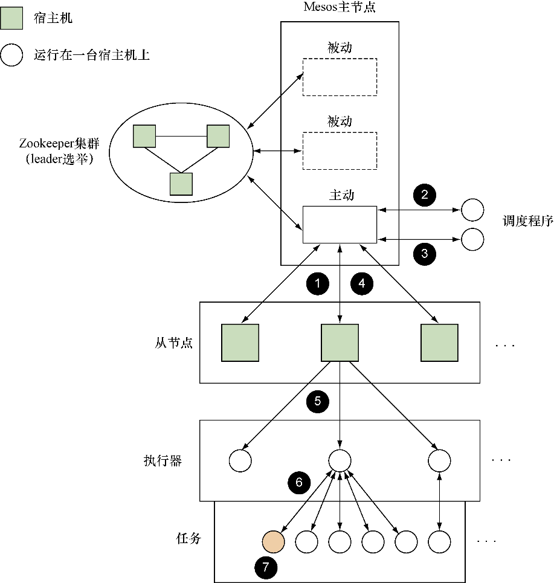
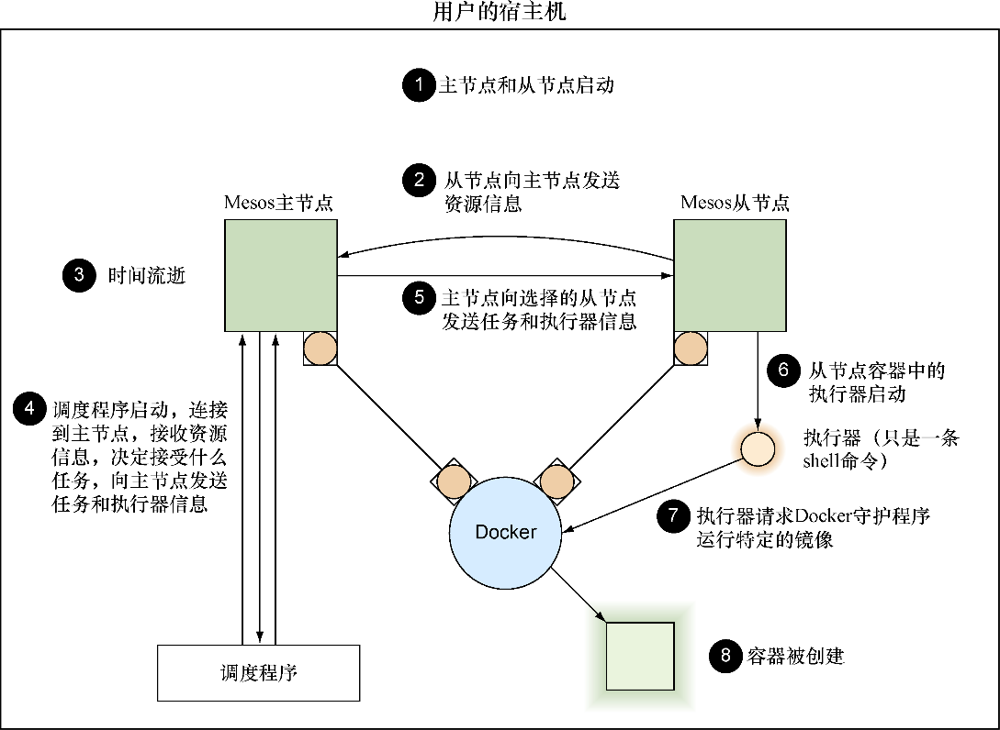
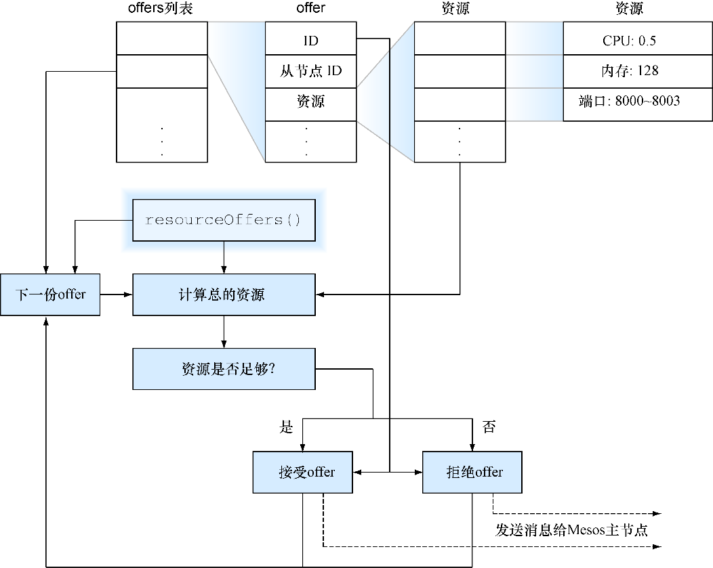

### 技巧91　在Mesos上构建框架


当讨论众多的编排可能性时，读者可能会发现一个被特别提及作为Kubernetes的替代品的工具——Mesos。人们通常会这样描述Mesos，如“Mesos是框架的框架”，以及“Kubernetes可以运行在Mesos之上”！

我们遇到的最恰当的类比是将Mesos看作数据中心的内核。单独使用它做不成什么有价值的事情，将它和一个init系统还有应用程序组合在一起就有价值了！

一个通俗的解释是，想象有一只猴子坐在面板前面控制所有的机器，并有权随意启动和停止应用程序。当然，你需要给猴子一个 **非常** 清楚的指示：在特定情况下要做什么，何时启动应用程序等。你可以自己做，但是很花时间，而猴子劳动力则比较廉价。

Mesos就是这只猴子！

Mesos是具有高度动态化和复杂基础设施的企业的理想选择，这些企业拥有自己的生产环境编排方案的经验。如果不满足这些条件，比起花时间量身定制Mesos，现成的解决方案可能会服务得更好一些。

#### 问题

有很多控制应用程序和作业启动的规则，想要无须手动就能在远程机器上启动它们并跟踪其状态。

#### 解决方案

使用Mesos，Mesos是一个提供资源管理抽象的灵活且强大的工具。

Mesos是一款成熟的软件，用于在多台机器上提供资源管理的抽象。一些你可能有所耳闻的公司已经将它们部署到了生产环境中并且历经考验，结果证明，它是稳定和可靠的。


**注意**

本技巧要求Docker 1.6.2或更高版本，这样Mesos才能使用正确的Docker API版本。

图12-3展示了一个通用的生产环境Mesos配置。

参考图12-3可以看到Mesos启动一个任务的基本生命周期是怎样的。

❶ 一个从节点运行在节点上，追踪资源利用率并持续接收主节点的通知。

❷ 主节点从一个或多个从节点上收集可用的资源，并向调度程序提供资源。

❸ 调度程序接收主节点提供的资源，决定在哪里执行任务，并将消息通知回主节点。

❹ 主节点将任务信息传递给适当的从节点。

❺ 每个从节点将任务信息传递给节点上现有的执行器，或启动一个新的执行器。

❻ 执行器读取任务信息并在节点上启动任务。

❼ 任务执行。


<center class="my_markdown"><b class="my_markdown">图12-3　通用的生产环境Mesos配置</b></center>

Mesos项目提供了主节点（master）和从节点（slave），还有内置的shell执行器。你的工作是提供一个 **框架** （或 **应用程序** ），它是由一个调度程序（猴子类比例子中的指令列表）和可选的自定义执行器组成的。

许多第三方项目提供了使用户可以运行在Mesos上的框架（我们将在技巧92中详细介绍），但为了更好地了解如何充分利用Mesos和Docker的力量，我们将构建自己的框架，该框架只包含一个调度程序。如果启动应用程序有非常复杂的逻辑，这可能也会是最终的途径。


**注意**

与Mesos结合使用Docker并不是必须的，但由于这是本书的内容，我们会这样做。因为Mesos非常灵活，所以我们不会深入细节。我们也会在单台机器上运行Mesos，但我们会尝试尽可能地保持其贴进实际，并指出需要怎么做才能上线。


我们还没有解释Docker是如何适配Mesos的生命周期的——该谜题的最后一部分便是Mesos提供了对 **容器化** 的支持，允许用户隔离执行器或任务（或两者同时隔离）。在这里，Docker并不是唯一可用的工具，但是它非常受欢迎，所以Mesos有一些特定于Docker的功能支持，可以让用户快速上手。

我们的示例只会容器化我们执行的任务，因为我们使用的是默认执行器。如果用户有只能运行在一个特定的语言环境中的自定义执行器，每个任务需要动态加载和运行一些代码，那么可能需要考虑容器化执行器。作为一个示例用例，用户可能会把JVM用作执行器来实时加载和运行代码，从而避免当执行潜在的非常小的任务时JVM的启动开销。

图12-4展示了在创建新的Docker化任务时，在我们当前的示例里后台会发生什么。


<center class="my_markdown"><b class="my_markdown">图12-4　单宿主机Mesos设置启动一个容器</b></center>

话不多说，让我们开始吧！接下来首先要做的是通过代码清单12-6启动一个主节点。

代码清单12-6　启动主节点

```c
$ docker run -d --name mesmaster redjack/mesos:0.21.0 mesos-master \
 --work_dir=/opt
24e277601260dcc6df35dc20a32a81f0336ae49531c46c2c8db84fe99ac1da35
$ docker inspect -f '{{.NetworkSettings.IPAddress}}' mesmaster
172.17.0.2
$ docker logs -f mesmaster
I0312 01:43:59.182916   1 main.cpp:167] Build: 2014-11-22 05:29:57 by root
I0312 01:43:59.183073   1 main.cpp:169] Version: 0.21.0
I0312 01:43:59.183084   1 main.cpp:172] Git tag: 0.21.0
[...]
```

主节点的启动有点儿冗长，但是用户应该能发现它很快就停止了日志记录。保持该终端开启，以便在启动其他容器时可以看到主节点发生了什么。


**注意**

通常Mesos将会被配置成具有多个Mesos主节点（一个主动节点和多个备份节点）以及一个Zookeeper集群。Mesos站点的“Mesos High-Availability Mode”（Mesos高可用模式）页面记录了如何配置多主节点的Mesos。用户还需要公开端口5050用于外部通信，并且使用work_dir文件夹作为卷来保存持久化信息。


我们也需要从节点。但是这需要一些技巧。Mesos的定义特征之一就是对执行任务有资源限制的能力，这要求从节点拥有自由检查和管理进程的能力。因此，执行从节点的命令需要将一些外部系统的细节公开到容器内部，如代码清单12-7所示。

代码清单12-7　启动从节点

```c
$ docker run -d --name messlave --pid=host \
 -v /var/run/docker.sock:/var/run/docker.sock -v /sys:/sys \
 redjack/mesos:0.21.0 mesos-slave \
 --master=172.17.0.2:5050 --executor_registration_timeout=5mins \
 --isolation=cgroups/cpu,cgroups/mem --containerizers=docker,mesos \
 --resources="ports(*):[8000-8100]"
1b88c414527f63e24241691a96e3e3251fbb24996f3bfba3ebba91d7a541a9f5
$ docker inspect -f '{{.NetworkSettings.IPAddress}}' messlave
172.17.0.3
$ docker logs -f messlave
I0312 01:46:43.341621 32398 main.cpp:142] Build: 2014-11-22 05:29:57 by root
I0312 01:46:43.341789 32398 main.cpp:144] Version: 0.21.0
I0312 01:46:43.341795 32398 main.cpp:147] Git tag: 0.21.0
[...]
I0312 01:46:43.554498 32429 slave.cpp:627] No credentials provided. >
Attempting to register without authentication
I0312 01:46:43.554633 32429 slave.cpp:638] Detecting new master
I0312 01:46:44.419646 32424 slave.cpp:756] Registered with master >
master@172.17.0.2:5050; given slave ID 20150312-014359-33558956-5050-1-S0
[...]
```

此刻，用户应该可以看到Mesos主节点终端的一些活动，开始几行如下所示：

```c
I0312 01:46:44.332494     9 master.cpp:3068] Registering slave at >
slave(1)@172.17.0.3:5051 (8c6c63023050) with id >
20150312-014359-33558956-5050-1-S0
I0312 01:46:44.333772     8 registrar.cpp:445] Applied 1 operations in >
134310ns; attempting to update the 'registry'
```

这两行日志展示了用户已经启动了从节点并连接到了主节点。如果没有看到日志，不妨停下来再次检查配置的主节点的IP地址。当没有可连接的从节点时，尝试和调试为什么框架没有启动任何任务是非常令人沮丧的。

不管怎样，代码清单12-7中的命令做了很多事情。 `run` 之后和 `redjack/mesos:0.21.0` 之前的部分传入的参数都是Docker的参数，它们主要包含了给从节点容器传入的很多关于外部世界的信息。 `mesos-slave` 之后的参数更有意思。 `master` 告诉从节点在哪里能找到主节点（或者Zookeeper集群）。接下来的3个参数 `executor_registration_timeout` 、 `isolation` 和 `containerizers` 都是对Mesos设置的调整，使用Docker时要始终设置这3个参数。最后，也是相当重要的一点是，需要让Mesos从节点知道哪些端口可以作为资源交出来。默认情况下，Mesos提供31000～32000，但我们想使用更小的、更容易记忆的端口。

现在简单的步骤都已经完成，我们进行到了设置Mesos的最后阶段——创建调度程序。

幸好我们已经有了一个示例框架可以使用。我们来试试它能做什么，然后探索它的工作原理。用户不妨在主节点容器和从节点容器中保持两个 `docker logs –f` 命令窗口是打开的，以便可以看到通信。

代码清单12-8中给出的命令将从GitHub获取示例框架的源代码库并启动它。

代码清单12-8　下载和启动示例框架

```c
$ git clone https://github.com/docker-in-practice/mesos-nc.git
$ docker run -it --rm -v $(pwd)/mesos-nc:/opt redjack/mesos:0.21.0 bash
# apt-get update && apt-get install -y python
# cd /opt
# export PYTHONUSERBASE=/usr/local
# python myframework.py 172.17.0.2:5050
I0312 02:11:07.642227   182 sched.cpp:137] Version: 0.21.0
I0312 02:11:07.645598   176 sched.cpp:234] New master detected at >
master@172.17.0.2:5050
I0312 02:11:07.645800   176 sched.cpp:242] No credentials provided. >
Attempting to register without authentication
I0312 02:11:07.648449   176 sched.cpp:408] Framework registered with >
20150312-014359-33558956-5050-1-0000
Registered with framework ID 20150312-014359-33558956-5050-1-0000
Received offer 20150312-014359-33558956-5050-1-O0. cpus: 4.0, mem: 6686.0, >
ports: 8000-8100
Creating task 0
Task 0 is in state TASK_RUNNING
[...]
Received offer 20150312-014359-33558956-5050-1-O5. cpus: 3.5, mem: 6586.0, >
ports: 8005-8100
Creating task 5
Task 5 is in state TASK_RUNNING
Received offer 20150312-014359-33558956-5050-1-O6. cpus: 3.4, mem: 6566.0, >
ports: 8006-8100
Declining offer
```

读者可能会注意到，我们已经把Git仓库挂载到了Mesos镜像中。这是因为它包含了我们需要的所有Mesos库。不然，安装它们会是一个很痛苦的过程。

`mesos-nc` 框架被设计用来在所有可用的宿主机上的8000和8005之间的所有可用端口之间执行 `echo 'hello <task id>' | nc -l <port>` 命令。根据netcat的工作原理，这些“服务器”在用户访问它们时就会终止，无论是通过curl、Telnet、nc还是浏览器来访问。可以在新的终端中执行 `curl localhost:8003` 来进行验证。它将会返回预期的响应，并且Mesos的日志会显示新产生的任务替代了被终止的那个。用户还可以使用 `docker ps` 来跟踪哪些任务正在执行。

值得一提的是，这里有Mesos保持跟踪已分配的资源并在任务终止时将它标记为可用的证据。特别是，当访问 `localhost:8003` （不妨再次尝试下）时，请仔细查看 `Received offer` 行，它展示了两个端口范围（因为它们没有被连接），包括刚刚释放的端口范围：

```c
Received offer 20150312-014359-33558956-5050-1-O45. cpus: 3.5, mem: 6586.0, >
ports: 8006-8100,8003-8003
```


**警告**

Mesos从节点给所有容器的命名均是以mesos-开头的，并且它假定这样的名称可以被从节点自由管理。留心容器的命名，否则Mesos从节点可能会杀掉它自己。


框架代码（myframework.py）加上了很好的注释，以便用户能够读懂。我们将介绍一些宏观的设计：

```c
class TestScheduler
(mesos.interface.Scheduler):
[...]
    def registered(self, driver, frameworkId, masterInfo):
[...]
    def statusUpdate(self, driver, update):
[...]
    def resourceOffers(self, driver, offers):
[...]
```

所有的Mesos调度程序都是Mesos调度程序类的子类，并且实现了一些方法，Mesos将会在适当的时间点通知用户运行的框架，使其对相应的事件做出响应。尽管上面的代码段中已经实现了3个方法，但其中的两个是可选的，它们的实现是用来添加额外的日志来进行演示的。唯一一个用户 **必须** 实现的方法是 `resourceOffers` ——框架在启动任务时没有太多不清楚的点。用户可以为了自己的目的添加任意额外的方法，如 `init` 和 `_makeTask` ，只要它们不和Mesos期望使用的任何方法冲突就好，因此，请读者先确保阅读过相关文档。


**提示**

如果用户最终选择编写自己的框架，那么需要查看一些方法和结构的文档。但是在编写本书时，官方唯一产出的文档是针对Java方法的。想要找到深入结构的起点的读者，可以从查看Mesos源代码中的include/mesos/mesos.proto文件开始。祝你好运!


我们来看一下 `main` 方法中一个有意思的部分—— `resourceOffers` 的更多细节。它会决定启动任务还是拒绝任务。图12-5展示了Mesos调用了框架的 `resourceOffers` 方法后的执行流程（通常是因为一些资源已经可供框架使用）。

`resourceOffers` 会接收一个offer列表，每个offer对应单个Mesos从节点。该offer包含了在从节点上执行的任务的可供使用的资源的细节，而该方法的一个典型实现将会使用该信息来识别最适合的位置来启动想要执行的任务。启动任务会给Mesos主节点发送消息，主节点会继续图12-3中列出的生命周期。


<center class="my_markdown"><b class="my_markdown">图12-5　调用resourceOffers时框架的执行流程</b></center>

#### 讨论

重要的是注意 `resourceOffers` 的灵活性——任务的启动取决于选定的任意标准，从外部服务的健康检查乃至于月相的变化都行！这种灵活性可能是一种负担，所以业内现有的已发布的框架会隐藏这一底层的细节并简化对Mesos的使用。技巧92会讲述其中一个框架。

读者可以阅读Roger Ignazio的Mesos in Action来了解Mesos的功能的更多细节——这里只进行了一些简单的介绍，而我们已经看到了它和Docker的配合是多么轻松。

