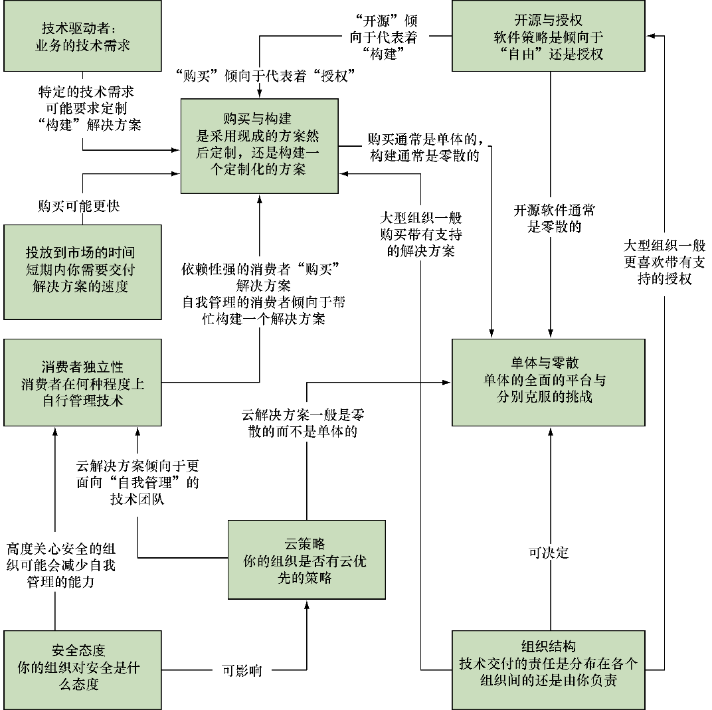

### 13.1　组织选择的因素

本节会给出组织内可能驱动Docker平台选择的主要因素。图13-1展示了其中一些因素及其内在联系。

<b class="my_markdown">图13-1　驱动平台选择的因素</b>

在详细讨论这些因素之前，我们会简单给出每个因素的定义并解释其意义。可能你在理解它们是什么之前已经考虑了所有的因素，但是在组织内和组织间不同的术语会让其含义变得模糊，在有些组织内有些术语应用得更加广泛。

+ **购买与构建** ——这反映了组织在转向新的软件部署时方式的不同。一些组织更喜欢购买解决方案，其他组织更喜欢自己构建并维护。这反过来会影响他们对平台（或者平台们）的选择。
+ **技术驱动者** —— 一些业务因它们的技术特点而不同，比如高水平的性能表现或运维效率。加强这些特性的理由可能是非常特殊的，一些通用的服务或工具可能无法满足特定的技术组件。这可能会驱动他们选择定制化的解决方案，这些解决方案采用“构建”而非“购买”的方式。
+ **单体与零散** ——这又是一个组织在采取软件解决方案时的通用文化方法。一些组织喜欢把解决方案在单体实体（一个中心化的服务器或服务）上集中起来，另外一些组织喜欢把问题拆成一小块一小块的。后一种方式可能看上去更加灵活、适应性更强，前者在大规模应用上有更高的效率。
+ **投放到市场的时间** ——通常，组织（出于商业或文化原因）承受着尽快向其用户交付解决方案的压力。这种压力可能会使某些平台胜于其他平台，但代价是将来的成本或灵活性。
+ **开源与授权** ——近来组织通常更倾向于选择开源软件而非授权产品，但是仍有足够的理由从供应商那里获取授权软件。另外一个把组织推向开源软件解决方案的理由是对绑定在特定供应商或者平台的恐惧，这可能导致随着产品的持续存在授权费用也随之上涨。
+ **消费者独立性** ——你部署的平台会有消费者。他们可能是个人、团队或整个事业部。无论这些消费者规模如何，他们都会有自己的文化和运维模式。这里的关键问题是在他们运维的环境中，他们技术上自我管理的程度有多高，以及他们的开发环境需要何种程度的定制。这些问题的答案可能决定了你选择部署的平台的特性。
+ **云策略** ——很少有组织当下没有云计算的定位了。不管你是不是立刻就要把工作负载迁移到云，在你做决定的过程中该解决方案的云原生的程度都可能成为影响因素。即使你决定迁移到云，你仍然需要考虑策略是仅限于一种云平台还是设计成可在多个云平台间迁移，甚至迁移回数据中心。
+ **安全态度** ——组织在其IT策略中越来越重视安全。不管是国家资助的参与者、业余（或者专业的）黑客、工业间谍还是盗窃，安全是一个人人都需关心的问题。对此领域的关注程度可能有所不同，这也可能在平台选择的影响因素中占据一席之地。
+ **组织结构** ——如果你是为了企业组织工作，而非其他组织，上述的很多定义，对你来说可能更有意义。

在本书中我们把企业宽泛地定义为一种内部不同部门有较少的独立性的组织。比如，如果你运作着集中式的IT部门，能否不计后果地不用依赖其他业务部门（比如安全组、开发团队、开发工具团队、财务、运维/DevOps团队）就可以进行部署？如果如此，我们认为这是非企业组织。企业组织通常更大（部门更不相关联），更规整（内部来说和外部来说），会限制他们的自由从而仅允许进行影响更小的变更。

与此相对，一个非企业组织（在本书中），是那些只要觉得合适就可以通过自行决定来自由部署解决方案的组织。在此定义下，创业公司通常被认为是非企业组织，因为它们可以迅速做出决定而不用参考（或者可更快地确定） 其他人的意见。

尽管非企业组织通常更倾向于采用某些策略（比如构建而非购买），但从长远来看，考虑到这些决策对企业的影响，购买仍然是值得的。

我们接下来看一下这些不同因素是如何互相作用来影响不同的平台的。希望其中的某些分析能够引起你的经验或情景的共鸣。

讨论之后，我们接下来会看一下运行一个Docker平台可能带来的挑战。以这些因素作为背景，你可以做出一个深思熟虑的决定：何种技术才是最适合你的组织的需求的。

