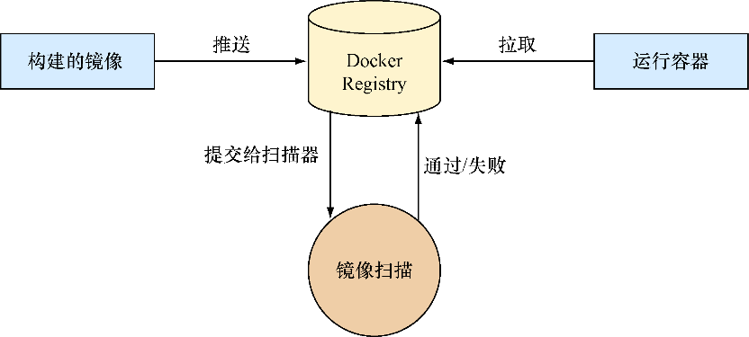
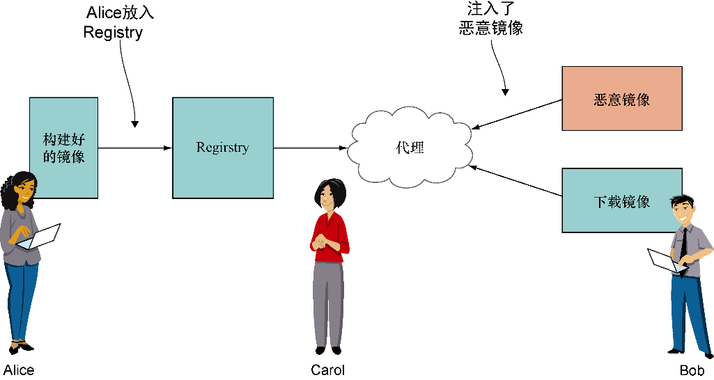

### 13.2.1　安全与控制

我们将首先处理安全问题，因为你的安全性和控制态度从许多方面都会从根本上影响你处理所有其他主题的方式。同样，如果你的组织比其他组织更不关心安全性，则可能对解决本节中概述的问题不太关心。


**注意**

“控制”是指覆盖在开发团队和运行团队的操作上的治理系统。这包括集中管理的软件开发生命周期、授权管理、安全审计及常规审计等。一些组织与此不甚相关，而另一些组织则权重较大。


##### 1．镜像扫描

无论将镜像存储在何处，都将有一个绝佳的机会在存储时检查这些镜像是否符合你的期望。你可能要检查的内容取决于你的用例，但以下是一些你可能希望或多或少得到实时回答的特定问题的示例。

+ 哪些镜像具有shellshock版本的bash？
+ 任何镜像上都有过期的SSL库吗？
+ 哪些镜像基于当前可疑的基础镜像？
+ 哪些镜像具有非标准（或明显错误）的开发库或工具？


**注意**

shellshock是2014年发现的bash中一组特别严重的安全漏洞。在揭露一系列相关错误中的第一个之后的几天里，安全公司记录了数百万与该错误相关的攻击和探测。


图13-2显示了软件开发生命周期中镜像扫描的基本工作流程。生成镜像并将其推送到Registry，这将触发镜像扫描。扫描程序可以检查Registry中的镜像，也可以下载并对其进行处理。根据你对镜像的怀疑程度，你可以同步检查镜像并在确定没问题之前阻止其使用，也可以异步查看镜像并向提交用户提供一个报告。通常，怀疑的方法用于生产中使用的镜像，异步询问方法用于开发中。


<center class="my_markdown"><b class="my_markdown">图13-2　镜像扫描工作流程</b></center>

在镜像扫描的世界中，有很多选择，但是它们并不完全相同。要了解的最重要的一点是，扫描器大致分为两类：聚焦于已安装软件包的扫描器和主要用于深度扫描镜像中软件的扫描器。第一类的示例是Clair和OpenSCAP，第二类的示例是Black Duck Software、Twistlock、Aqua Security和Docker公司等。这两个类别之间有些重叠，但主要的分界线是成本：维护必要的信息数据库以应对各种类型的库或二进制文件中的弱点的成本更高，因此深层扫描器的成本往往更高。

这种划分可能与你的决策有关。如果你的镜像是半信任的，则可以假定用户不是恶意的，并使用简单软件包扫描器。这将为你提供有关标准包及其适当风险等级的指标和信息，而不会带来太多成本。

尽管扫描器可以降低镜像中恶意软件或垃圾软件的风险，但它们并不是灵丹妙药。我们对扫描器进行评估的经验表明，即使是最佳的也不是完美的，而且它们在识别某些类型的二进制文件或库中的问题方面往往比其他类型的软件更好。例如，比起用C++编写的软件，有些扫描器更擅长识别npm包的问题，反之亦然。有关我们用来锻炼和测试这些扫描器的镜像，参见第14章中的技巧94。

要注意的另一件事是，尽管扫描器可以处理不可变的镜像并检查这些镜像的静态内容，但是容器仍然有很大的风险，即容器可能在运行时构建和运行恶意软件。静态镜像分析无法解决该问题，因此你可能还需要考虑运行时控制。

与本节中的所有主题一样，你必须在选择扫描器时考虑要实现的目标。你可能想要：

+ 防止恶意行为者将对象插入构建中；
+ 在软件使用方面强制执行全公司范围的标准；
+ 快速修补已知和标准CVE。


**注意**

CVE是对软件漏洞的标识符，对于特定错误可以提供通用且不混淆的标识。


最后，你可能还需要考虑将该工具集成到DevOps流水线中的成本。如果你找到满意的扫描器，并且它与你的平台（或其他相关的DevOps工具）集成得很好，则可能是对该扫描器有利的另一个因素。

##### 2．镜像完整性

镜像完整性和镜像扫描通常会混淆，但是它们不是一回事。 **镜像扫描** 可确定镜像 **中** 的内容，而 **镜像完整性** 可确保从Docker Registry中 **检索** 到的内容与安全地放置在其中的内容相同。（镜像验证是描述此要求的另一种常用方法。）

想象一下以下情形：Alice将一个镜像放置在Registry中（镜像A），当然也是在经历了存在的所有授权过程以检查该镜像之后才做到这一点的，Bob希望在服务器上运行该镜像。Bob向服务器请求镜像A，但是他不知道攻击者（Carol）已破坏了网络，并在Bob和Registry之间放置了代理。鲍勃（Bob）下载该镜像时，实际上是由恶意镜像（镜像C）来处理，该恶意镜像将运行代码来把机密数据窃取到网络外部第三方IP（见图13-3）。


<center class="my_markdown"><b class="my_markdown">图13-3　镜像完整性破坏</b></center>

Docker公司凭借其Content Trust产品（也称为Notary）引领了这一潮流。该产品使用私有密钥对镜像清单进行签名，以确保在使用公共密钥解密内容时，其内容与上传到Registry的内容相同。Content Trust还提供了一些其他我们不会在此谈及的功能，如密钥责任代理。

除了Docker的产品之外，截至2018年，尚无太多报告，由此可见他们在此方面的工程领袖地位。像Kubernetes和OpenShift这样的领先产品在开箱即用的区​​域中提供的很少，因此，如果你不购买Docker的产品，则可能必须自己集成这些产品。对于许多组织而言，这种努力是不值得的，因此他们将依靠现有的（可能是外围）防御。

如果确实要实现镜像完整性解决方案，则仍必须考虑如何在组织内管理密钥。足够重视这一点的组织可能会为此制定相应的政策和解决方案。

##### 3．第三方镜像

继续讨论镜像的主题，提供平台时的另一个常见挑战是外部镜像。同样，这里的基本困难是信任的一环：如果你有一家供应商想要将Docker镜像带入你的平台，那么如何确保它可以安全运行？在多租户环境中，这是一个特别重要的问题，在该环境中，不同的团队（不必彼此信任）必须在同一主机上运行容器。

一种方法就是简单地禁止所有第三方镜像，并且仅允许使用存储在公司网络中的代码和制品（artifact）从已知的和经过策划的基础镜像构建镜像。在这种情况下，某些供应商镜像仍可以起作用。如果供应商镜像本质上是在标准JVM下运行的JAR（Java归档）文件，则可以使用该制品在网络内重新创建和构建镜像，并在批准的JVM镜像下运行。

但是，不可避免地，并非所有镜像或供应商都适合这种方法。如果允许第三方镜像的压力足够大（根据我们的经验就是如此），你可以选择以下几种方法：

+ 信任你的扫描器；
+ 人工检查镜像；
+ 让团队负责管理其带入组织的镜像。

你不会完全相信扫描器能够为你确定第三方镜像的安全性，除非内置该镜像已经有段时间了，因此你可能需要依靠某种其他方式。

第二种方法是手动检查镜像，该方法不可扩展且容易出错。最后一个选项是最简单、最容易实现的。

我们已经看到了采用这3种方法的环境，平台管理团队对镜像进行了完整性检查，但最终的责任在于将其交付的应用程序团队。通常，存在将虚拟机镜像引入组织的现有过程，因此一种简单的方法是将此过程复制到Docker映像。这里值得指出的一个主要区别是，尽管VM是多租户的，它们与其他租户共享一个虚拟机管理程序，而Docker镜像共享一个功能全面的操作系统，这使攻击面更大（有关此信息，参见第14章）。

另一个选择是在自己的硬件环境上沙盒运行镜像，例如通过标记集群上的Kubernetes节点，或使用云产品（如ECS）的单独实例，或在单独的硬件乃至网络上运行完全独立的平台。

##### 4．机密

无论何时（尤其是在你投入生产时），机密信息都将需要以安全的方式进行管理。机密信息包括传递到内部版本的文件或数据，例如：

+ SSL密钥；
+ 用户名/密码组合；
+ 客户识别数据。

将机密数据传递到软件生命周期中可以在几个点完成。一种方法是在构建时将机密信息嵌入到镜像中。由于该方法将机密数据分布在镜像所到之处，因此人们对此方法一无所知。

一种更受认可的方法是让平台在运行时将机密放入你的容器中。有多种方法可以执行此操作，但是需要回答以下几个问题。

+ 机密在存储时是否已加密？
+ 机密在传输过程中是否已加密？
+ 谁可以访问机密（在存储中或在容器中的运行时）？
+ 机密如何暴露在容器中？
+ 你可以跟踪或审计谁看到或使用了该机密吗？

Kubernetes具有所谓的“机密”功能。让人感到惊讶的是，它以纯文本格式存储在永久性存储区（一个etcd数据库）中。从技术上讲，它是base64编码的，但是从安全角度来看，这是纯文本（未经加密，并且很容易逆转）。如果有人要拿走包含此信息的磁盘，那么他们可以毫无困难地访问这些机密。

就目前而言，存在诸如HashiCorp的库与Kubernetes集成的应用程序的概念验证实现。Docker Swarm开箱即用地提供了更多的安全机密支持，但Docker公司似乎在2017年年末与Kubernetes展开了合作。

##### 5．审计

在生产环境（或任何其他敏感环境）中运行时，审计成为证明你可以控制谁执行什么命令以及何时运行的关键。对于开发人员而言，这并不是显而易见的事情，因为开发人员并不太关心如何恢复此信息。

第14章介绍了此“根本”问题的原因，但在此可以简要说明，以便可以使用户有效地访问Docker套接字，使他们对整个主机具有根控制权。在许多组织中，这是禁止的，因此对Docker的访问通常至少必须是可追溯的。

以下是你可能需要回答的一些问题。

+ 谁（或什么）能够执行Docker命令？
+ 你对谁运行有什么控制权？
+ 你对运行的东西有什么控制权？

解决此问题的是有办法的，但它们相对较新，通常是其他较大解决方案的一部分。例如，OpenShift率先向Kubernetes添加健壮的基于角色的访问控制（role based access control，RBAC）。Kubernetes随后将其添加到其核心中。云提供商通常有更多的云原生方式，可以通过使用IAM角色或ECS或EKS中嵌入的类似功能来实现这种控制（以AWS举例）。

Twistlock和Aqua Security等供应商的容器安全工具提供了一种管理哪些特定Docker子命令和标志可以由谁运行的方法，通常是通过在你和Docker套接字之间添加一个中间套接字或其他类型的代理来代理访问Docker命令。

在记录谁做了什么事情方面，本地功能在OpenShift等产品中的投放速度很慢，但现在它毕竟有了这些功能。如果你在看其他产品，请不要假设它们已经完全实现了这种功能！

##### 6．运行时控制

运行时控制可以看作是更高级别的审计。受监管的企业可能希望能够确定整个产业的运行状况并对此进行报告。可以将此类报告的输出与现有的配置管理数据库（configuration management database，CMDB）进行比较，以查看是否存在无法解决的异常情况或正在运行的工作负载。在这方面，可能会要求你回答以下问题。

+ 你怎么知道正在运行什么？
+ 你可以将该内容与你的一个或多个注册表和（或）CMDB进行匹配吗？
+ 自启动以来，是否有任何容器更改过关键文件？

同样，有一些其他产品，这些产品可能构成了Docker策略的一部分，因此请当心。这可能是整个应用程序部署策略和网络体系结构的副作用。例如，如果你使用Amazon VPC构建和运行容器，则建立和报告容器中的内容是要解决的相对小的问题。

在该领域中另一个经常看到的卖点是异常检测。安全解决方案提供了酷炫的机器学习解决方案，声称可以了解容器应该做什么，并且当容器似乎在做异常事情（例如连接到与应用程序无关的外部应用程序端口）时可以向你发出警告。

这听起来不错，但是你需要考虑一下它将如何运作。你可能会得到很多误报，而这些误报可能需要大量处理——你是否有足够的资源来处理呢？一般而言，组织越大，对安全性的意识越强，他们就越有可能对此关心。

##### 7．取证

取证与审计类似，但重点更加突出。当发生安全事件时，各方都想知道发生了什么。在旧的物理机和虚拟机世界中，有许多安全措施可以协助事后调查。所有描述的代理程序和监视程序进程可能已经在操作系统上运行，或者可能在网络甚至硬件级别上放置了窃听器。

在发生安全事件后，取证团队可能希望回答以下问题。

+ 你能告诉我谁运行了一个容器吗？
+ 你能告诉我谁构建了一个容器吗？
+ 你能确定一个容器用完后做了什么吗？
+ 你能确定容器一旦用完可能会做什么吗？

在这种情况下，你可能需要强制使用特定的日志记录解决方案，以确保有关系统活动的信息在各个容器实例之间持久存在。

Sysdig及其Falco工具（开源）是该领域中另一个有趣且很有前途的产品。如果你熟悉tcpdump，Falco工具和它看起来非常相似，可让你查询运行中的系统调用。这是此类规则的示例：

```c
container.id != host and proc.name = bash
```

如果bash shell在容器中运行那就匹配上了。

Sysdig的商业产品不仅限于监控，还使你能够根据针对你定义的规则集的跟踪行为采取行动。

